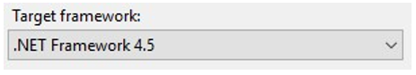
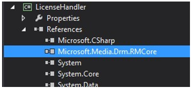
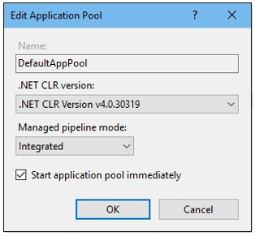
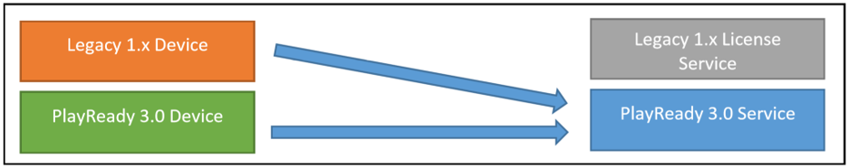
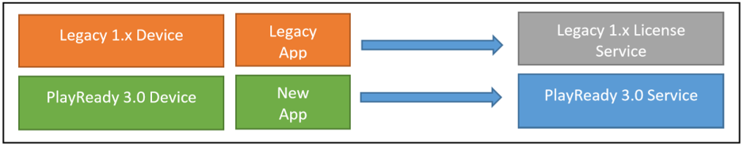
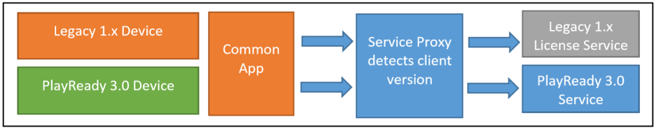
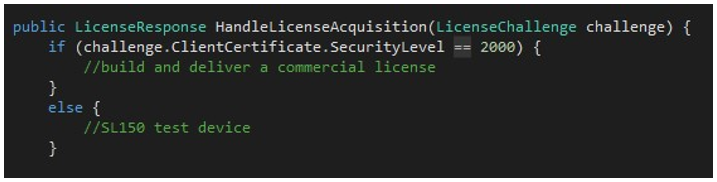
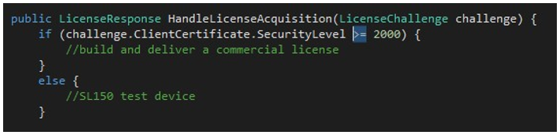
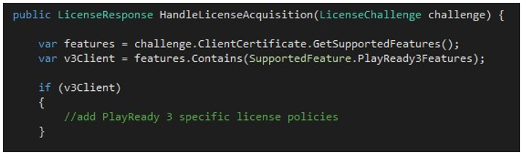
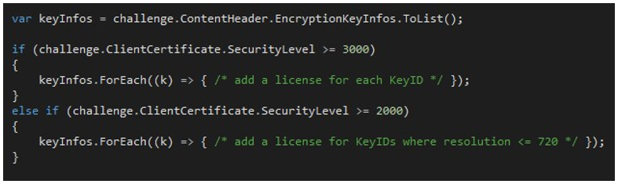

# How to Migrate from Previous Versions of the PK and Server

## Recommendations for PlayReady Services 
Microsoft recommends the following migration policies:

* Ensure that a service is upgraded to the latest version of the PlayReady SDK. This will provide the best compatibility across new and legacy devices. The recent versions of the Server SDK also have added significant performance and stability improvements. Note that *no additional licensing or license fees are required* to upgrade to the newest PlayReady Server 4.0. 

* As new devices continue the migration of PlayReady to the hardware (SoC), there will be more and more devices reporting to a service as PlayReady 3.0 and higher, and SL3000. For example, all Windows 10 devices now report as PlayReady 3.0 and higher devices. Services are encouraged to upgrade to the latest version of the server SDK to maintain compatibility as well as leverage some of the new features.  

* Use the information provided in this topic as a guide to handle edge cases such as maintaining legacy license services as-is while supporting new devices. 

* Licensees can contact askdrm@microsoft.com to gain access to our feedback site to submit migration questions. 


## Recommendations for PlayReady Device Manufacturers 

It is strongly recommended that OEMs upgrade their devices to PK4.0 released in October 2017, which is the only version allowing devices to leverage the latest functionalities being implemented by top media services. 

| **Pros**  | **Cons - Attention points**  | 
|:--|:--|
| Can support SL3000 | Not compatible with Server SDK 1.X |
| Can implement latest functionalities like SecureStop, SecureDelete, MaxResDecode, and so on |
| Better Codebase |
| Ensure new license policies as requested by content owners can be enforced | 
 

### OEM Upgrade Plan 

1. Contact your services and make sure they all migrate or add a server SDK 2.0+ version.

    * Verify their server SDK version. 

    * Reiterate considerations for the service: **no additional Licensing requirements from Microsoft and no additional** fees. 

    * If they run a server SDK v2.0+ based license service, they will likely be compatible. The service URLs and scenarios in the next section can assist in compatibility testing. 
    
    * If they run a server SDK v1.X based license server, they can migrate their license server or add a newer license server for the new clients - based on server SDK 2.0+ (latest version is recommended).  

1. Download the PK 4.0 from Microsoft. 

1. Get support from Microsoft's partners or directly from Microsoft by sending email to AskDRM@microsoft.com.

1. Implement PK 4.0 and release your product. 


## Migrations Notes for Services  

For optimal device compatibility, ensure the license server is running the latest version of the Server SDK. The most recent Server SDK will be able to deliver licenses to all PlayReady clients regardless of the Porting Kit version used. If a Client developed with the 3.0 or higher Device Porting Kit attempts to obtain a license from a license service using PlayReady SDK 1.x, the license service will return a generic service specific SOAP fault. The server will log an exception to the Windows log noting that the challenge was missing the client certificate chain. 


### Migrating a PlayReady service to Server SDK 4.0  

A service upgrade will usually not involve any code changes, but just a recompilation and deployment of the updated libraries. In some cases, there might be minor code changes due to some deprecated APIs. The recompilation and deployment of the license handler library should be transparent to devices accessing the service.  

#### Compiling and deploying an updated license handler will need to take into account the following: 

* The project will need to remove references to the old PlayReady libraries and reference the new ones prior to recompiling. 

* The newer Server SDKs require .NET 4.0 or greater. When upgrading the license service handler from an early version such as 1.52, the target framework will need to be updated in the project properties to that of 4.0 or greater. 

  

* If the legacy handler is referencing other libraries that were targeting a .NET version less than 4.0, there could be additional migration steps. However, a .NET library can reference a lesser version without any issues in general. It would be worth investigating the opportunity to recompile referenced libraries to the version of the handler or acquire library updates for third party components. 

* Only Microsoft.Media.Drm.RMCore needs to be referenced within the project. When deploying a solution, the other DLLs need to be deployed in the bin directory of the website. They do not need to be referenced within the project, as was the case with earlier SDKs.

    

* A minimum .NET CLR version of 4.0 is required for the *Application Pool* utilized by the license service. If the license service was running 2.0 or earlier, it is likely that it is running within a .NET CLR version less than 4.0.

   

* The latest PlayReady Server SDK is only supported under Windows Server 2012 and greater. Windows Server 2008 R2, however, is not known to have any issues with the Server SDK. 


### Supporting different Server SDK versions for a Service 

Microsoft recommends that you migrate to the latest version of the SDK soon after its released. In some cases, however, a service may want to run multiple versions of the Server SDK. This can be due to maintaining legacy and archive services and endpoints that are not easily updated. In this case a service can point new clients to an updated license service while leaving the legacy service untouched. For example, a service may have a number of legacy devices within their ecosystem running a client built with PlayReady PK 1.2. Their new devices are developed using the PlayReady PK 4.0. The new client would need to point to a license service built with Server SDK 2.0 or greater. If both the legacy and new devices use the same application (such as an HTML based app platform), then logic will need to be added to the application to detect the version of the client. The client application can then direct license requests to a newer license service. 

The recommended migration is to update the license service to the latest version of the Server SDK. This can provide compatibility across all devices for many services. A service will need to test across clients to validate compatibility. 



If a service does not want to make alterations to a legacy client and service configuration, the recommendation is to host a second license service that has been upgraded to the latest version of the SDK and is utilized by modern clients.  



If a service uses a single client application on both legacy devices (PlayReady 1.X) and newer devices (PlayReady 3.0 or higher) it needs to operate two PlayReady License Servers (PlayReady 1.X and PlayReady 3.0 or higher) to serve licenses to all these devices. The application may include the logic to route the requests to the right license server based on the version of the underlying PlayReady client, or the service may use a service proxy that routes the requests coming from all these devices on a single URL to the appropriate license server.  



This can be done in a proxy by inspecting the license challenge. The PK version will be noted in the <CLIENTVERSION> element.  

The element is located within the SOAP challenge under the following element:  

``` xml
<Challenge><LA><CLIENTINFO><CLIENTVERSION>3.1.0.1017</CLIENTVERSION> 
```


### Supporting Clients based on PK 3.0 or higher with legacy license services 

A client device developed with the PlayReady Device Porting Kit 3.0 or higher will likely work with existing services developed with the Server SDK 2.0 or higher. As noted above, a service needs to test PK 3.0 or higher clients to validate compatibility. 

If the device has a SL3000 certificate, the SecurityLevel exposed through the client certificate in the license handler will report as 3000. This can possibly cause problems with some license handlers if they are looking for a specific SecurityLevel value to differentiate between production and test devices. 

Differentiating between SecurityLevels is common for services that provide limited content access for test devices to validate playback licenses from a live service. Only devices that reported as SecurityLevel 2000 would have playback licenses delivered for commercial content. The service would throw a service specific exception that would result in a SOAP fault on the client. 

In the example below, the SecurityLevel is being checked in the client certificate to ensure that it is a production device. Since it has been hardcoded to 2000, devices with the security level of 3000 will not be seen as production devices. 



This next example updates the check for security level to whether it is greater than or equal to 2000. This will ensure compatibility with SL3000 devices. 



### Supporting PlayReady 3.X and higher features for services  

In addition to the new hardware DRM security level, PlayReady 3.0 and higher releases also introduced a variety of new features. In order to take advantage of these new features, the service will need to first determine if the client is capable of PlayReady 3.0 and higher features. The client certificate class now supports a GetSupportedFeatures method that will return a collection of features to help in the logic of defining policies within the handler. If the client was developed with the 3.0 Device Porting Kit, it will have the SupportedFeature.PlayReady3Features property in the collection. There are additional useful features in the collection such as whether the client is using a secure clock or anti-rollback clock. 

Here's an example of how to detect whether the device is a PlayReady 3.0 client.  



Once detected the handler can add policies such as Secure Stop, Real-time license expiration, and MaxResDecode for example. 


### Supporting both SL2000 and SL3000 in services 

PlayReady introduced a new security level SL3000 which is reported by devices who have met the PlayReady hardware security level for running within a trusted execution environment as defined in the Compliance and Robustness Rules. It will be common for services to have some clients report as SL2000 and others report as SL3000. For example, in Windows, older devices that have upgraded to Windows 10 may report as SL2000. New Windows 10 devices will report as SL3000 where the DRM has been incorporated into the newer chips.  

Here is an example of a service providing different policies based on the reported security level from the client's challenge: 



A service will determine how policies should differ between software-based DRM clients and hardware-based DRM clients. These policies may be driven by studio requirements. For example, a studio may require in the future that Ultra-HD or 4K content be limited to devices that support hardware-based PlayReady DRM.  

PlayReady 3.0 and higher policies around resolutions can be accomplished in a couple of different ways. One way is to set the MaxResDecode policy of SL2000 licenses to the allowable limits provided by the content owner. The SL3000 devices would not get this policy restriction. Another option applicable to adaptive streaming technologies is to use a different KeyID when protecting the various resolutions. When detecting the security level, a service can then only provide licenses for the resolutions allowed for a software-based client. A client reporting a security level of SL3000 would get playback licenses for all the resolutions. PlayReady introduced a new DRM header (v4.2.0.0 and higher) to support this latter scenario by enabling multiple KeyIDs in the schema. 

## See Also

[PlayReady Product Versions](../Overview/product-versions.md)

[How to Test PlayReady Clients with Versions of the PlayReady Server SDK](testing-client-server-versions.md)

