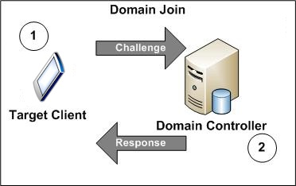

# PlayReady Domains

You can manage content access for multiple clients through a single entity, called a *PlayReady domain*. Because PlayReady introduces simplified license acquisition for mobile and embedded clients, the scenario in which clients are sharing service access is nowadays more common. Domains provide simplified and more robust service access for multiple clients, including mobile device clients.

PlayReady adds the ability for clients to have extensible client identities. This extended identity is stored on a certificate on the client and is associated with an entity (a domain). PlayReady considers clients with credentials for a particular domain to be members of that domain and grants them rights associated with membership in that domain.

A PlayReady domain controller manages domain membership. The domain controller determines what the domain represents (a user, a family, or a group of users, for example) and holds a list of entities that are associated with it.

> [!NOTE]
> A PlayReady domain is not the same as network or Web domains.

## Domain management

Before you can create a domain, the domain controller must acquire a root certificate from a certificate authority (CA). Once the domain controller has a root certificate, it can create certificates for each domain that uses the CA certificate as a root of trust.

When a client joins a domain, the client receives a domain certificate for that domain. In the event that a certificate in the domain certificate chain is compromised, certificates in the content chain become invalidated. After the existing certificates become invalidated, a new root certificate must be acquired from the CA, and the domain controller must reissue domain certificates.

## Domain binding

Under some scenarios, content keys protected by domain private keys are only transmitted to entities associated with or "joined to" a domain for that particular content. Before the target client can receive keys for content, the client must be joined to the domain for that content. Target clients can directly join a domain (typical for phones that have Web connectivity).

The following figure illustrates a domain join.

In the figure above, the target client sends a domain-join challenge (1) and the domain controller then directly responds to the target client (2). PlayReady Server Software Development Kit (SDK) contains the interfaces for handling join request messages.

PlayReady Server SDK provides the functionality to manage clients joined to a domain. For example, PlayReady can remove a device from a domain if the user has purchased a new device and wants to remove his or her older device from the domain. Developers can create a device management portal either using a Web service or an application that can enable this functionality.

## Renewability

Domain renewability allows for domain certificates to be upgraded without invalidating previously-acquired content. Without renewability, content breaches of one entity on a domain would require all entities on the domain to reacquire their protected content. Renewability is enabled by invalidating all current certificates in a domain when the version is revised and then adding a newer-versioned certificate associated with a new private key. Whenever new content is acquired, the client must bind to the new version.

> [!NOTE]
> Renewability is different from revocation because content for invalidated certificates still plays back on devices that are associated with the domain and the devices continue to function.

