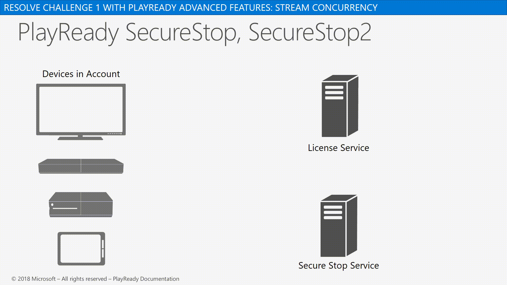

# PlayReady Secure Stop

Introduced in PlayReady version 3.0, *PlayReady Secure Stop* is a feature that provides the means for a PlayReady device to confidently assert to a media streaming service that media playback has stopped for any given piece of content. This capability ensures your media streaming services provide accurate enforcement and reporting of usage limitations on different devices for a given account.

## Secure Stop overview

A Secure Stop event is reported to a Secure Stop Server by the client when media playback stops, either at the end of the media or because the user stopped the media presentation somewhere in the middle. When a Secure Stop event is reported, and at the time the Secure Stop event is recorded, the PlayReady Client ensures that the content key is erased from memory. A Secure Stop is also reported when the previous session ends unexpectedly (for example, due to a system or application crash).

> [!NOTE]
> Secure Stop applies only to non-persistent licenses.

There are two primary scenarios for sending a Secure Stop challenge:

   *  When the media playback stops either at the end, or because the user stopped the media presentation somewhere in the middle.
   *  When the previous session ends unexpectedly (for example, due to a system or app crash). The app will need to query, either at startup or shutdown, for any outstanding Secure Stop sessions and send challenge(s) separate from any other media playback.

For information about Secure Stop in UWP apps, see the *[Add secure stop](https://docs.microsoft.com/en-us/windows/uwp/audio-video-camera/playready-Client-sdk#add-secure-stop)* section in the [PlayReady DRM](https://docs.microsoft.com/en-us/windows/uwp/audio-video-camera/playready-client-sdk) article.

## Secure Stop 2

In PlayReady version 4.3, *PlayReady Secure Stop 2* provides more security by enforcing the Secure Stop functionality on the client in the Trusted Execution Environment (TEE) at Security Level 3000.

A service may use the SecureStop feature to enforce playback across multiple clients belonging to a same user account. Depending on the configuration of a particular client in that user account, the service will receive slightly different messages from the client.

The following table shows the Server App logic on different Client Security Level and Secure Stop versions.

<table>
  <tr>
    <th>Client Version</th>
    <th>SecureStop Server Logic</th>
    <th>Robustness</th>
  </tr>
  <tr>
    <td>PlayReady version 2.0+ SL2000</td>
    <td>Server does not receive any SecureStop message from the client. Use app logic to do this.</td>
    <td>Low</td>
  </tr>
  <tr>
    <td>PlayReady version 3.0+  SL3000 (Example: Windows 10 App)</td>
    <td>Server receives a SecureStop1 message from the client.  The robustness of this message against attacks is higher than simple app logic.</td>
    <td>Medium</td>
  </tr>
  <tr>
    <td>PlayReady version 4.3+  SL3000</td>
    <td>Server receives a SecureStop2 message from the client. A malicious SecureStop2 message from this client would require an attack in the client’s Trusted Execution Environment (TEE).  The robustness of this message against attacks is higher than SecureStop1.</td>
    <td>High</td>
  </tr>
</table>

 

In order to take advantage of the Secure Stop 2 feature, the Server application must enalble the feature as follows:

   *  Set the SecureStop2AESKey property on the MediaLicense class when issuing a license with Secure Stop. (This can be done regardless of whether or not the client supports Secure Stop 2.)
   *  Create a class that implements the ISecureStop2Handler interface such that, for any given KID, it returns the same Key that was used when setting the SecureStop2AESKey property on a MediaLicense with that KID.
   *  Pass an instance of the class that implements the ISecureStop2Handler interface to the GetSecureStopData method of the SecureStopDataChallenge class.
   *  After calling GetSecureStopData, query the SecureStop2VerifiedSession property on the SecureStopDataChallenge class. If it is set to Guid.Empty, then the client sent a SecureStop1 message. If it is set to any other Guid, then the client sent a SecureStop2 message. The returned Guid is the session Id of the single session within the SecureStop2 challenge which can be verified to be non-malicious (assuming the client's Trusted Execution Environment (TEE) was not successfully attacked).

## See also

[Secure Stop Server](https://docs.microsoft.com/en-us/playready/overview/secure-stop-server)
