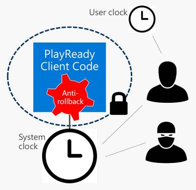

# PlayReady Trusted Clocks

A *PlayReady Trusted Clock* is a general term for a clock that is used to enforce time-based limitations set on PlayReady protected content on PlayReady Clients. Any client that implements a trusted clock ensures that a client that restricts playback to a beginning date and time, an expiration date and time, or expiration date and time after first play cannot be tampered with using hacking tools to a level defined in the <a href="https://www.microsoft.com/playready/licensing/compliance/" target="_blank">Robustness Rules for PlayReady Products</a>.

Microsoft does not require client developers to use a trusted clock. However, clients without a trusted clock won't be allowed to manage licenses with time based policies, including expiration. Because this scenario is very common in the industry (like rental or subscription), Microsoft does recommend implementing a *PlayReady Trusted Clock* in every client.

Client developers can choose amongst two types of PlayReady Trusted Clocks in their design. They both allow you to manage licenses with time-based policies:

* *PlayReady Secure Clock*
* *PlayReady Anti-rollback Clock*

## PlayReady Secure Clock

A *PlayReady Secure Clock* is "a hardware real-time clock that has been designed to resist unauthorized access at the level defined in the Robustness Rules", as defined in the <a href="https://www.microsoft.com/playready/licensing/compliance/" target="_blank">Defined Terms document for the Compliance and Robustness Rules for PlayReady Products</a>.

Per the requirements of the <a href="https://www.microsoft.com/playready/licensing/compliance/" target="_blank">Compliance Rules for PlayReady Products</a>, a *PlayReady Secure Clock* must use a *Secure Clock Service* to set its value. Microsoft operates some [*PlayReady Secure Clock Services*](../Overview/secure-clock-services.md) that device makers can use for this purpose.

### License Server Time

Starting with PlayReady 4.5, the *Secure Clock Service* may be the License Acquisition Server itself where the PlayReady Server SDK provides the time during license acquisition.

To use this functionality, the following requirements must be met.

   *  Both the server and the client (including TEE and REE, if separate) must use PlayReady 4.5 or higher.
   *  Both the server and the client applications must be aware of the feature.
   *  The client (in both the TEE and REE, if separate) must include the Secure Time feature at compile/link time and implement the associated OEM_TEE methods as documented in code comments in the PlayReady Porting Kit.
   *  The client application must either only talk to License Acquisition servers that support and enable this feature OR must also be capable of talking to an external *Secure Clock Service*.
   *  The server must have a License Server Time certificate provided by Microsoft.
   *  If multiple License Acquisition Server instances are being used for scalability purposes, their OS system times must be synchronized with each other.
   *  If persistent licenses with time-based restrictions were acquired before the feature was enabled (e.g. the client is upgraded from a previous version of PlayReady to PlayReady 4.5), the client and server must enable reacquisition of those licenses after the feature is in use.

A server enables this functionality as follows.

   *  Construct an instance of the LicenseServerTimeCertificate class with the License Server Time certificate provided by Microsoft and its corresponding keypair.
   *  Set the LicenseResponse class's LicenseServerTimeCertificate property to that instance.  Note: Setting this property has no effect if the client does not support the feature, so there is no need to bifurcate your application code based on client support.
   *  (Optional) If the LicenseAcquisitionChallenge class's LicenseServerTimeRequested read-only property returns true, the license response may optionally include no licenses.
   *  (Optional) If the PlayReadyHeader class's LicenseRequested read-only property returns false, the client has indicated that no licenses are being requested and server application logic may choose to act on this information.  (This means that the PlayReady Header v4.3.0.0 sent from the client has the additional optional attribute LICENSEREQUESTED on the PROTECTINFO node set to false.)

A client enables this functionality as follows.

   *  Include (in both the TEE and REE, if separate) the Secure Time feature at compile/link time and implement the associated OEM_TEE methods as documented in code comments in the PlayReady Porting Kit.
   *  When any PlayReady API returns DRM_E_SECURETIME_CLOCK_NOT_SET, perform License Acquisition to set the secure clock.
   *  When any PlayReady API returns DRM_E_LICENSESERVERTIME_MUST_REACQUIRE_LICENSE, perform License Acquisition to reacquire a persistent license which has been invalidated.  This will only occur if persistent licenses with time-based restrictions were acquired before the feature was enabled (e.g. the client was upgraded from a previous version of PlayReady to PlayReady 4.5).
   *  (Optional) When performing License Acquisition purely for the purpose of setting the secure clock, the application may choose to use a PlayReady Header v4.3.0.0 with the additional optional attribute LICENSEREQUESTED on the PROTECTINFO node set to false to indicate that no license is needed.  For more information, refer to the [PlayReady Header Specification](../Specifications/playready-header-specification.md).

## PlayReady Anti-rollback Clock
A *PlayReady Anti-rollback Clock* is "a real-time clock that is periodically verified by the PlayReady Final Product to have advanced", as defined in the [Defined Terms document for the Compliance and Robustness Rules for PlayReady Products](https://www.microsoft.com/playready/licensing/compliance/)

Per the requirements of the <a href="https://www.microsoft.com/playready/licensing/compliance/" target="_blank">Compliance Rules for PlayReady Products</a>, a *PlayReady Anti-rollback Clock* can use any source of time to set its value. The trust in the clock is provided by the anti-rollback mechanism built-in the PK. Using a *PlayReady Secure Clock Service* to set its value is also allowed. Microsoft operates some [*PlayReady Secure Clock Services*](../Overview/secure-clock-services.md) that device makers can use for this purpose.

