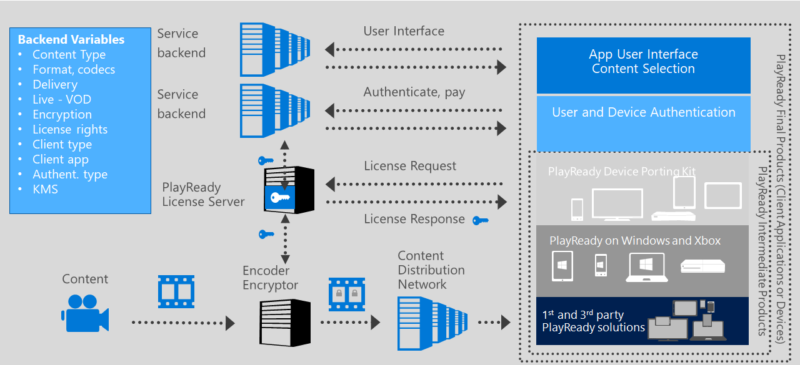
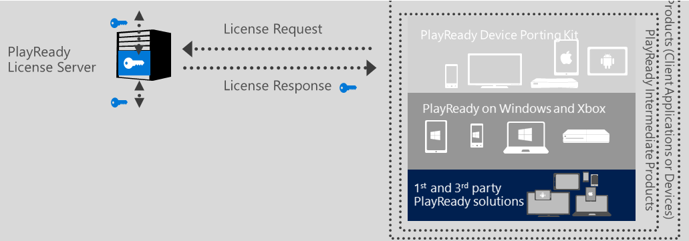
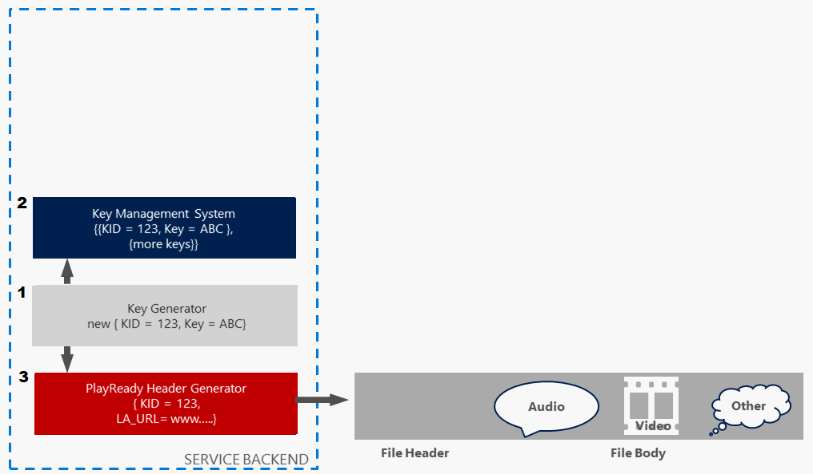
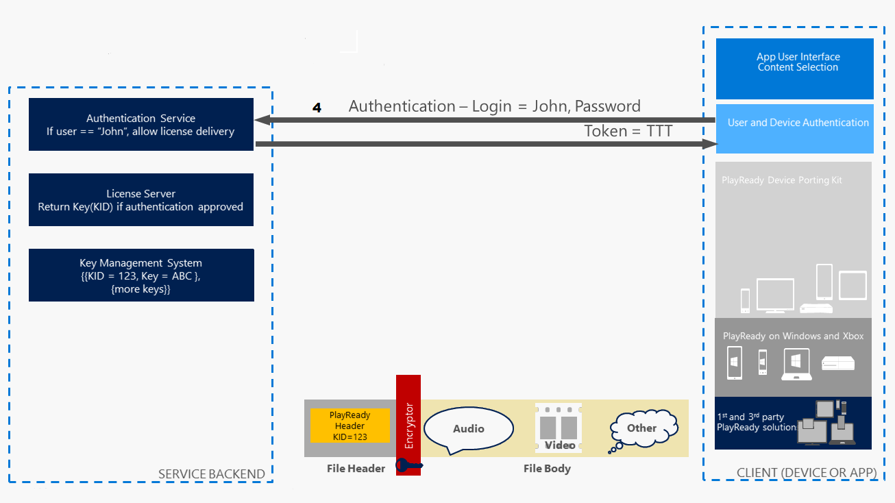
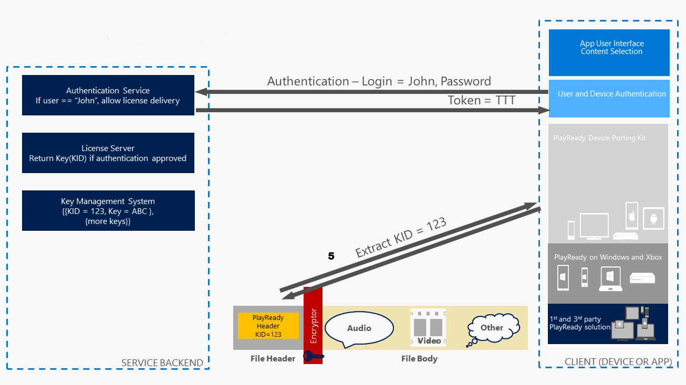
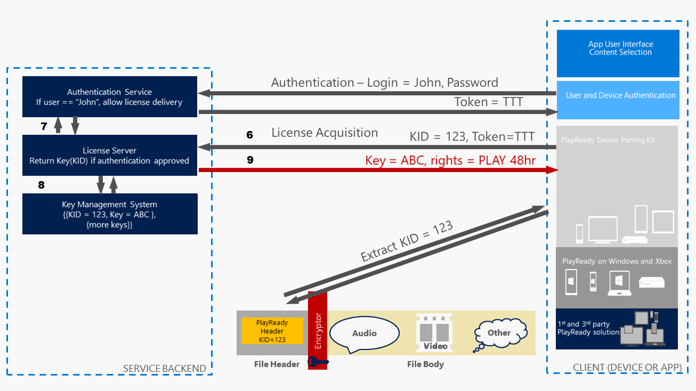
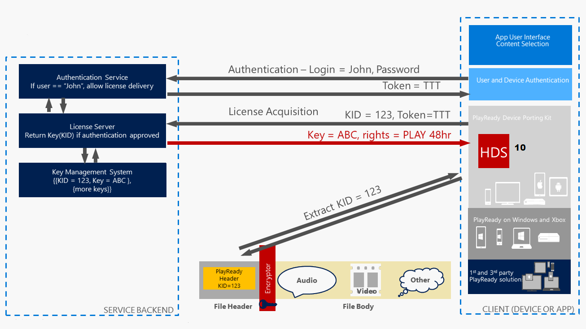

# Basic Purpose of PlayReady

In typical use, Microsoft PlayReady protects content by providing licenses for media files. There is no need to hide files, make them inaccessible, or put special protection in place when files are transmitted from system to system. In other words, there are no operating system requirements or high-security, file-transport mechanisms needed. However, copying a file and giving it to a friend will not enable that friend to use the file if it's protected by PlayReady. To use a media file, users need a license. This license is the primary means of exercising control over content (the media file). A license is granted to a single client (such as a media player) or a domain. The license will not function on other clients or other domains.  

Each license contains rights and restrictions, defining exactly how the content may be used and under what conditions. For example, a music file license may enable a "right to play" but restrict the security level of the application on which the content can be played. The license might be valid for the period between October 1, 2017 and November 1, 2017. There may be multiple licenses for a single file. A user will be able to access and use his or her content so long as one of the licenses grant the appropriate rights and the restrictions do not prevent access. 

## Overview of an end-to-end video Service 

The following illustration contains a high-level look at an end-to-end video service, including the back end of the service on the left and clients on the right. 

On the left side of the illustration you can see the service has some servers to stream the video (content distribution network). There are also some servers that let the users browse the content and choose the content they want to play (user interface). In addition, there are some servers that allow the users to log in and be authenticated, as well as pay for content (authenticate, pay). And, there is also a PlayReady license server.

On the right side of the illustation are the clients. The clients could be Windows applicationss, iPhone applications, or specific devices such as set top boxes, Roku receivers, and so on. Some of these clients may come with a PlayReady integrated client in their players, for example, the OEM may have integrated PlayReady in the operating system or in the hardware. Others could come with a client integrated in the application that is published in the app store. There are many different options for players to integrate PlayReady on the client side.

This topic is going to focus on what PlayReady does for a service, as shown in the following figure.

What PlayReady provides is a way for a client to request licenses from a server, which then delivers the keys that protect the content in a secure way over an open network. The second thing PlayReady does is deliver rights and right restrictions to the client. With PlayReady, the service has the ability to provide a key for content playback but, for example, only allow the client to use that key for two days in a rental scenario. So PlayReady provides a way to declare rights and right restrictions with the key.

PlayReady also provides a way to securely store the content key on the client side so the client will be able to use that client key to decrypt content for rendering, but not allow saving content in the clear and sharing it with other users.

The way PlayReady enforces these rules is through agreements Microsoft has with OEMs, typically with Final Product Licensees that deliver clients and applications to the market, that require them to reach a certain level of compliance and robustness when they distribute their players. So, when a client receives instructions to use the content key with a certain set of restrictions, the developer that programmed that client has to follow those instructions. For example, the client is not allowed to use the license for more than 48 hours if the license contains a 48 hour restriction. These rules are provided by Microsoft in the [Compliance and Robustness Rules](https://www.microsoft.com/playready/licensing/compliance/), and it is up to the client developer to enforce those rules in their clients.

## Basic encryption and licensing process

The following steps illustrate the end-to-end encryption and licensing process for content and how PlayReady is involved in the process.

The following figure contains one asset - an audio/video file - that has not been encrypted. The method used to encrypt the content is entirely up to the content provider and is not provided as part of PlayReady. 

   

   1. To encrypt this file, the service needs to use a key generator in their content encryptor that generates a new content key that will be used to encrypt the content. This content key will later be delivered from the PlayReady license server to the client to allow decryption of the content and rendering for the user. Along with the content key, which is a private value, encryption services also associate a key identifier (KeyID) - which is a GUID - with the content key. The KeyID is a public value. 

   2. The key and KeyID are designed at encryption time, and are stored in a key management system, which is typically some kind of database. PlayReady does not provide the key management system, so it is up to the service or partner that builds the service with the broadcaster to supply the key management system. 

   3. In addition to storing the key and KeyID in the key management system, you will also need to fit the KeyID to an encryptor, which then generates a header. This header is going to be formatted by the service or partner according to the PlayReady header specification, and then fitted in the clear in the content file header. 

      At this point, the audio and video will be encrypted using the KeyID, and you will have an encrypted content file that is ready to be delivered to a client.

      

   4. Now, the client can begin consuming the content. The first thing the client is probably going to do is to authenticate the user to the service, typically providing a login name and password, but also using any other mechanism for authentication user and device. Typically, a session token is returned to the client once the user is verified. Note that whatever mechanism is used for user authentication, it is entirely up to the service how the user is authenticated; PlayReady does not supply this technology. 

      

   5. Next, the content is delivered to the client (for example, the client has begun downloading part of the data stream that makes up the content). The client then begins to parse this content and discovers that it is encrypted and uses a key that is unknown, but contains a KeyID. 

      

   6. At that point, the client will sent a license acquisition request to the license server.

   7. The license server then interfaces with the authentication service to verify the user. Typically the first thing the license server is going to do is verify that the client/user has the right for that particular license. And again, PlayReady does not provide that layout (authentication), we just provide the license server. The authentication service will then typically respond with yes or no, or maybe yes with restrictions (for example, this user has the right for this particular movie, but only at a lower quality of video because the user doesn't have the highest quality subscription level - based on the amount the user pays per month).

   8. Then, the license server is going to request the value of the key, based on the KeyID, from the key management system that stores the keys, and the key management system is going to respond to that request. Just to reiterate, PlayReady does not supply the components of the key managemaent system, so there will be a request coming from the PlayReady license server to whatever component the service has built to store the keys. 

   9. The key is going to be recieved by the license server and the license server can deliver the license. The secure PlayReady license response includes the value of the key and a list of rights and right restrictions for the client to enforce.

      Although this demonstration shows the PlayReady license server only delivering one key, it is possible that the license server will deliver a stack of licenses in one license response. Multiple licenses could be included in one transaction, with each license supplying one key if the content is protected with multiple keys or if the service wants to deliver multiple keys in advance because, for example, the service knows that the user is going to listen to eight tracks in a row.

      

   10. The other piece of technology that PlayReady provides is a way to store the key and the rights in the client, which is called the license store. 

       The license store is typically called the HDS because the structure of the license store is a hashed data store. There can be multiple types of license stores on a device&mdash;one application could contain its own HDS just to ensure that one company's HDS is not in the same file as another company's HDS. It is entirely up the the client developer to make this design choice. For example, using PlayReady on Windows, Microsoft chose to have one HDS for Internet Explorer and another for Edge per site, as well as one for Windows Universal Apps. 

       The HDS can be stored in a persistent way, such as on the hard drive or persistent memory of the device, or it can be stored in a non-persistent way, such as in non-persistent memory. Therefore, when the license server issues a license, it could set a property of the license indicating that the license should not be stored on the hard drive of the client, or in the case of a set top box or phone, that it should not be stored in persistent memory because, as a service, you don't want to have your licenses stored in persistent memory. In that case, just store the HDS in memory in the context of the player application, so as soon as the user closes the player application, the license and its rights will vanish.

