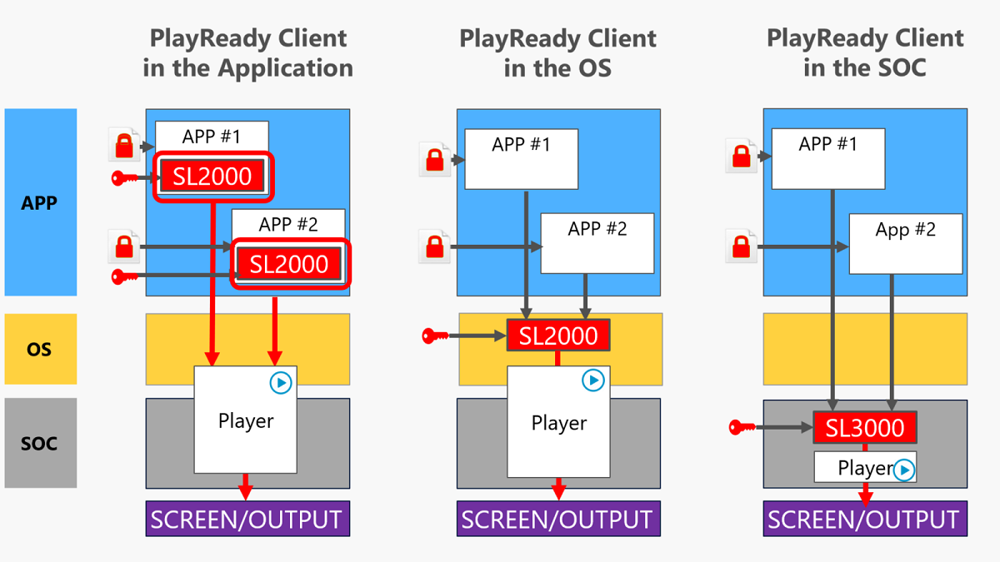

# PlayReady Clients
This topic provides a description of the different ways to implement a PlayReady Client in a device or in an application. Regarding application development, there are two cases depending on whether the device embeds a PlayReady Client exposed to applications through an API or not:
- if the device embeds a PlayReady Client in the OS or in the SOC and makes it available to application developers, then application development is simpler and cheaper. This is the Windows 10 or Android TV case.
- if the device does not embed a PlayReady Client in the OS or in the SOC or does not make it available to application developers, then the application must include the PlayReady Client itself. This is the iOS case.

 

 
 

## In this section

[Developing Applications using PlayReady](developing-applications.md)

[Integrating PlayReady in Devices](integrating-in-devices.md)

[PlayReady Initialization](initialization.md) 

[PlayReady Revocation](revocation.md) 
