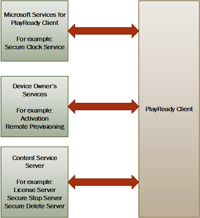

# PlayReady Communication Protocols

PlayReady Clients communicate with PlayReady Servers to acquire licenses and perform additional operations related to the management of rights set by services for clients. PlayReady Clients also communicate with other services that allow them to function according to the [PlayReady Compliance and Robustness Rules](https://www.microsoft.com/playready/licensing/compliance/) (for example, to a secure clock service, which provides the trusted time and allows the client to enforce time restrictions).

## PlayReady Client-Server Protocol

Most communication between a PlayReady Client and a PlayReady Server are managed through the use of Simple Object Access Protocol (SOAP) messages. This communication begins when the client sends a SOAP message containing a challenge. The Server responds with a SOAP message that contains a response. Both the challenge and the response contain information in XML format that signifies the type of challenge or response, and the various elements needed to process and identify the specific transaction that needs to take place.

These SOAP messages can be exchanged over HTTP or HTTPS.

Note that service providers may wrap the protocol into their own custom protocol if they desire. The PlayReady Server SDK, as well as most PlayReady Clients, allows access to and manipulation of the SOAP challenges and responses to extend them or wrap them in another type of protocol.

Examples of the challenge and response SOAP messages can also be found on a PlayReady Server after installing and configuring IIS for PlayReady.

## OEM or App Vendor Services for PlayReady Clients

OEMs or App Vendors releasing PlayReady Clients may design their device or application so as to contact a service when they perform PlayReady operations. A very common scenario is the remote provisioning service, which delivers a unique Client Certificate to a client the first time it performs a PlayReady operation.

These services are specific to the client, owned by the device maker or app developer, and use ad-hoc protocols.

Microsoft operates some of these services for the clients that it owns, including Windows 10, Windows 8.1, Xbox, Silverlight.

## See also

[PlayReady Secure Clock Services for PlayReady Clients](secure-clock-services.md)
