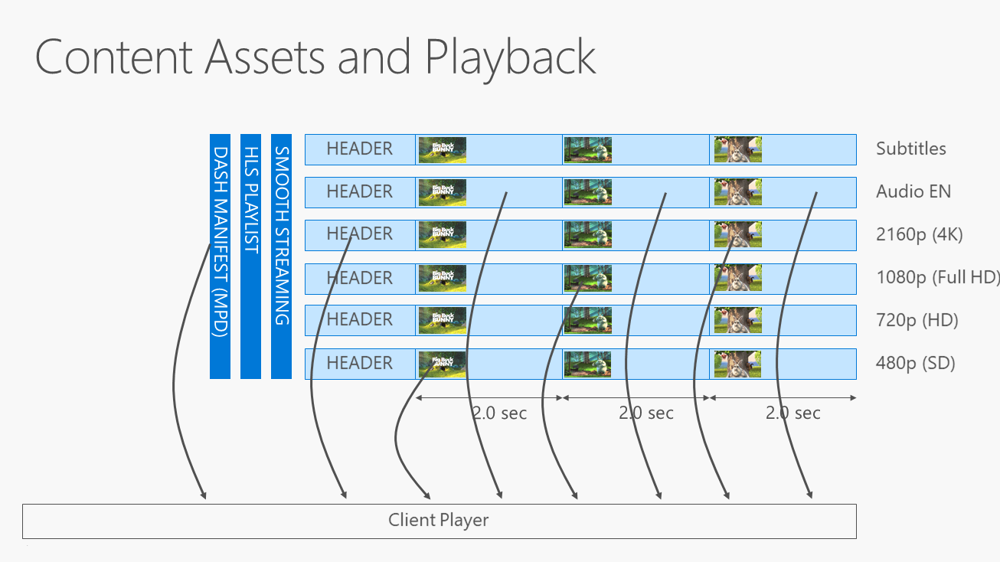
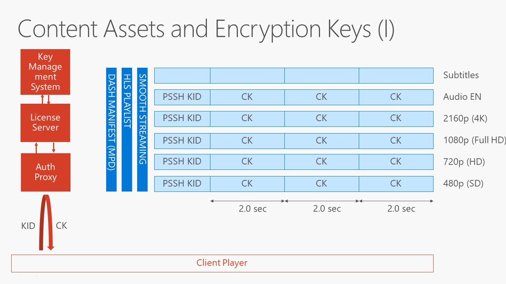
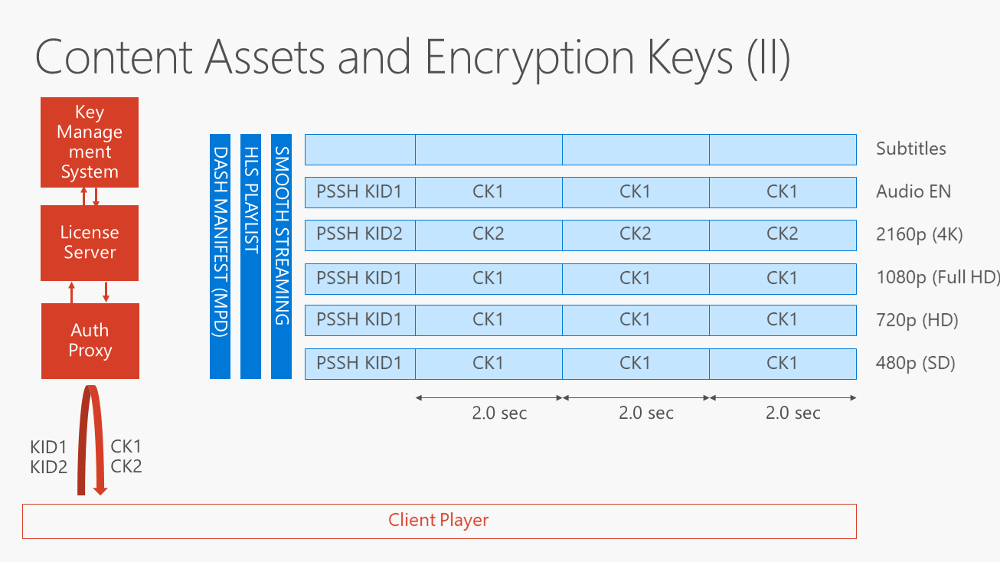
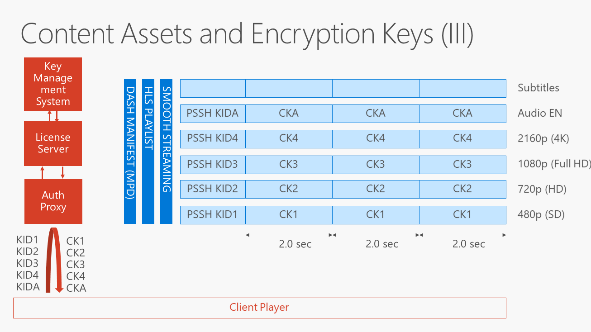
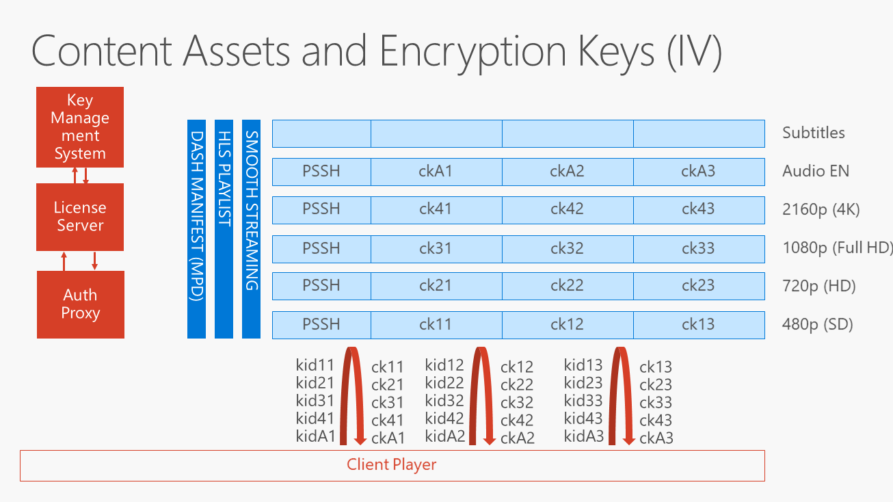
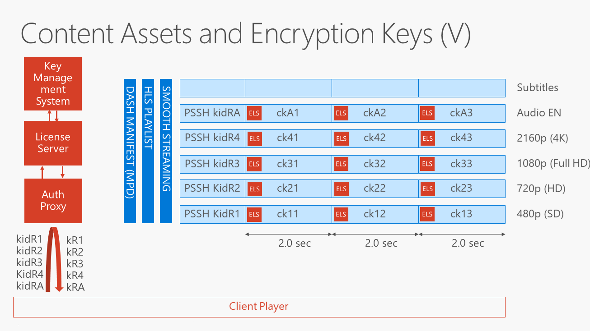

# Content Encryption and Delivery
   
  
The basic capability of PlayReady is to protect content from unauthorized use, or unwanted malicious attacks. To do this, your content must first be encrypted and an associated PlayReady Header inserted in the content. The system that does this operation is the encryptor, also known as the packager, which sometimes is integrated with the encoder. You can either design this system yourself, or you could contract with a [PlayReady Partner](https://www.microsoft.com/playready/partners/) to supply this functionality for you. 

This topic describes various ways to encrypt and deliver your content using PlayReady.

## Packaging PlayReady content&mdash;Encrypting and inserting the DRM header 

The process of encrypting clear content consists in defining one or several encryption keys, using these keys to encrypt the bytes that constitute the content itself, and inserting a DRM header in the content (in the files of the content, or in the manifest if the content has one).

All encrypted content protected by PlayReady must have a PlayReady Header inserted in your encrypted file. This PlayReady Header is used by a PlayReady client to locate or acquire a license for that particular piece of content. A PlayReady Header is composed of XML strings encoded using UTF-16. It includes the key identifiers (KIDs) that are used to encrypt the content, a default URL that the client will use to acquire a license from if no other is provided, as well as any custom attributes.  

Any packager that packages clear content needs to implement a PlayReady Header generator to build the header and embed it in the encrypted content. The PlayReady Header must be implemented according to the [PlayReady Header Object Specification](https://www.microsoft.com/playready/documents/). There are multiple ways to create a PlayReady Header generator in your packager: 

  *  Develop it yourself based on the *PlayReady Header Object Specification*. 
  *  Use the PlayReady Server SDK API that generates a PlayReady Header. 
  *  Use the Windows 10 API that generates a PlayReady Header. 
  *  Use the PlayReady Device Porting Kit API that generates a PlayReady Header. 

Your encrypted content can contain multiple DRM headers, including PlayReady Headers along with third-party DRM headers. For more information on how this works, see [Using Encryption Tools](#encryptiontoools).

## Encryption tools

Microsoft does not include a packager in the PlayReady deliverables. Instead, PlayReady works with Standards in which services commonly use common encryption. Therefore the encryption format is not PlayReady specific, rather it's a function of the file format. The most widely used encryption format today is the Common Encryption ISO Standard format, **ISO/IEC 23001-7**.

Basically, you could either create your own packager, or you could work with any type of open source encryptor (such as ffmpeg). In addition, you could work with a professional encoder company if you want to encrypt content with PlayReady (such as Harmonic, Elemental, Ericsson, Wowza, Allegro). Azure Media Services also provides a packaging functionality for clear content. 

## Using encryption tools

The process to encrypt an asset with multiple DRMs or common technologies is going to use Common Encryption. This process is basically the same as described in [Basic encryption and licensing process](basicpurposeofplayready.md#basicprocess), except that the particular key that is going to be used to encrypt the asset is going to be published in a header for PlayReady (and this header is not going to include the value of the keys, but is going to include the value of the KIDs). Then other headers are going to be potentially included in the asset for other DRMs. All those headers will have their own syntax that designates the KIDs or the information required to ultimately access the content keys. But the content keys for this asset are going to be the same for all the DRMs.

## Using encryption keys

There are many different ways to encrypt the your assets. The simplest one to the most sophisticated one depends on how much complexity you want to bring in the system and what the needs of the service are.

Let's take an example of an adaptive streaming asset shown in the figure below. It has four different video qualities, one audio track, and one subtitle track. It is encoded in fragmented MP4 files, with fragments of 2.0 seconds each. It is one asset that is served in multiple different formats depending on what the client would prefer to play back. Smooth Streaming, HLS, and DASH are the most common variants to be used. During playback, the client (the video player) is going to successively download the fragments of the asset over the network, selecting for each playback time the video fragment from the adequate video track, in order to keep playback quality as high as possible, given the constraints of the network bandwidth, the playback speed, and other limited resources like the player capabilities. This logic is known as adaptive streaming playback, governed by some heuristics rules implemented in the player. 

### Encrypting the asset with just one key

The simplest way to encrypt these assets would be to use a single content key to encrypt everything (typically subtitles are not encrypted - it's not against any rule, but they are usually kept in the clear). Using one content key makes life easy for the license server because the license server has to deliver one key {KID, CK}. This key would typically be acquired by the client before playback occurred. 

##### Note: proactive versus reactive license acquisition

PlayReady has a concept of proactive versus reactive license acquisitions. A proactive license acquisition occurs when the client initiates a license request before playback begins. This is typically a scenario where the system is programmed such that the application has browsed content, and would take the time to "proactively" acquire the license before any playback session is started. After the license is received, playback can start at any time. The application could start playback immediately, or there are cases where the license would be acquired days before the content is actually played, typically in a on the fly scenario. 

In reactive license acquisition, the application doesn't acquire a license before the content is played back. Instead the application will start playback and rely on the player to actually discover that the content is encrypted and is missing the key, because a license has not been acquired previously. The player will "reactively" acquire a license for this content before it can start decryption and playback.

### Encrypting the asset with two keys, dedicating one to the highest quality 

There have been some enhancements in the past years to use multiple keys per asset, mostly driven by the requirement to allow only certain highest-robustness clients to consume the highest quality content. With the arrival of Ultra HD (4K) content, and with the addition of high dynamic range (HDR) for higher color content, there was a need by studios and services to allow the highest quality only on certain clients, which typically have hardware DRM built in. In this scenario, the asset is encrypted using one content key {kid1, ck1} for all the tracks, except for the 4K track that is encrypted using a different content key {kid2, ck2}. That is:

  *  A client that is allowed to play only up to Full HD (not the 4K track) will be delivered a PlayReady license including only {kid1, ck1}. 
  *  A client that is allowed to play up to 4K will be delivered a PlayReady license including {kid1, ck1} and {kid2, ck2}.
  
Using this additional complexity, the service can ensure that some clients will not be able to decrypt the 4K track, and that 4K track can be reserved to only the clients that the service most trusts. 

### Encrypting the asset with one key per track

Now, the service may have a more complex map of rights to enforce. Some clients, depending on their screen size, their robustness, their outputs, and their location, may be allowed to access only some video tracks, some video qualities, and some audio tracks. To ensure the service has full flexibility in enforcing an arbitrary set of restrictions in the future, it may encrypt an asset with a content key specific to each track. For example:

  *  A client that is allowed to play only 720p will be delivered a PlayReady license including {kid1, ck1}, {kid2, ck2}, and {kidA, ckA}. 
  *  A client that is allowed to play up to 4K will be delivered a PlayReady license including {kid1, ck1}, {kid2, ck2}, {kid3, ck3}, {kid4, ck4}, and {kidA, ckA}. 
  *  A client playing offline the 4K version of the asset (previously downloaded) will be delivered a PlayReady license including {kid4, ck4} and {kidA, ckA}. 

### Changing the encryption keys periodically (multi-period asset)&mdash;license rotation 

In some scenarios, the service wants to change the encryption keys sometimes, typically at program boundaries. For example, a live linear stream has multiple periods with free to air content that you want everyone to have access to, followed by some content that is restricted to subscribers. Changing the encryption keys at program boundaries allows the service to deliver the free to air keys {KIDi1, CKi1} to all users without any restrictions, and deliver the content keys {kidi2, cki2} only to the subscribers that have successfully logged in the service.

Note that this license rotation is not very scalable: every time the encryption keys change, all clients request the new encryption keys using their own license request. This can result is a high peak of license requests in systems with a large number of clients.  

### Changing the encryption keys frequently&mdash;scalable key rotation 

There is an advanced mechanism in PlayReady called scalable key rotation (as opposed to license rotation). This method stores an embedded license store (ELS) in the stream of the actual content. In this mechanism, the key used to encrypt the A2 fragment itself is called the leaf key {kidA2, ckA2}, and is delivered in the ELS of the fragment A2, being itself encrypted with a separate key that is the same for all the fragments of track A, called the root key {kidRA, ckRA}. If you are familiar with MPEG-2 TS and the Control Word encryption, this is a similar mechanism except for the encryption is much stronger and is also more flexible.

Let's say this asset is live linear TV. When the client attempts playback, it finds kidRA in the PlayReady header of the stream manifest, and requests a license for kidRA. The license server returns a root license for the root key {kidRA, ckRA}. Then the client parses the fragment A1 and discover the ELS in the header of the fragment. Parsing this ELS, it finds the leaf license {kidA1, ckA1} in this ELS. Using the root key {kidRA, ckRA}.and the leaf license {kidA1, ckA1}, it can get the value of ckA1, and decryt and render the fragment A1. 

The PlayReady scalable key rotation feature is extremely scalable because it does not require the clients to hit the license server every time the encryption keys are changed. It keeps the volume of license requests to the lowest possible, as a client only needs one root license from the license server per stream, or track. It allows encryption keys to rotate as frequently as every fragment, typically every 2 seconds if wanted. 

## See Also

[Key and Key IDs (KIDs)](keyandkeyidskids1.md)

