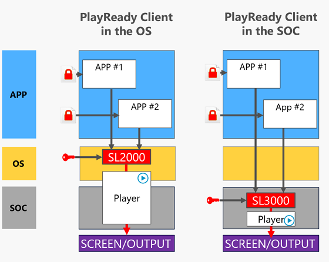
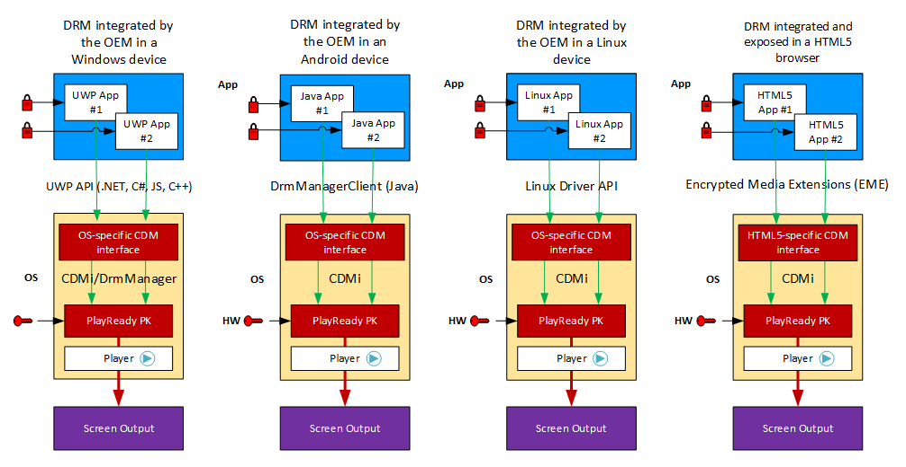
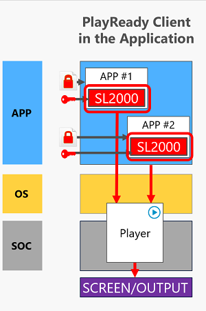

# Developing Applications using PlayReady

## Devices including a PlayReady Client embedded by the OEM

A lot of OEMs have licensed the PlayReady Porting Kit, integrated it in their devices, and made it available to application developers as part of their SDK.

For example, Microsoft ensures all Windows 10 devices include a PlayReady Client integrated in the Windows OS itself, or in the chip's firmware of the device (TEE), and exposes it through UWP APIs to application developers, but also Android TV device makers do the same. These devices use various APIs to expose the PlayReady Client to applications, including:
  - the Universal Windows Platform API on PCs, Xbox
  - the Java DrmManagerClient API on Android devices
  - various interfaces on Linux devices
  - the Javascript EME API on modern web browsers
  - the CE-HTML HbbTV API on old embedded web browsers

 

 

On these devices, application developers do not need to license PlayReady, or manipulate PlayReady code or certificate. They just use the SDK provided by the OEM on the platform and run PlayReady operations from within their app, like AcquireLicense(KID), etc.

An application developed with this model is not royalty-bearing.

 

The following table shows the current availability of a PlayReady Client on various devices.

<table>
  <tr>
    <th></th>
    <th>Embedded in the device</th>
    <th>In the application</th>
  </tr>
  <tr>
    <td>Windows 10</td>
    <td>Yes. Windows SDK. UWP or Web app in Microsoft Edge</td>
    <td></td>
  </tr>
  <tr>
    <td>Windows 8, 8.1</td>
    <td>Yes, Windows SDK</td>
    <td>3rd party SDKs possible</td>
  </tr>
  <tr>
    <td>Windows 7</td>
    <td>Yes, Silverlight</td>
    <td>3rd party SDKs possible</td>
  </tr>
  <tr>
    <td>MacOS</td>
    <td>No</td>
    <td>Silverlight and 3rd party SDKs</td>
  </tr>
  <tr>
    <td>iOS</td>
    <td>No</td>
    <td>1st and 3rd party SDKs</td>
  </tr>
  <tr>
    <td>Apple TV OS</td>
    <td>No</td>
    <td>3rd party SDKs</td>
  </tr>
  <tr>
    <td>Chrome OS</td>
    <td>No</td>
    <td></td>
  </tr>
  <tr>
    <td>Android Mobile</td>
    <td>Yes on some models</td>
    <td>3rd party SDKs</td>
  </tr>
  <tr>
    <td>Android TV</td>
    <td>Yes on all models</td>
    <td></td>
  </tr>
  <tr>
    <td>Linux TVs</td>
    <td>Yes on most models</td>
    <td></td>
  </tr>
  <tr>
    <td>Consoles</td>
    <td>Yes on PlayStations and Xbox</td>
    <td></td>
  </tr>
  <tr>
    <td >Network Receivers</td>
    <td>Yes on most models</td>
    <td></td>
  </tr>
  <tr>
    <td>Blu Ray Disc Players</td>
    <td>Yes on most models</td>
    <td></td>
  </tr>
</table>

 

## Devices **not** including a PlayReady Client

Some OEMs have made the choice to not embed a PlayReady Client in their device, or to embed it but not make it available to application developers through their SDK.

On these devices, application developers can still run PlayReady operations from within their app, but they need to integrate the PlayReady Client in their application, including PlayReady code and certificates.

The integration of a PlayReady Client in the application requires the application developer to license and use the PlayReady Porting Kit in the application.

This development requires expertise to harden the application including the PlayReady code and the PlayReady secrets (keys, certificates). Most application developers decide to use a PlayReady SDK developed and maintained by a [Microsoft Partner](https://www.microsoft.com/playready/partners/)).

## Developing Applications using PlayReady on Windows, Xbox

Microsoft develops and distributes a PlayReady Client in every Windows 10, 8.1, 8 unit, and in every Xbox unit. This PlayReady Client is exposed and freely accessible through a high-level API to application developers.

Application developers can create Universal Windows Platform (UWP) applications capable of providing PlayReady content to the user while enforcing the access rules defined by the content provider. An application can freely use this built-in PlayReady Client in Windows 8, 8.1, or 10, without signing any agreement with Microsoft, and without the need of any PlayReady certificate, or any PlayReady fee or royalty due.

Windows 10 PlayReady documentation can be found at [PlayReady for Windows 10](https://msdn.microsoft.com/en-us/windows/uwp/audio-video-camera/playready-Client-sdk) and at [Windows.​Media.​Protection.​Play​Ready Namespace](https://docs.microsoft.com/en-us/uwp/api/Windows.Media.Protection.PlayReady) . Samples of PlayReady Windows 10 applications can be found as part of the [UWP Samples collection](https://github.com/Microsoft/Windows-universal-samples) and at [PlayReady sample Universal Windows Apps for Windows 10 (Javascript/C#/EME)](https://code.msdn.microsoft.com/windowsapps/PlayReady-samples-for-124a3738).

You can also create PlayReady Windows Store and Web applications for Windows 8.1. Windows 8.1 PlayReady documentation can be found at [Developing PlayReady Windows Store and Web Apps](https://msdn.microsoft.com/en-us/library/windows/apps/xaml/dn468834.aspx). Samples of PlayReady Windows 8.1 applications can be found at [PlayReady sample for Windows 8.1 Store apps](https://code.msdn.microsoft.com/windowsapps/PlayReady-sample-for-bb3065e7).

 
Some PlayReady Partners provide SDKs to run PlayReady on Windows 7 and Mac OS, based on Electron, Xamarin, or other technologies. You can contact these [PlayReady Partners](https://www.microsoft.com/playready/partners) directly for more information.

Silverlight is a deprecated application framework running on Windows 7 and Mac OS that includes a fully functional PlayReady Client. It runs in browsers with limitations, and can also run out of browsers to provide standalone apps on Windows 7 and Mac OS.

## Developing Applications using PlayReady on Android

Some Android device models embed a PlayReady Client integrated by the OEM, some other don't.

Developing an application for the models embedding one is as simple as using the SDK from these devices. They will typically expose the PlayReady Client through the Java  [**DrmManagerClient** class](https://developer.android.com/reference/android/drm/DrmManagerClient.html). See the [PlayReady Plugin for Android Microsoft Specification](../Specifications/playready-plugin-for-android-specification.md) for more information.

Developing an application for the models which don't embed a PlayReady Client requires the integration of the PlayReady Client in the application itself.

Microsoft Partners develop PlayReady SDKs for various platforms from the PlayReady Porting Kit, and make them available to application developers. If you have the project of an application using PlayReady on these operating systems, please contact directly the listed [Microsoft Partners](https://www.microsoft.com/playready/partners/) for proposals and quotes.

## Developing Applications using PlayReady on iOS, AppleTV OS, MacOS

Apple products do not ship with an embedded PlayReady Client. Though, it is possible to distribute applications for these platforms that integrate a PlayReady Client in the application itself.

Microsoft Partners develop PlayReady SDKs for various platforms from the PlayReady Porting Kit, and make them available to application developers. If you have the project of an application using PlayReady on these operating systems, please contact directly the listed [Microsoft Partners](https://www.microsoft.com/playready/partners/) for proposals and quotes.

## Developing Applications using PlayReady in a Web Browser

A web app running in a modern web browser supporting HTML5 and JavaScript will use the [Encrypted Media Extensions (EME)](http://www.w3.org/TR/encrypted-media/) interface to do PlayReady operations.

 

