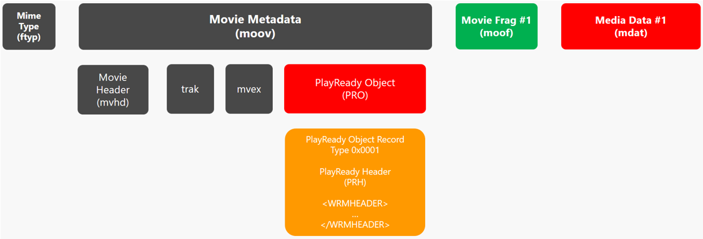

# Developing and Operating a PlayReady Packager

Companies developing an encoder or a packager (also known as encryptor) utilizing PlayReady technologies need to integrate two functionalities in their product:

1. A functionality that encrypt content in a PlayReady compatible encryption format.

2. A functionality that generates a PlayReady Header and inserts it in the encrypted content

>[!NOTE]
> A PlayReady licensing agreement is not necessary to build a PlayReady encoder or packager. In addition, there is no royalty applicable to PlayReady encoders or packagers.

## Content Encryption

Any encryption format that uses AES-128 keys used in CTR mode or CBC mode is allowed. Microsoft recommends using Common Encryption: CENC or CBCS.

For more information, see [Content Encryption and Delivery](content-encryption-and-delivery.md)


## Generating of the PlayReady Header

The packager needs to include a PlayReady Header in the encrypted content.

The PlayReady Header contains information about the content being played back, including the key identifiers (KIDs) that identify the keys used to encrypt the data, the default license acquisition URL of the PlayReady License Server, and any custom data that you want to include. The key and KID used to encrypt the content must be shared with the PlayReady License Server that will be issuing the licenses for that specific content, typically through a Key Management System (KMS).

>[!NOTE]
>Microsoft does not provide a Key Management System with PlayReady.

Here is an example of a PlayReady Header, which may be inserted in the header of a fragmented MP4 file:

```xml
<WRMHEADER xmlns="http://schemas.microsoft.com/DRM/2007/03/PlayReadyHeader" version="4.3.0.0">
  <DATA>
    <PROTECTINFO>
      <KIDS>
        <KID ALGID="AESCTR" VALUE="PV1LM/VEVk+kEOB8qqcWDg=="></KID>
        <KID ALGID="AESCTR" VALUE="tuhDoKUN7EyxDPtMRNmhyA=="></KID>
      </KIDS>
    </PROTECTINFO>
    <LA_URL>http://rm.contoso.com/rightsmanager.asmx</LA_URL>
    <DS_ID>AH+03juKbUGbHl1V/QIwRA==</DS_ID>
  </DATA>
</WRMHEADER>
```


For more information about generating the PlayReady Header, see the [PlayReady Header Object Specification](../Specifications/playready-header-specification.md).

&nbsp;

## Inserting the PlayReady Header in the protected content

The packager needs to insert the PlayReady Header it has generated into the content. It will typically be inserted either in the header of the content files, or in the manifest of streaming assets.

&nbsp;

### Inserting the PlayReady Header in protected content files

For MP4 ISO files, Microsoft recommends following the ISO format specification and inserting the PlayReady Header in a PSSH box.



&nbsp;

### Inserting the PlayReady Header in protected streaming manifests

For adaptive streaming assets, Microsoft recommends inserting the PlayReady Header in the manifest of the asset.

&nbsp;

**Example of a Smooth Streaming manifest containing a PlayReady Header**

```xml
<?xml version="1.0" encoding="UTF-8"?>
<SmoothStreamingMedia MajorVersion="2" MinorVersion="0" Duration="7340000000" TimeScale="10000000">
	<StreamIndex Chunks="367" Type="video" Url="QualityLevels({bitrate})/Fragments(video={start time})" QualityLevels="12">
		<QualityLevel Index="1" Bitrate="4535153" FourCC="H264" MaxWidth="1920" MaxHeight="860" CodecPrivateData="0000000167640028ACD9407806DFBFFC0D700D6440000003004000000C03C60C65800000000168EBECB22C" />
		<QualityLevel Index="2" Bitrate="3294017" FourCC="H264" MaxWidth="1280" MaxHeight="572" CodecPrivateData="000000016764001FACD94050049FBFFC0D680D6440000003004000000C03C60C65800000000168EBECB22C" />
		<QualityLevel Index="3" Bitrate="2181139" FourCC="H264" MaxWidth="960" MaxHeight="428" CodecPrivateData="000000016764001EACD940F037FBFFC0D600D644000003000400000300C03C58B6580000000168EBECB22C" />
		<QualityLevel Index="4" Bitrate="970010" FourCC="H264" MaxWidth="640" MaxHeight="288" CodecPrivateData="0000000167640015ACD940A025BFF036003591000003000100000300300F162D960000000168EBECB22C" />
		<c t="0" d="20000000" />
		<c d="20000000" />
		<c d="20000000" />
		<c d="20000000" />
		<c d="20000000" />
		<c d="20000000" />
	</StreamIndex>
	<StreamIndex Chunks="367" Type="audio" Url="QualityLevels({bitrate})/Fragments(aac_UND_2_128={start time})" QualityLevels="1" Name="aac_UND_2_128">
		<QualityLevel AudioTag="255" Index="0" BitsPerSample="16" Bitrate="128003" FourCC="AACL" CodecPrivateData="1190" Channels="2" PacketSize="4" SamplingRate="48000" />
		<c t="0" d="20053333" />
		<c d="20053333" />
		<c d="20053334" />
		<c d="20053333" />
		<c d="20053333" />
		<c d="20053334" />
	</StreamIndex>
	<Protection>
		<ProtectionHeader SystemID="9A04F079-9840-4286-AB92-E65BE0885F95">
		XAMAAAEAAQBSAzwAVwBSAE0ASABFAEEARABFAFIAIAB4AG0AbABuAHMAPQAiAGgAdAB0AHAAOgAvAC8AcwBjAGgAZQBtAGEAcwAuAG0AaQBjAHIAbwBzAG8AZgB0AC4AYwBvAG0ALwBEAFIATQAvADIAMAAwADcALwAwADMALwBQAGwAYQB5AFIAZQBhAGQAeQBIAGUAYQBkAGUAcgAiACAAdgBlAHIAcwBpAG8AbgA9ACIANAAuADAALgAwAC4AMAAiAD4APABEAEEAVABBAD4APABQAFIATwBUAEUAQwBUAEkATgBGAE8APgA8AEsARQBZAEwARQBOAD4AMQA2ADwALwBLAEUAWQBMAEUATgA+ADwAQQBMAEcASQBEAD4AQQBFAFMAQwBUAFIAPAAvAEEATABHAEkARAA+ADwALwBQAFIATwBUAEUAQwBUAEkATgBGAE8APgA8AEsASQBEAD4ANABSAHAAbABiACsAVABiAE4ARQBTADgAdABHAGsATgBGAFcAVABFAEgAQQA9AD0APAAvAEsASQBEAD4APABDAEgARQBDAEsAUwBVAE0APgBLAEwAagAzAFEAegBRAFAALwBOAEEAPQA8AC8AQwBIAEUAQwBLAFMAVQBNAD4APABMAEEAXwBVAFIATAA+AGgAdAB0AHAAcwA6AC8ALwBwAHIAbwBmAGYAaQBjAGkAYQBsAHMAaQB0AGUALgBrAGUAeQBkAGUAbABpAHYAZQByAHkALgBtAGUAZABpAGEAcwBlAHIAdgBpAGMAZQBzAC4AdwBpAG4AZABvAHcAcwAuAG4AZQB0AC8AUABsAGEAeQBSAGUAYQBkAHkALwA8AC8ATABBAF8AVQBSAEwAPgA8AEMAVQBTAFQATwBNAEEAVABUAFIASQBCAFUAVABFAFMAPgA8AEkASQBTAF8ARABSAE0AXwBWAEUAUgBTAEkATwBOAD4AOAAuADAALgAxADcAMQAzAC4AMQAzADwALwBJAEkAUwBfAEQAUgBNAF8AVgBFAFIAUwBJAE8ATgA+ADwALwBDAFUAUwBUAE8ATQBBAFQAVABSAEkAQgBVAFQARQBTAD4APAAvAEQAQQBUAEEAPgA8AC8AVwBSAE0ASABFAEEARABFAFIAPgA=</ProtectionHeader>
	</Protection>
</SmoothStreamingMedia>
```


**Example of a MPEG-DASH manifest containing a PlayReady Header**
```xml
<?xml version="1.0" encoding="utf-8"?>
<MPD xmlns="urn:mpeg:dash:schema:mpd:2011" xmlns:xsi="http://www.w3.org/2001/XMLSchema-instance" profiles="urn:mpeg:dash:profile:isoff-live:2011" type="static" xmlns:cenc="urn:mpeg:cenc:2013" xmlns:mspr="urn:microsoft:playready" mediaPresentationDuration="PT10M56.907S" minBufferTime="PT4S">
  <Period>
    <AdaptationSet id="1" group="1" profiles="ccff" bitstreamSwitching="true" segmentAlignment="true" contentType="video" mimeType="video/mp4" codecs="avc1.640028" maxWidth="1920" maxHeight="1080" startWithSAP="1">

        <ContentProtection schemeIdUri="urn:mpeg:dash:mp4protection:2011" value="cenc" cenc:default_KID="10000000-1000-1000-1000-100000000001"/>
        <ContentProtection schemeIdUri="urn:uuid:9a04f079-9840-4286-ab92-e65be0885f95" value="2.0" cenc:default_KID="10000000-1000-1000-1000-100000000001">
            <mspr:pro>PABXAFIATQBIAEUAQQBEAEUAUgAgAHgAbQBsAG4AcwA9ACIAaAB0AHQAcAA6AC8ALwBzAGMAaABlAG0AYQBzAC4AbQBpAGMAcgBvAHMAbwBmAHQALgBjAG8AbQAvAEQAUgBNAC8AMgAwADAANwAvADAAMwAvAFAAbABhAHkAUgBlAGEAZAB5AEgAZQBhAGQAZQByACIAIAB2AGUAcgBzAGkAbwBuAD0AIgA0AC4AMwAuADAALgAwACIAPgA8AEQAQQBUAEEAPgA8AEwAQQBfAFUAUgBMAD4AaAB0AHQAcAA6AC8ALwBlAHgAcABlAHIAaQBtAGUAbgB0AGEAbAAxAC4AYQB6AHUAcgBlAHcAZQBiAHMAaQB0AGUAcwAuAG4AZQB0AC8AcgBpAGcAaAB0AHMAbQBhAG4AYQBnAGUAcgAuAGEAcwBtAHgAPwBjAGYAZwA9ACgAYwBrADoAVwAzADEAYgBmAFYAdAA5AFcAMwAxAGIAZgBWAHQAOQBXADMAMQBiAGYAUQA9AD0ALABjAGsAdAA6AEEARQBTADEAMgA4AEIAaQB0AEMAQgBDACkAPAAvAEwAQQBfAFUAUgBMAD4APABQAFIATwBUAEUAQwBUAEkATgBGAE8APgA8AEsASQBEAFMAPgA8AEsASQBEACAAQQBMAEcASQBEAD0AIgBBAEUAUwBDAEIAQwAiACAAVgBBAEwAVQBFAD0AIgBBAEEAQQBBAEUAQQBBAFEAQQBCAEEAUQBBAEIAQQBBAEEAQQBBAEEAQQBRAD0APQAiAD4APAAvAEsASQBEAD4APAAvAEsASQBEAFMAPgA8AC8AUABSAE8AVABFAEMAVABJAE4ARgBPAD4APAAvAEQAQQBUAEEAPgA8AC8AVwBSAE0ASABFAEEARABFAFIAPgA=</mspr:pro>
        </ContentProtection>

        <SegmentTemplate timescale="10000000" media="video/bbb_sunflower_1080p_60fps_normal_VIDEO$Number$.mp4"  initialization="video/bbb_sunflower_1080p_60fps_normal_VIDEO0.mp4">
          <SegmentTimeline>
            <S d="83166700" />
            <S d="79166700" />
            <S d="80333300" />
            <S d="73000000" />
          </SegmentTimeline>
        </SegmentTemplate>
      <Representation id="video" bandwidth="10646158" width="1920" height="1080"/>
    </AdaptationSet>

    <AdaptationSet id="2" group="2" profiles="ccff" bitstreamSwitching="true" segmentAlignment="true" contentType="audio" mimeType="audio/mp4" codecs="ac-3" startWithSAP="1">

        <ContentProtection schemeIdUri="urn:mpeg:dash:mp4protection:2011" value="cenc" cenc:default_KID="10000000-1000-1000-1000-100000000001"/>
        <ContentProtection schemeIdUri="urn:uuid:9a04f079-9840-4286-ab92-e65be0885f95" value="2.0" cenc:default_KID="10000000-1000-1000-1000-100000000001">
            <mspr:pro>PABXAFIATQBIAEUAQQBEAEUAUgAgAHgAbQBsAG4AcwA9ACIAaAB0AHQAcAA6AC8ALwBzAGMAaABlAG0AYQBzAC4AbQBpAGMAcgBvAHMAbwBmAHQALgBjAG8AbQAvAEQAUgBNAC8AMgAwADAANwAvADAAMwAvAFAAbABhAHkAUgBlAGEAZAB5AEgAZQBhAGQAZQByACIAIAB2AGUAcgBzAGkAbwBuAD0AIgA0AC4AMwAuADAALgAwACIAPgA8AEQAQQBUAEEAPgA8AEwAQQBfAFUAUgBMAD4AaAB0AHQAcAA6AC8ALwBlAHgAcABlAHIAaQBtAGUAbgB0AGEAbAAxAC4AYQB6AHUAcgBlAHcAZQBiAHMAaQB0AGUAcwAuAG4AZQB0AC8AcgBpAGcAaAB0AHMAbQBhAG4AYQBnAGUAcgAuAGEAcwBtAHgAPwBjAGYAZwA9ACgAYwBrADoAVwAzADEAYgBmAFYAdAA5AFcAMwAxAGIAZgBWAHQAOQBXADMAMQBiAGYAUQA9AD0ALABjAGsAdAA6AEEARQBTADEAMgA4AEIAaQB0AEMAQgBDACkAPAAvAEwAQQBfAFUAUgBMAD4APABQAFIATwBUAEUAQwBUAEkATgBGAE8APgA8AEsASQBEAFMAPgA8AEsASQBEACAAQQBMAEcASQBEAD0AIgBBAEUAUwBDAEIAQwAiACAAVgBBAEwAVQBFAD0AIgBBAEEAQQBBAEUAQQBBAFEAQQBCAEEAUQBBAEIAQQBBAEEAQQBBAEEAQQBRAD0APQAiAD4APAAvAEsASQBEAD4APAAvAEsASQBEAFMAPgA8AC8AUABSAE8AVABFAEMAVABJAE4ARgBPAD4APAAvAEQAQQBUAEEAPgA8AC8AVwBSAE0ASABFAEEARABFAFIAPgA=</mspr:pro>
        </ContentProtection>

        <SegmentTemplate timescale="10000000" media="audio/bbb_sunflower_1080p_60fps_normal_AUDIO$Number$.mp4"  initialization="audio/bbb_sunflower_1080p_60fps_normal_AUDIO0.mp4">
          <SegmentTimeline>
            <S d="99840000" r="62" />
            <S d="51520000" />
          </SegmentTimeline>
        </SegmentTemplate>
      <Representation id="audio" bandwidth="322337" />
    </AdaptationSet>

  </Period>
</MPD>
```

&nbsp;

**Example of a HLS manifest containing a PlayReady Header**

```M
#EXTM3U
#EXT-X-VERSION:4
#EXT-X-PLAYREADYHEADER:XAMAAAEAAQBSAzwAVwBSAE0ASABFAEEARABFAFIAIAB4AG0AbABuAHMAPQAiAGgAdAB0AHAAOgAvAC8AcwBjAGgAZQBtAGEAcwAuAG0AaQBjAHIAbwBzAG8AZgB0AC4AYwBvAG0ALwBEAFIATQAvADIAMAAwADcALwAwADMALwBQAGwAYQB5AFIAZQBhAGQAeQBIAGUAYQBkAGUAcgAiACAAdgBlAHIAcwBpAG8AbgA9ACIANAAuADAALgAwAC4AMAAiAD4APABEAEEAVABBAD4APABQAFIATwBUAEUAQwBUAEkATgBGAE8APgA8AEsARQBZAEwARQBOAD4AMQA2ADwALwBLAEUAWQBMAEUATgA+ADwAQQBMAEcASQBEAD4AQQBFAFMAQwBUAFIAPAAvAEEATABHAEkARAA+ADwALwBQAFIATwBUAEUAQwBUAEkATgBGAE8APgA8AEsASQBEAD4ANABSAHAAbABiACsAVABiAE4ARQBTADgAdABHAGsATgBGAFcAVABFAEgAQQA9AD0APAAvAEsASQBEAD4APABDAEgARQBDAEsAUwBVAE0APgBLAEwAagAzAFEAegBRAFAALwBOAEEAPQA8AC8AQwBIAEUAQwBLAFMAVQBNAD4APABMAEEAXwBVAFIATAA+AGgAdAB0AHAAcwA6AC8ALwBwAHIAbwBmAGYAaQBjAGkAYQBsAHMAaQB0AGUALgBrAGUAeQBkAGUAbABpAHYAZQByAHkALgBtAGUAZABpAGEAcwBlAHIAdgBpAGMAZQBzAC4AdwBpAG4AZABvAHcAcwAuAG4AZQB0AC8AUABsAGEAeQBSAGUAYQBkAHkALwA8AC8ATABBAF8AVQBSAEwAPgA8AEMAVQBTAFQATwBNAEEAVABUAFIASQBCAFUAVABFAFMAPgA8AEkASQBTAF8ARABSAE0AXwBWAEUAUgBTAEkATwBOAD4AOAAuADAALgAxADcAMQAzAC4AMQAzADwALwBJAEkAUwBfAEQAUgBNAF8AVgBFAFIAUwBJAE8ATgA+ADwALwBDAFUAUwBUAE8ATQBBAFQAVABSAEkAQgBVAFQARQBTAD4APAAvAEQAQQBUAEEAPgA8AC8AVwBSAE0ASABFAEEARABFAFIAPgA=
#EXT-X-MEDIA:TYPE=AUDIO,GROUP-ID="audio",NAME="aac_UND_2_128",DEFAULT=YES,URI="QualityLevels(128003)/Manifest(aac_UND_2_128,format=m3u8-aapl)"
#EXT-X-STREAM-INF:BANDWIDTH=1138489,RESOLUTION=640x288,CODECS="avc1.640015,mp4a.40.2",AUDIO="audio"
QualityLevels(970010)/Manifest(video,format=m3u8-aapl)
#EXT-X-I-FRAME-STREAM-INF:BANDWIDTH=1138489,RESOLUTION=640x288,CODECS="avc1.640015",URI="QualityLevels(970010)/Manifest(video,format=m3u8-aapl,type=keyframes)"
#EXT-X-STREAM-INF:BANDWIDTH=2376263,RESOLUTION=960x428,CODECS="avc1.64001e,mp4a.40.2",AUDIO="audio"
QualityLevels(2181139)/Manifest(video,format=m3u8-aapl)
#EXT-X-I-FRAME-STREAM-INF:BANDWIDTH=2376263,RESOLUTION=960x428,CODECS="avc1.64001e",URI="QualityLevels(2181139)/Manifest(video,format=m3u8-aapl,type=keyframes)"
#EXT-X-STREAM-INF:BANDWIDTH=3513624,RESOLUTION=1280x572,CODECS="avc1.64001f,mp4a.40.2",AUDIO="audio"
QualityLevels(3294017)/Manifest(video,format=m3u8-aapl)
#EXT-X-I-FRAME-STREAM-INF:BANDWIDTH=3513624,RESOLUTION=1280x572,CODECS="avc1.64001f",URI="QualityLevels(3294017)/Manifest(video,format=m3u8-aapl,type=keyframes)"
#EXT-X-STREAM-INF:BANDWIDTH=4782065,RESOLUTION=1920x860,CODECS="avc1.640028,mp4a.40.2",AUDIO="audio"
QualityLevels(4535153)/Manifest(video,format=m3u8-aapl)
#EXT-X-I-FRAME-STREAM-INF:BANDWIDTH=4782065,RESOLUTION=1920x860,CODECS="avc1.640028",URI="QualityLevels(4535153)/Manifest(video,format=m3u8-aapl,type=keyframes)"
#EXT-X-STREAM-INF:BANDWIDTH=6095244,RESOLUTION=1920x860,CODECS="avc1.640028,mp4a.40.2",AUDIO="audio"
QualityLevels(5820064)/Manifest(video,format=m3u8-aapl)
#EXT-X-I-FRAME-STREAM-INF:BANDWIDTH=6095244,RESOLUTION=1920x860,CODECS="avc1.640028",URI="QualityLevels(5820064)/Manifest(video,format=m3u8-aapl,type=keyframes)"
#EXT-X-STREAM-INF:BANDWIDTH=8096400,RESOLUTION=2560x1144,CODECS="avc1.640032,mp4a.40.2",AUDIO="audio"
QualityLevels(7778142)/Manifest(video,format=m3u8-aapl)
#EXT-X-I-FRAME-STREAM-INF:BANDWIDTH=8096400,RESOLUTION=2560x1144,CODECS="avc1.640032",URI="QualityLevels(7778142)/Manifest(video,format=m3u8-aapl,type=keyframes)"
#EXT-X-STREAM-INF:BANDWIDTH=10117885,RESOLUTION=2560x1144,CODECS="avc1.640032,mp4a.40.2",AUDIO="audio"
QualityLevels(9756112)/Manifest(video,format=m3u8-aapl)
#EXT-X-I-FRAME-STREAM-INF:BANDWIDTH=10117885,RESOLUTION=2560x1144,CODECS="avc1.640032",URI="QualityLevels(9756112)/Manifest(video,format=m3u8-aapl,type=keyframes)"
#EXT-X-STREAM-INF:BANDWIDTH=12129814,RESOLUTION=2560x1144,CODECS="avc1.640032,mp4a.40.2",AUDIO="audio"
QualityLevels(11724731)/Manifest(video,format=m3u8-aapl)
#EXT-X-I-FRAME-STREAM-INF:BANDWIDTH=12129814,RESOLUTION=2560x1144,CODECS="avc1.640032",URI="QualityLevels(11724731)/Manifest(video,format=m3u8-aapl,type=keyframes)"
#EXT-X-STREAM-INF:BANDWIDTH=14127575,RESOLUTION=3840x1716,CODECS="avc1.640033,mp4a.40.2",AUDIO="audio"
QualityLevels(13679488)/Manifest(video,format=m3u8-aapl)
#EXT-X-I-FRAME-STREAM-INF:BANDWIDTH=14127575,RESOLUTION=3840x1716,CODECS="avc1.640033",URI="QualityLevels(13679488)/Manifest(video,format=m3u8-aapl,type=keyframes)"
#EXT-X-STREAM-INF:BANDWIDTH=16130666,RESOLUTION=3840x1716,CODECS="avc1.640033,mp4a.40.2",AUDIO="audio"
QualityLevels(15639459)/Manifest(video,format=m3u8-aapl)
#EXT-X-I-FRAME-STREAM-INF:BANDWIDTH=16130666,RESOLUTION=3840x1716,CODECS="avc1.640033",URI="QualityLevels(15639459)/Manifest(video,format=m3u8-aapl,type=keyframes)"
#EXT-X-STREAM-INF:BANDWIDTH=18134680,RESOLUTION=3840x1716,CODECS="avc1.640033,mp4a.40.2",AUDIO="audio"
QualityLevels(17600334)/Manifest(video,format=m3u8-aapl)
#EXT-X-I-FRAME-STREAM-INF:BANDWIDTH=18134680,RESOLUTION=3840x1716,CODECS="avc1.640033",URI="QualityLevels(17600334)/Manifest(video,format=m3u8-aapl,type=keyframes)"
#EXT-X-STREAM-INF:BANDWIDTH=20115909,RESOLUTION=4096x1828,CODECS="avc1.640033,mp4a.40.2",AUDIO="audio"
QualityLevels(19538914)/Manifest(video,format=m3u8-aapl)
#EXT-X-I-FRAME-STREAM-INF:BANDWIDTH=20115909,RESOLUTION=4096x1828,CODECS="avc1.640033",URI="QualityLevels(19538914)/Manifest(video,format=m3u8-aapl,type=keyframes)"
#EXT-X-STREAM-INF:BANDWIDTH=138979,CODECS="mp4a.40.2",AUDIO="audio"
QualityLevels(128003)/Manifest(aac_UND_2_128,format=m3u8-aapl)
```

## See also
[PlayReady Test Server Content](http://test.playready.microsoft.com/)
