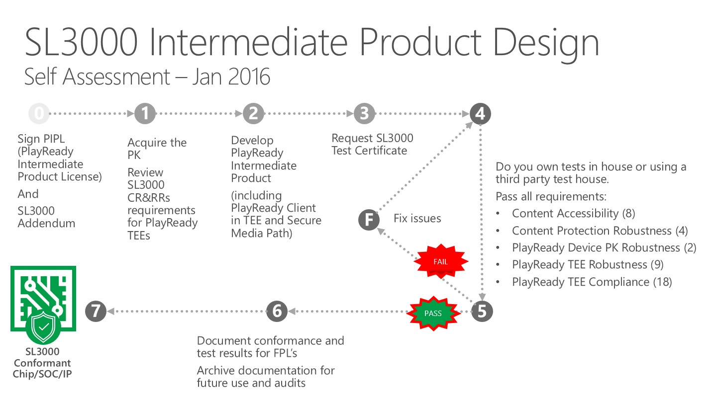
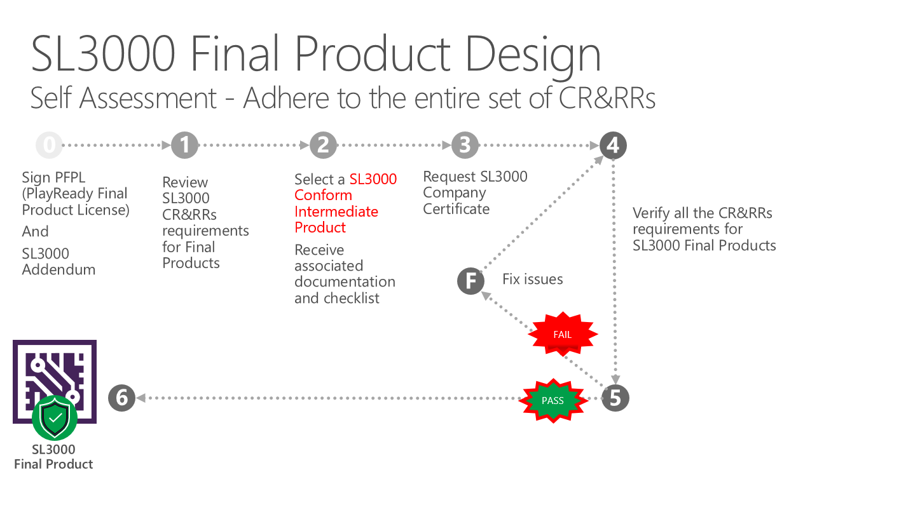
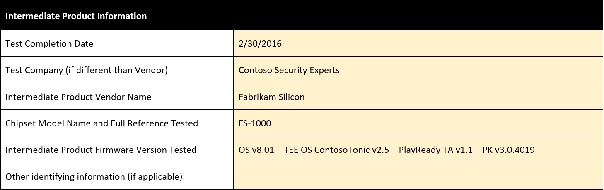

# Developing PlayReady Security Level 3000 Clients

## Introduction 

This page is intended to serve as a step-by-step guide for PlayReady Licensees seeking SL3000 Compliance for PlayReady Intermediate or Final Products. The document outlines the end-to-end process for Intermediate and Final Products and details the requirements for SL3000 Conformant Intermediate Products.

This page contains two main sections:

 - The SL3000 Design Process section outlines the end-to-end process to be followed by a PlayReady Licensee seeking SL3000 Compliance for an Intermediate Product or a PlayReady Final Product. 

 - The SL3000 Requirements section details the requirements for SL3000 Conformant Intermediate Products. It is important, and required, that IPLs verify these requirements and document this verification for FPLs in a form of “checklist”, because of the nature of the requirements: they’re deep in the hardware and the TEE, and FPLs might not always be in the capacity of verifying these requirements themselves. The provided test report or checklist is a tool to use by IPLs so FPLs know what tests were already run and passed, and can confidently do the supplemental tests that verify the entire conformity of the Final Product.

There is no such section detailing the requirements for Final Products, because FPLs make the final self-assessment of the Final Product that they distribute to end-users, and are not required to communicate their tests to anyone.

## 2. SL3000 Design Process Overview

A PlayReady Security Level is a publicly available and widely understood definition of robustness for PlayReady Products. While products may exceed the robustness requirements for a specific PlayReady Security Level, it establishes the minimum bar that must be met by a product in order to consume content requiring the defined level of protection. The [PlayReady Compliance and Robustness Rules](http://www.microsoft.com/playready/licensing/compliance/) updated in April 2015 introduce the PlayReady Security Level 3000 (SL3000), and requirements for PlayReady TEE implementations to meet the hardware security requirements for PlayReady Enhanced Content Protection. PlayReady SL3000 is designed to be sufficient to meet the security standards for a wide range of content producers, including premium Hollywood content.

PlayReady SL3000 Self-Assessment is intended to assist PlayReady Licensees in obtaining distribution rights for UHD (4K), other types of Enhanced Content (e.g. HDR, 3D, etc.), and new Enhanced Content Delivery Models (e.g., early window).

The security of a PlayReady Product depends critically on the robustness of the PlayReady implementation. A security review, including hardware and firmware, is required for Intermediate Products to qualify for SL3000. The security review is based on the SL3000 Requirements, outlined in Section 4 of this document. This security review must be documented, and the documentation communicated to companies building a Final Products based on this Intermediate Product. This security review can be conducted by a third-party test house, or by the implementer themselves (the IPL).

PlayReady Final Products are not required to be reviewed by a third-party test house to qualify for SL3000 Compliance. However, Final Products that wish to ship with an SL3000 Certificate may only do so when they meet the requirements for SL3000 Compliant Final Products.  This requires the Final Product to utilize an SL3000 Conformant Intermediate Product and conform to the SL3000 Compliance and Robustness rules. 

## 3. SL3000 Requirements for Intermediate Products

The security of a PlayReady Product depends critically on the robustness of the PlayReady implementation. As such, Microsoft has defined requirements in the [PlayReady Compliance and Robustness rules](http://www.microsoft.com/playready/licensing/compliance/) that all PlayReady Intermediate Products MUST meet or exceed before they can be distributed to Final Product Licensees. The checklist below is a tool for IPLs to document the security review they’ve run on their product before they distribute it. This security review documentation must be communicated to companies building a Final Product based on this Intermediate Product.

The requirements are broken into 5 categories: 
 1)	CA: Content Accessibility
 2)	CPR: Content Protection Robustness
 3)	PKR: PlayReady Device Porting Kit Robustness
 4)	TEER: PlayReady Trusted Execution Environment (TEE) Robustness
 5)	TEEC: PlayReady Trusted Execution Environment (TEE) Compliance

### SL3000 Requirements for Intermediate Products Test Report – Check List

| Requirement	| Underlying Rule | Title | Requirement | Testing Procedure(s) Overview & Resource Usage | Result |
| --- | --- | --- | --- | --- | --- |
| CA-1.1 | RR 2.2.1 | Product Design - TEE | PlayReady Product is clearly designed such that is uses a PlayReady Trusted Execution Environment (TEE). | Architecture Review and Code Review | - |
| CA-1.2 | RR 2.2.1 | Product Design - TEE | PlayReady Product only uses Content Protection Functions implemented by a PlayReady TEE. |  Architecture Review and Code Review | - |
| CA-2.1 | RR 2.2.2.1 | Decrypted Content | Decrypted A/V Content must not be readable or be placed outside the PlayReady Trusted Execution Environment.  Decrypted A/V Content must not be available to code running outside the PlayReady TEE | Architecture Review and Code Review. Penetration Tests under tools XYZ | - |
| CA-2.2 | RR 2.2.2.2 | Application Secrets | Application Secrets must not be available in contiguous cleartext memory except when in use to decrypt Content and/or keying material.  Application Secrets must not be available to code running outside the PlayReady Trusted Execution Environment. | Architecture Review and Code Review | - |
| CA-3 | RR 2.2.3 | Video Transmission | PlayReady Products must be clearly designed such that when the video portion of Compressed or Uncompressed decrypted A/V Content is transmitted, such data is secure from unauthorized interception using Widely Available Tools, Specialized Tools, or Professional Software Tools and can only with difficulty be intercepted using Professional Hardware Tools. The level of difficulty applicable to Professional Hardware Tools is such that a typical consumer should not be able to use Professional Hardware Tools, with or without instructions, to intercept such data without risk of serious damage to the product or personal injury. | Architecture Review and Code Review | - |
| CPR-1.1 | RR 3.1.2 | Device Secrets, Protocol Secrets, and Application Secrets | Implemented Content Protection Functions and characteristics set forth in Section 1.2.1 (Discover, reveal, and/or use without authority the Device Secrets, Protocol Secrets, and/or Application Secrets) of the PlayReady Robustness Rules: cannot be defeated or circumvented using Widely Available Tools, Specialized Tools, Professional Software Tools, or any software running outside the PlayReady Trusted Execution Environment. | Architecture Review and Code Review. Penetration Tests under tools XYZ | - |
| CPR-1.2 | RR 3.1.2 | Device Secrets, Protocol Secrets, and Application Secrets | Implemented Content Protection Functions and characteristics set forth in Section 1.2.1 (Discover, reveal, and/or use without authority the Device Secrets, Protocol Secrets, and/or Application Secrets) of the PlayReady Robustness Rules: can only with difficulty be defeated or circumvented using Professional Hardware Tools. | Architecture Review and Code Review | - |
| CPR-2.1 | RR 3.2 | Content Keys, License Integrity Keys, and Intermediate Keys | Implemented Content Protection Functions and characteristics set forth in Section 1.2.2 (Discover, reveal, and/or use without authority the Content Keys, License Integrity Keys, and/or Intermediate Keys) of the PlayReady Robustness Rules: cannot be defeated or circumvented using Widely Available Tools, Specialized Tools, Professional Software Tools, or any software running outside the PlayReady Trusted Execution Environment. | Architecture Review and Code Review | - |
| CPR-2.2 | RR 3.2 | Content Keys, License Integrity Keys, and Intermediate Keys | Implemented Content Protection Functions and characteristics set forth in Section 1.2.2 (Discover, reveal, and/or use without authority the Content Keys, License Integrity Keys, and/or Intermediate Keys) of the PlayReady Robustness Rules: can only with difficulty be defeated or circumvented using Professional Hardware Tools. | Architecture Review and Code Review. Penetration Tests under tools XYZ | - |
| CPR-3.1 | RR 3.3.2 | Root Public Keys | Implemented Content Protection Functions and characteristics set forth in Section 1.3.1 (Replace without authority the Root Public Keys) of the PlayReady Robustness Rules: cannot be defeated or circumvented using Widely Available Tools, Specialized Tools, Professional Software Tools, or any software running outside the PlayReady Trusted Execution Environment. | Architecture Review and Code Review | - |
| CPR-3.2 | RR 3.3.2 | Root Public Keys | Implemented Content Protection Functions and characteristics set forth in Section 1.3.1 (Replace without authority the Root Public Keys) of the PlayReady Robustness Rules: can only with difficulty be defeated or circumvented using Professional Hardware Tools. |  Etc. | - |
| CPR-4.1 | RR 3.4.1 | Confidential Information | Implemented Content Protection Functions and characteristics set forth in Section 1.4 (Keep Confidential) of the PlayReady Robustness Rules, wherever applicable: cannot be defeated or circumvented using Widely Available Tools. | Etc | - |
| CPR-4.2 | RR 3.4.1 | Confidential Information | Implemented Content Protection Functions and characteristics set forth in Section 1.4 (Keep Confidential) of the PlayReady Robustness Rules, wherever applicable: can only with difficulty be defeated or circumvented using Specialized Tools, Professional Software Tools, or Professional Hardware Tools. | Etc. | - |
| PKR-1.1 | RR 5.2.2.1 | Anti-Rollback Clock - Last Known Good Time | Implemented Trust Values and characteristics set forth in Section 5.1.2.8 (Last Known Good Date and Time, for PlayReady Final Products implementing an Anti-Rollback Clock) of the PlayReady Robustness Rules: cannot be modified without authority using Widely Available Tools or Specialized Tools. | Etc. | - |
| PKR-1.2 | RR 5.2.2.1 | Anti-Rollback Clock - Last Known Good Time | Implemented Trust Values and characteristics set forth in Section 5.1.2.8 (Last Known Good Date and Time, for PlayReady Final Products implementing an Anti-Rollback Clock) of the PlayReady Robustness Rules: can only with difficulty be modified without authority using Professional Software Tools or Professional Hardware Tools. | Etc. | - |
| PKR-2.1 | RR 5.2.4 | Validation State and Timer State | Implemented Trust Values and characteristics set forth in Section 5.1.2.5 (Validation State) and Section 5.1.2.6 (Timer State) of the PlayReady Robustness Rules: cannot be modified without authority using Widely Available Tools. | Etc. | - |
| PKR-2.2 | RR 5.2.4 | Validation State and Timer State | Implemented Trust Values and characteristics set forth in Section 5.1.2.5 (Validation State) and Section 5.1.2.6 (Timer State) of the PlayReady Robustness Rules: can only with difficulty be modified without authority using Specialized Tools, Professional Software Tools, or Professional Hardware Tools. | Etc. | - |
| TEER-1.1 | RR 7.2.1 | Secure Clock - Secure Clock State | Implemented Content Protection Functions and characteristics set forth in Section 7.1.2.3 (Secure Clock State, for PlayReady Final Products implementing a Secure Clock) of the PlayReady Robustness Rules: cannot be modified without authority using Widely Available Tools, Specialized Tools, Professional Software Tools, or any software running outside the Trusted Execution Environment. | Etc. | - |
| TEER-1.2 | RR 7.2.1 | Secure Clock - Secure Clock State | Implemented Content Protection Functions and characteristics set forth in Section 7.1.2.3 (Secure Clock State, for PlayReady Final Products implementing a Secure Clock) of the PlayReady Robustness Rules: can only with difficulty be modified without authority using Professional Hardware Tools. The level of difficulty applicable to Professional Hardware Tools is such that a typical consumer should not be able to use Professional Hardware Tools, with or without instructions, to modify without authority the Content Protection Functions and the characteristics set forth in Section 7.1.2.3 (Secure Clock State, for PlayReady Trusted Execution Environment Implementations implementing a Secure Clock) without risk of serious damage to the product or personal injury. | Etc. | - |
| TEER-2.1 | RR 7.2.2 | Device Secrets, Revocation Data, Timer State, Protocol Secrets, Working Set, and Output Protection State | Implemented Trust Values and characteristics set forth in Section 7.1.2.1 (Device Secrets), Section 7.1.2.4 (Revocation Data), Section 7.1.2.5 (Timer State, for PlayReady Products implementing a Secure Clock), Section 7.1.2.6 (Protocol Secrets), Section 7.1.2.8 (Working Set), and Section 7.1.2.9 (Output Protection State) of the PlayReady Robustness Rules: cannot be modified without authority using Widely Available Tools, Specialized Tools, Professional Software Tools, or any software running outside the Trusted Execution Environment. | Etc. | - |
| TEER-2.2 | RR 7.2.2 | Device Secrets, Revocation Data, Timer State, Protocol Secrets, Working Set, and Output Protection State | Implemented Trust Values and characteristics set forth in Section 7.1.2.1 (Device Secrets), Section 7.1.2.4 (Revocation Data), Section 7.1.2.5 (Timer State, for PlayReady Products implementing a Secure Clock), Section 7.1.2.6 (Protocol Secrets), Section 7.1.2.8 (Working Set), and Section 7.1.2.9 (Output Protection State) of the PlayReady Robustness Rules: can only with difficulty be modified without authority using Professional Hardware Tools. The level of difficulty applicable to Professional Hardware Tools is such that a typical consumer should not be able to use Professional Hardware Tools, with or without instructions, to modify without authority the Trust Values and characteristics set forth in Section 7.1.2.1 (Device Secrets), Section 7.1.2.4 (Revocation Data), Section 7.1.2.5 (Timer State, for PlayReady Products implementing a Secure Clock), Section 7.1.2.6 (Protocol Secrets), Section 7.1.2.8 (Working Set), and Section 7.1.2.9 (Output Protection State) without risk of serious damage to the product or personal injury. | Etc. | - |
| TEER-3.1 | RR 7.2.3 | Serial Numbers | Implemented Trust Values and characteristics set forth in Section 7.1.2.2 (Serial Number) of the PlayReady Robustness Rules: cannot be Specifically Set using Widely Available Tools, Specialized Tools, Professional Software Tools, or any software running outside the Trusted Execution Environment. | Etc. | - |
| TEER-3.2 | RR 7.2.3 | Serial Numbers | Implemented Trust Values and characteristics set forth in Section 7.1.2.2 (Serial Number) of the PlayReady Robustness Rules: can only with difficulty be Specifically Set using Professional Hardware Tools. The level of difficulty applicable to Professional Hardware Tools is such that a typical consumer should not be able to use Professional Hardware Tools, with or without instructions, to Specifically Set the Trust Values and characteristics set forth in Section 7.1.2.2 (Serial Number) without risk of serious damage to the product or personal injury. | Etc. | - |
| TEER-4.1 | RR 7.2.4 | Secure Code | Implemented Trust Values and characteristics set forth in Section 7.1.2.7 (Secure Code) of the PlayReady Robustness Rules: cannot be modified without authority using Widely Available Tools, Specialized Tools, Professional Software Tools, or any software running outside the Trusted Execution Environment. | Etc. | - |
| TEER-4.2 | RR 7.2.4 | Secure Code | Implemented Trust Values and characteristics set forth in Section 7.1.2.7 (Secure Code) of the PlayReady Robustness Rules: cannot be modified without authority due to a transition of power state, whether authorized or unauthorized. | Etc. | - |
| TEER-4.3 | RR 7.2.4 | Secure Code | Implemented Trust Values and characteristics set forth in Section 7.1.2.7 (Secure Code) of the PlayReady Robustness Rules: cannot be modified without authority due to a lack of any Required Process, including but not limited to Secure Boot Processes. | Etc. | - |
| TEER-4.4 | RR 7.2.4 | Secure Code | Implemented Trust Values and characteristics set forth in Section 7.1.2.7 (Secure Code) of the PlayReady Robustness Rules: can only with difficulty be modified without authority using Professional Hardware Tools. The level of difficulty applicable to Professional Hardware Tools is such that a typical consumer should not be able to use Professional Hardware Tools, with or without instructions, to modified without authority the Trust Values and characteristics set forth in Section 7.1.2.7 (Secure Code)  without risk of serious damage to the product or personal injury. | Etc. | - |
| TEER-5.1 | RR 7.3.1 | Secure Boot Process | Implemented required processes set forth in Section 7.1.3.1 (Secure Boot Processes) of the PlayReady Robustness Rules, including without exception their utilized data, secrets, and process flow: cannot be modified without authority using Widely Available Tools, Specialized Tools, Professional Software Tools, or any software running outside the Trusted Execution Environment. | Etc. | - |
| TEER-5.2 | RR 7.3.1 | Secure Boot Process | Implemented required processes set forth in Section 7.1.3.1 (Secure Boot Processes) of the PlayReady Robustness Rules, including without exception their utilized data, secrets, and process flow: can only with difficulty be modified without authority using Professional Hardware Tools. The level of difficulty applicable to Professional Hardware Tools is such that a typical consumer should not be able to use Professional Hardware Tools, with or without instructions, to modify without authority the Trust Values and characteristics set forth in Section 7.1.3.1 (Secure Boot Process) without risk of serious damage to the product or personal injury | Etc. | - |
| TEER-6.1 | RR 7.3.2 | Secure Update Process | Implemented required processes set forth in Section 7.1.3.2 (Secure Update Processes) of the PlayReady Robustness Rules: cannot be modified without authority using Widely Available Tools, Specialized Tools, Professional Software Tools, or any software running outside the Trusted Execution Environment. | Etc. | - |
| TEER-6.2 | RR 7.3.2 | Secure Update Process | Implemented required processes set forth in Section 7.1.3.2 (Secure Update Processes) of the PlayReady Robustness Rules: cannot be rolled back to any previous state when doing so would reduce the level of robustness of the process or any related Trust Values. | Etc. | - |
| TEER-6.3 | RR 7.3.2 | Secure Update Process | Implemented required processes set forth in Section 7.1.3.2 (Secure Update Processes) of the PlayReady Robustness Rules: can only with difficulty be modified without authority using Professional Hardware Tools. The level of difficulty applicable to Professional Hardware Tools is such that a typical consumer should not be able to use Professional Hardware Tools, with or without instructions, to modify without authority the Trust Values and characteristics set forth in Section 7.1.3.2 (Secure Update Process) without risk of serious damage to the product or personal injury | Etc. | - |
| TEER-7.1 | RR 7.4.1 | Remote Provisioning | Implemented optional processes set forth in Section 7.1.4.1 (Remote Provisioning)  of the Robustness Rules: cannot be modified without authority using Widely Available Tools, Specialized Tools, Professional Software Tools, or any software running outside the Trusted Execution Environment. | Etc. | - |
| TEER-7.2 | RR 7.4.1 | Remote Provisioning | Implemented optional processes set forth in Section 7.1.4.1 (Remote Provisioning)  of the Robustness Rules: can only with difficulty be modified without authority using Professional Hardware Tools. The level of difficulty applicable to Professional Hardware Tools is such that a typical consumer should not be able to use Professional Hardware Tools, with or without instructions, to modify without authority the Trust Values and characteristics set forth in Section 7.1.4.1 (Remote Provisioning) without risk of serious damage to the product or personal injury. | Etc. | - |
| TEER-7.3 | RR 7.4.1 | Remote Provisioning | Implemented optional processes set forth in Section 7.1.4.1 (Remote Provisioning)  of the Robustness Rules: cannot utilize Device Secrets to prove authenticity unless such Secrets are unique to the device and meet the requirements in Section 7.2.2. | Etc. | - |
| TEEC-1.1 | CR 19.2.1 | Hardware identification | PlayReady Trusted Execution Environment (TEE) supplies unique Hardware Identifier. | Etc. | - |
| TEEC-1.2 | CR 19.2.2 | Hardware identification | PlayReady TEE's Hardware Identifier is persistent across device reboots. | Etc. | - |
| TEEC-1.3 | CR 19.2.2 | Hardware identification | PlayReady TEE's Hardware Identifier is persistent across device firmware updates. | Etc. | - |
| TEEC-2.1 | CR 19.3.1 | Interface Definition | All functions of the PlayReady Interface for Trusted Execution Environments (PRiTEE) have been implemented within the PlayReady TEE. | Etc. | - |
| TEEC-2.2 | CR 19.3.1 | Interface Definition | A secure replacement implementation has been provided for any function which is documented as requiring replacement in the Microsoft Implementation. | Etc. | - |
| TEEC-2.3 | CR 19.3.3 | Interface Definition | PlayReady TEE has not changed the structure or content of method parameters defined by the PRiTEE. | Etc. | - |
| TEEC-3.1 | CR 19.3.2 | Key Material | PlayReady Product’s TEE provides a symmetric key unique to each client. | Etc. | - |
| TEEC-3.2 | CR 19.3.2 | Key Material. | PlayReady Product’s symmetric key is only accessible to code running inside the PlayReady TEE.  | Etc. | - |
| TEEC-4 | CR 19.4.1 | Required Protection Policies | PlayReady TEE has implemented Output controls, as defined in Section 3.6 (Output Controls) of the PlayReady Compliance Rules. | Etc. | - |
| TEEC-5.1 | CR 19.5.1 | Output Protection Requirements | PlayReady TEE supports all Output Control requirements found in Section 3.6 (Output Controls) of the PlayReady Compliance Rules. | Etc. | - |
| TEEC-5.2 | CR 19.5.1 | Output Protection Requirements | All output protection requirements are enforced within the PlayReady TEE regardless of the minimum License Security Level of any License being interpreted. | Etc. | - |
| TEEC-6.1 | CR 19.6.2 | Secure Clock | Secure Clock implemented within PlayReady TEE does not provide a valid time upon being reset. | Etc. | - |
| TEEC-6.2 | CR 19.6.2 | Secure Clock | Secure Clock can only be set from within the PlayReady TEE. | Etc. | - |
| TEEC-6.3 | CR 19.6.2 | Secure Clock | Secure Clock can be set on a regular basis. | Etc. | - |
| TEEC-6.4 | CR 19.6.3 | Secure Clock | PlayReady TEE reporting that is supports a Secure Clock, uses such Secure Clock to enforce license expiration. | Etc. | - |
| TEEC-7 | CR 19.8.1 | Key History | Upon updating or changing a key, PlayReady TEE is able to recover all previous keys to decrypt stored content. | Etc. | - |
