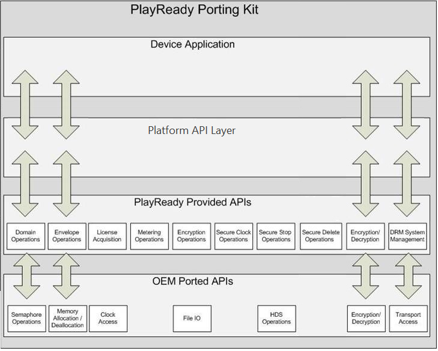

# Integrating PlayReady in Devices

This topic provides an overview of the process for a device maker to integrate a PlayReady Client with a device.

The integration of a PlayReady Client in a device is of great value. It ensures applications will have access to the best content protection on the device and make the implementation of all sorts of video and audio services on the device easier.

## Architecture

The following figure shows the PlayReady PK components and how they fit in a device software stack.

## Process for development, integration and self-certification

1. License the PlayReady Porting Kit (PK) from Microsoft.

2. Port the PK onto the platform.

    1. Compile the PK for the platform.
    2. Adapt the functionality in the OEM functions of the PK to the platform, to provide the basic services needed by the PK (memory, clock, encryption accelerators, video path, and so on).
    3. Integrate the PK with the video and audio player.
    4. Create an application that enables PlayReady operations on the device, or an API exposed in an SDK that will allow multiple application developers to use them.

3. Validate the port with respect to the Compliance and Robustness Rules requirements.

    1. Test the device towards all applicable requirements.
    2. Fix any non-conformance found. Re-test.
    3. Optionally use a third party security house or test house.

4. Prepare the device secrets (model-level Client Certificate and associated private keys, or unit-level Client Certificate provisioning service).

5. Manufacture and distribute the device to the market.

6. Quarterly, report volumes to Microsoft and pay royalties.

### Integrating a PlayReady-enabled Chip in a Device

If you are designing a device with PlayReady installed in hardware or PlayReady on an integrated circuit, it is up to you to supply any hardware or software required to port the PlayReady Device Porting kit to your hardware. Some integrated circuits designed by [PlayReady Partners](https://www.microsoft.com/playready/partners/) already have PlayReady installed on the chip, and you could use these integrated circuits while designing your device.

For general information about developing hardware-based PlayReady, see [Hardware versus software DRM](security-level.md#hardwarevssoftware).
