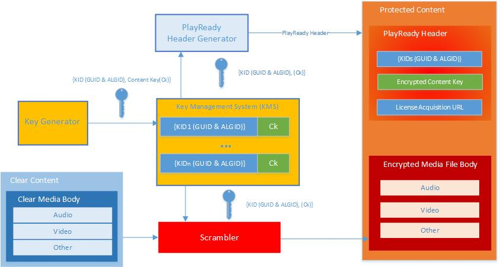

# Key and Key IDs (KIDs)


Every media file protected by PlayReady has a *PlayReady Object* (PRO), which contains several pieces of information that PlayReady needs. This is located in the file's *content header* which, for example, might also contain metadata for the video and audio tracks.


Within each PRO is a *PlayReady Header*, which gives a client the information needed to locate or acquire a license for the piece of content in which it's stored. The PlayReady Header looks something like this:

```xml

<WRMHEADER xmlns="http://schemas.microsoft.com/DRM/2007/03/PlayReadyHeader" version="4.2.0.0">
  <DATA>
    <PROTECTINFO>
      <KIDS>
        <KID ALGID="AESCTR" CHECKSUM="xNvWVxoWk04=" VALUE="0IbHou/5s0yzM80yOkKEpQ=="></KID>
        <KID ALGID="AESCTR" CHECKSUM="GnKaQIRacPU=" VALUE="/qgG2xbs4k2SKCxx6bhWqw=="></KID>
      </KIDS>
    </PROTECTINFO>
  <LA_URL>https://test.playready.microsoft.com/service/rightsmanager.asmx</LA_URL>
  </DATA>
</WRMHEADER>
```


The part that interests us is the `<KIDS>` element, which contains one or more `<KID>` elements. A KID (Key ID) contains a globally unique identifier (GUID) that the client uses to ask the Server for a corresponding key, and an ALGID, which is then used to decrypt the file. The KID is public, since it's contained in the PRO, but the key itself is a secret to the service, and the relationship between key and KID is known only to the service.


## Generate a key and encrypt the content


Content encryption keys in PlayReady systems are AES-128 CTR and AES-128 CBC keys. The service that encrypts the content generates a new KID and a new content key. The KID is inserted into the PRO, and the video and audio frames of the content are encrypted with the content key. The following image shows how a key is generated, and then used to encrypt content.

&nbsp;



&nbsp;

There are two ways to generate a KID and key, including:

   *  Using a *Key Management System* (KMS), where the service randomly generates each KID and key value and stores them, and can simply look up the key value that corresponds to the KID provided by the client. <br/>
   *  Using the *PlayReady Key Seed* mechanism. With this mechanism, the service determines a constant value called the key seed (a 30-byte random value), and for each piece of content that requires a key, generates a random KID. Using the Server SDK, you can generate a key by providing the 128 bits of the key, or the key seed and KID. The key will be inferred by a PlayReady algorithm specified [here](../Specifications/playready-key-seed.md).


No matter how you generate the key, you must be able to verify that it corresponds to the correct KID and then encrypt the content.

<a id="ID4ENC"></a>


## Deliver a license for the content


When a client makes a license request, it sends the content's PlayReady Header to the license issuer. The license issuer extracts the KID and determines the corresponding key value, using one of the methods described above&mdash;if it uses the key seed mechanism, it just regenerates the key based on the KID and key seed. Then it generates a license including this key, which it sends back to the client in a *license response*.


For example, let's say you have a video file. The packager for this content generates a random KID `123`, which it inserts into the file's PlayReady Header. The packager also generates a random key value `ABC` to correspond with the KID `123`, and stores them both in the KMS. The packager asks the KMS for the correct key to encrypt the file with, and encrypts the file with the key `ABC`. When the customer tries to play the file, the client asks the license issuer for a license that corresponds to the KID `123`. The license issuer looks up the KID in the KMS, and responds with a license including the key `ABC`, which allows the client to unlock the file, and the customer to watch it.

> [!NOTE]
> The license sent by the license issuer to the client (in our example, the license containing the key `ABC`) is encrypted; an attacker can't intercept the key value.

The key used to protect the media file and the key in the license are the same; therefore, the content packager and the license issuer must both be able to retrieve or generate the exact same key for a specified media file. To accomplish this, if you're using a key seed to generate keys, you must share it between the content packager and the license issuer.

<a id="ID4E2D"></a>


## Sharing keys between files or tracks


Just as a real key can unlock more than one door, it is technically possible to use one PlayReady key to unlock multiple tracks in one file, or even multiple files in a collection of assets. During the packaging process, the content packager can specify the same key identifier for multiple tracks or multiple media files, and the same key is used for them all.

For example, with a multi-quality video asset with 4K, HD, and SD video tracks and several audio tracks, the encryptor has the flexibility to define one key per track, or one key for all the tracks.

Clients will need a license for each of the keys that they have the right to decrypt. Note that delivering multiple licenses can be done by a License Server in a single license response.

In a single asset with multiple tracks, the decision between one key for all tracks or a key for each track is done by the service managing the content, and based on the following criteria:
  * More keys brings more complexity but allows you to specify at license delivery time what tracks the service wants to allow a particular client to decrypt.
  * Less keys is less complex but does not allow you to specify at license delivery time what tracks the service wants to allow a particular client to decrypt.
  * Some clients may have the limitation that they do not support multiple keys for a single asset.

> [!NOTE]
> While PlayReady keys can unlock more than one digital media file, Microsoft is strongly against this. Using unique keys across all files provides greater security than protecting files with the same key.


<a id="ID4EEE"></a>


## Stacking licenses in a license response


A single license response can also carry multiple licenses and thus multiple keys to unlock multiple files or tracks in one transaction. This is more efficient than creating multiple responses for multiple licenses, since it only involves one transaction. This can be useful for different scenarios:

   *  One media file is encrypted using multiple keys. For example, the video track is encrypted using Key1, and the audio track is encrypted using Key2. When a client requests a license for KID1, the License Server issues a license response including licenses for KID1 and KID2, so the client has all the keys to decrypt the video and audio tracks of the file.
   *  Each song on an album is encrypted using a different key, but a customer has acquired the rights for all of them. When the customer starts playing the first song, the License Server issues a license response including one license for each song on the album, so the client has all the keys needed to play the entire album seamlessly.
   *  The key for a channel on live TV is expected to change every 24 hours. When playback starts, the Server sends a license response including the license for the current key, but also a license with the next key, so when the key changes, the client will already have the next key and the change happens seamlessly.


<a id="ID4E4E"></a>


## See also

 [PlayReady Header Specification](../Specifications/playready-header-specification.md)

 [Packaging Content](../Packaging/packaging-content.md)

