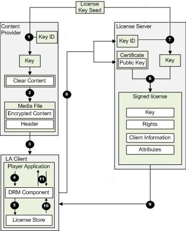
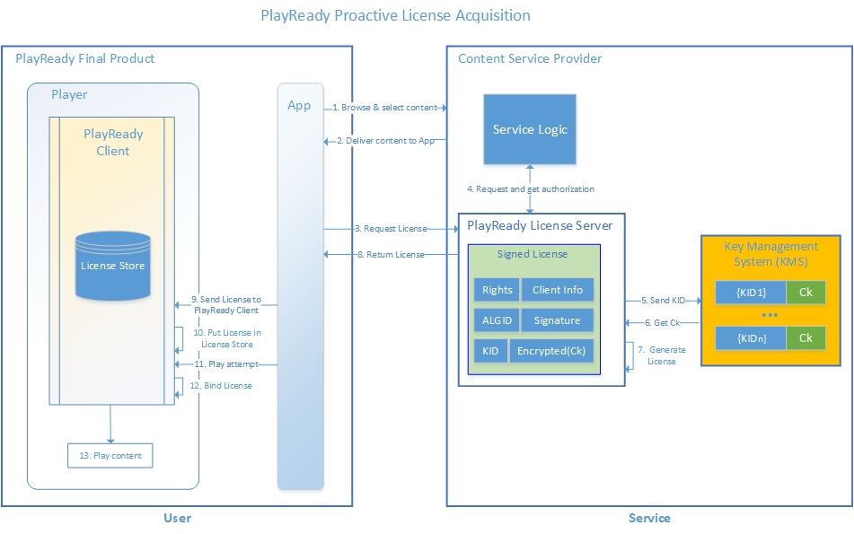
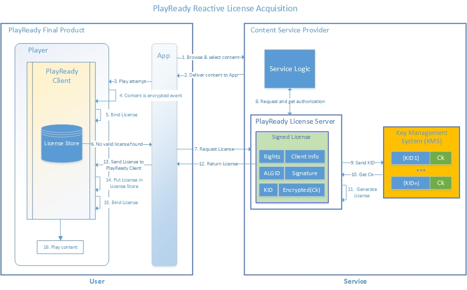

---
author:
title: License Acquisition
description: To play protected content, a valid license for the content must be available.
ms.assetid: "bfd615d3-0dfc-b261-b346-456e7aa617a5"
kindex: license acquisition, about
kindex: about, license acquisition
keywords:  about license acquisition,  license acquisition about
ms.author:
ms.topic: conceptual
ms.prod: playready
ms.technology: drm
---

# License Acquisition

To play protected content, a valid license for the content must be available. If there is no valid license for the content, the license must be acquired. During license acquisition, a client acquires its license from a license server or from a proxy server. The license acquisition client is a media player on a mobile device, such as a phone or tablet, or on a personal computer. Clients for license acquisition connect directly to a license server and request licenses for content they have acquired.

In the context of license acquisition, the license server and the packaging server are considered to be DRM servers. Portable devices and personal computers capable of license acquisition are considered to be clients.

## Server and client interactions for license acquisition

This section examines the component interactions for license acquisition.

On the server side, PlayReady Server SDK provides functionality for:

   *  License generation/issuance 

The client on the consumer's portable device or personal computer provides functionality for:

   *  License acquisition 
   *  Usage rules enforcement 
   *  Content decryption 

Domain, metering, secure stop, and secure delete support is also included with PlayReady Server SDK.

## Proactive, Reactive license acquisition

There are two modes for license acquisition:

   *  *Proactive license acquisition*&mdash;Your application explicitly creates a license acquirer and uses it to proactively acquire a license. Proactive license acquisition is typically used to acquire a root license or a persistent license.
   *  *Reactive license acquisition*&mdash;When the PlayReady media player plays back protected content that does not yet have a usable license, it automatically uses the associated license acquirer to acquire the license before resuming the playback. Reactive license acquisition can be used to acquire simple or leaf licenses (both persistent and non-persistent).

The following figure gives an architectural overview of content protection and license acquisition.

License acquisition follows these steps, as illustrated in the figure:

   1. The content provider uses a license key seed and key identifier to generate a key. 
   1. The content provider places the key identifier and the URL of the license server in the content header and then protects the file by encrypting it with the key. 
   1. The content provider delivers the protected file to the user. 
   1. The user's media player queries the DRM component of the user's device to determine whether the protected file can be played. 
   1. The DRM component searches the license store on the user's device for a valid license to play the file. 
   1. If the DRM component fails to find the necessary license, it requests a license from the license server. The license challenge used to request the license contains the content header and information about the user's device. 
   1. The license server uses the shared license key seed and the key identifier to generate the same content key that was generated by the content provider in step 1. The license server then encrypts the key. 
   1. The license server creates a license, adds the encrypted content key to the license, and signs the license by using the private signing key. 
   1. The license server delivers the signed license to the user's device. 
   1. The DRM component on the user's device verifies the signature and expiration date of the certificate, and places the license in the license store. 
   1. The DRM component decrypts packets of the requested content and sends them to the player. 

At this point, the player will have the content in a usable form. Any policy enabled by the license can be used. For example, if the license enables "play," the license acquisition client can play the content.

The following figure shows the basic steps to proactively acquire a license.

&nbsp;

&nbsp;

The following figure shows the basic steps to reactively acquire a license.

&nbsp;

&nbsp;

After a client retrieves a protected file, that client needs to acquire a license before it can perform actions that use that content. Licenses store the information necessary to access the associated content and store the rules by which that content can be accessed. Users must acquire their own licenses to play protected content, even if the protected content was copied from someone who already had a license for it. Licenses contain the encryption key to decrypt the corresponding content or, in the case of chained licenses, contain an intermediary key. Licenses also contain rights and other properties that specify the use of the content. For example, the license determines the number of times a protected file can be played, and whether the license ever expires. These properties are configured in the license separately from the protected file.

Each license contains the following information:

   *  The content encryption key.
   *  The rights and conditions of the license.
   *  Optional attributes, such as a name and description of the license.

Before a client can decrypt the content associated with a license, it must retrieve the policy from the license. The content protection information within the license is encrypted using a client's public key or a client's domain's public key encryption information. The license is considered "bound" to the client or domain that has the private key for decrypting the content protection information.

Clients acquire licenses either directly from license servers or through a proxy server.

# Transport for license acquisition
PlayReady license acquisitions all require a transaction between the client and the server:
1. A challenge generated by the client and sent to the server
2. A response generated by the server and sent to the client

Transactions typically occur on the Internet, through HTTP or HTTPS, or on a closed network. The protocol used are based on SOAP and can be customized.
They can also be implemented asynchronously, for example with a client posting somewhere the challenge, and a server processing this challenge, generating a response and posting that response in some other location.

> [!NOTE]
> PlayReady does not support, however, license broadcasting, meaning servers sending licenses to clients on a broadcast network.

