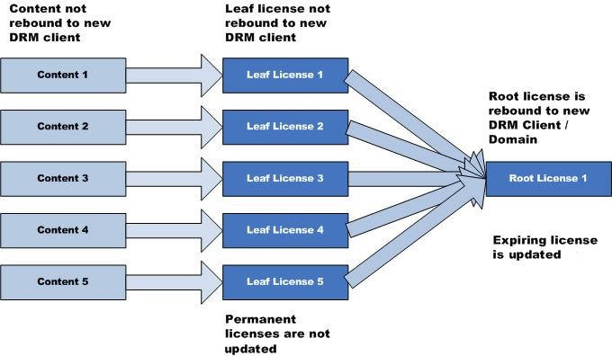

---
author:
title: License Chaining
description:
ms.assetid: "170f664b-757b-3677-c5a0-754c5f0ec08a"
kindex: license chaining, about
kindex: about, license chaining
keywords: playready license chaining,  license chaining about
ms.author:
ms.topic: conceptual
ms.prod: playready
ms.technology: drm
---

# License Chaining

A simple license is bound to the computer or device and contains the content key to unlock the content. In a license chain, the leaf license contains the content key, and the root license is bound to the computer or device. License chaining allows faster, more efficient coordination of large numbers of licenses. This is useful in any situation when a large number of content files will be downloaded, such as a music subscription service.

Although it is possible to link thousands of files to a single license, there are many reasons to use a different license for each file:

   *  Each content file may be encrypted with a different key, for greater security.

   *  Different licenses allow files to have different sets of rights and restrictions.

   *  Metering data is stored by a key identifier (KID); different licenses allow separate metering buckets.

License chaining provides the flexibility of multiple licenses and the download performance of a single license. The content is directly bound to a leaf license. The leaf license is then bound to a root license. Lastly, the root license is individually bound to each client or domain. The following figure illustrates license chaining.

License chaining improves performance in two crucial license scenarios:

   *  **Provisioning**&mdash;The initial download of content to a user machine. A license does not have to be generated when content is sent to a client. This is because the leaf license is not bound to any particular user machine and may be pre-generated and stored alongside the corresponding content files. A root license will also need to be generated for this user machine. This is a single operation, however, no matter how many content files exist.

   *  **Update**&mdash;The periodic renewal of rights. In a system where a large collection of content has to be periodically renewed, each piece of content has a leaf license with no expiration, and the root license is the only license that expires (for example, every month). In this case the root license is the only license that needs to be updated to update the rights of the entire collection of content.

