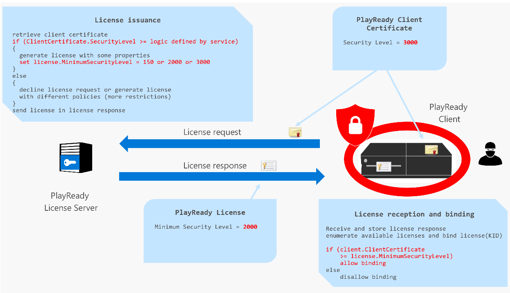

# License and Policies

During license acquisition, the client sends a challenge to the PlayReady license server containing the content header and information about the user's device. Once the challenge is received by the PlayReady license server, the server parses the challenge and begins to populate the license response. The response will include the content key (CK) originally used to encrypt the content that corresponds to the key identifier (KID) sent in the license challenge, or several of them. In addition, the license response will return the PlayReady policies (rights and restrictions) under which the content can be played. 

A PlayReady policy describes the actions permitted and/or required with respect to PlayReady content and restrictions on those actions as described in the PlayReady license associated with the PlayReady content. PlayReady policies are defined in the PlayReady Compliance Rules. The service provider must incorporate the mandatory policies and choose which of the optional policies to use, and have these policies integrated into the license handler on the PlayReady license server. These policies can be rights, such as the Play right, or restrictions, such as the Minimum Security Level, Output Protection Level, expiration after first play, and so on. 

Note that a license response may contain multiple licenses. Each license contains one and only one Content Key {KID, CK} and a set of associated policies.
 
When the client receives the license response from the PlayReady license server, it must be able to parse the content key and the policies sent back in the licenses it receives. The PlayReady client must be able to follow the policies sent in the license response and play back content if all the mandatory policies are met, or halt play back if any of the mandatory policies are not met. 

>[!NOTE]
>If the client supports PlayReady Device Porting Kit v3.0 and higher, the PlayReady license server will not provide a license that requires the Copy, Execute, or Read rights.

For more information about PlayReady policies, see the [PlayReady Compliance Rules](https://www.microsoft.com/playready/licensing/compliance/) and the [Defined Terms for PlayReady Compliance and Robustness Rules](https://www.microsoft.com/playready/licensing/compliance/). 

## PlayReady Rights

The following PlayReady rights are listed in the PlayReady Compliance Rules:

  *  Play right (see CR 3.1): right for a client to decrypt PlayReady Audio/Video content (movies and music), render it, and pass it to Outputs. 
  *  Execute right (see CR 4.1): right for a client to decrypt PlayReady Executable content (applications), and execute it. No longer supported in PlayReady 3.0 and later. 
  *  Read right (see CR 5.1): right for a client to decrypt PlayReady Literary content (ebooks), and display it. No longer supported in PlayReady 3.0 and later. 

## Right Restrictions and other Policies

The PlayReady Compliance Rules contain a full list of right modifiers (extensions and restrictions) that may apply to the license. Each of these modifiers has multiple properties:
 
  *  **Action**&mdash;specifies the action of the policy (for example, engage HDCP encryption on the HDMI output). 
  *  **Optional**&mdash;specifies if the client must engage the action or must try to engage the action (for example, Output Control for Uncompressed Digital Video Content 250, see CR 3.6.5).
  *  **Must Understand**&mdash;specifies if a client is allowed to bind a license and decrypt content even if it does not understand the policy. Applicable for clients of a lower version (for example, a PlayReady 2.X client) receiving a license including PlayReady policy introduced in a future version (for example, a PlayReady 3.X server, see CR 2.4).
  *  **Best Effort**&mdash;another way to specify if the client must engage the action or must try to engage the action (for example, Macrovision Best Effort, see CR 2.4).

  The following sections list some of the more commonly used right modifiers.
  
  ### Absolute Expiration Policy
  
One of the common restrictions is the absolute time date expiration policy. Every license may include an absolute time date expiration policy. If it is present, the client must stop binding this license and decrypting content if the current date time is after that value.

A practical example is a user on a client playing content from a monthly subscription service. The monthly renewal day of the service for this user is the 15th of the month. The user starts playback on the 2nd of the month (the 2nd of November, 2017). The license server will give right to the user until the 15th of the month, and include an Expiration policy set to 11/16/2017, 0:00am. Whenever the user pays the subscription fee for the next month, the service will issue another license with an Expiration date set one month later. 

This policy is by definition a Must Understand and Mandatory (meaning, not Best Effort) policy, so a client that binds a license that does include this policy MUST: 

  *  Have a PlayReady Trusted Clock System to have a trusted time. A PlayReady Secure Clock or a PlayReady Anti-Rollback Clock are two acceptable forms of PlayReady Trusted Clock Systems for PlayReady Clients.
  *  Have this PlayReady Trusted Clock set.
  *  Be able to parse and understand the Expiration policy in the license.
  *  Compare the current time from the PlayReady Trusted Clock System with the Epxiration value.
  *  Not bind the license if the current time is past the Expiration value. 
 
>[!NOTE]
>Whenever a license server sets an Absolute Expiration policy in a license, Microsoft strongly recommendeds that a Begin Date policy also be set, for Robustness Reasons. See [Best Practices for License Policies](bestpractices.md) for more details.

### Begin Date Policy 

Another common restriction is the begin date policy. If it is present, the client must not bind this license and begin decrypting content until the current date time is after that value.

For busines models that require content to be used only for a limited amount of time, such as in a rental scenario, an end date is required to indicate when the license expires and the content can no longer be played (for example, the content can only be played until 5pm EST, May 15, 2018). This is sufficient for a rental scenario. However, specifying a begin date with the end date is a natural impedence to clock rollback attacks.

This policy is by definition a Must Understand and Mandatory (meaning, not Best Effort) policy, so a client that binds a license that does include this policy MUST: 

  *  Have a PlayReady Trusted Clock System to have a trusted time. A PlayReady Secure Clock or a PlayReady Anti-Rollback Clock are two acceptable forms of PlayReady Trusted Clock Systems for PlayReady Clients.
  *  Have this PlayReady Trusted Clock set.
  *  Be able to parse and understand the Begin Date policy in the license.
  *  Compare the current time from the PlayReady Trusted Clock System with the Begin Date value.
  *  Not bind the license if the current time is before the Begin Time value.
  
For more information, see [Using BeginDate with EndDate](bestpractices.md#begindate) 

### Expiration After First Play Policy 

Besides scenarios in which content can be played back depending on a begin time and end time, there is also the model that specifies how long content can be played back after the content is first played. The expiration after first play policy, if present, indicates that the client must stop binding this license and decrypting content if the current number of seconds after the content was first played matches the value in this policy. 

### Security Level Policy

PlayReady clients all have a property set in their Unit-level Client Certificate called the Client Security Level. This security level indicates how robust the client is with respect to attacks for unauthorized use, for example attacks to record the decrypted A/V content with authorization, or attacks to access or modify the client secrets (Client Certificate associated Private Keys) or content secrets (Content Keys stored in the device).

The Client Security Level is a property set by the design of the client, and there is nothing the server can do to modify or increase it. 

When a license server sends a license to a client, it includes in the license the MinimumSecurityLevel policy and sets its value to 150, 2000, or 3000. This value means that the license can be bound and content can be decrypted only on clients that have this Security Level, or a higher one.

Typically, a license server will know at the time of the license response generation if the client is an SL150, SL2000, or SL3000 client. The server will provide licenses with a MinimumSecurityLevel set to the value of the client, making sure it gives licenses only for the keys that it has approved sending to this class of clients. For example, a content owner may have given instructions to a service provider that this particular movie, which is early windows content (that is, a movie that is released in video on demand (VOD) at the same time, or little after the theatrical release), can be played only on SL3000 clients (because a leak of the movie at this time has a much more dramatic impact on the monetization of the movie). SL2000 clients will not be allowed to access it. 

### Output Control for Uncompressed Digital Video Content Policy 

A service may want to allow a client to decrypt and render content, but restrict how it flows to external outputs, like HDMI outputs. The service may want to do this because there might be recorders plugged to the HDMI cable, capable of making a very good copy of the original content.

PlayReady has all sorts of Output Protection controls for analog, digital, and wireless outputs. One of the most common is the HDCP policy for HDMI outputs (see CR 3.6.5). Depending on the value the license server sets for this policy, which may be 100, 250, 270, 300 (see CR 6.7), the client must try to engage, or must engage HDCP on the HDMI outputs when playing back on these outputs. 

For example, if the license includes an Output Control for Uncompressed Digital Video Content set to 300 (also known as Digital Video OPL 300), the client MUST engage HDCP on the HDMI output when playing content. If the client cannot engage HDCP (any version) on an HDMI output, it has two options: 

  *  Play content and block this output. For example, play on an internal screen or on an analog output, but block the signal on the HDMI output. 
  *  Just not play the content. If the device has an internal screen, an analog output, and an HDMI output, blocking the playback on all outputs just because the device can’t engage HDCP on the HDMI output would certainly be a suboptimal user experience. The user may ask “why does it not play on the analog output although the restriction only applies to the HDMI output?”. However, this option is acceptable from a PlayReady Compliance perspective as it fulfills the CR&RRs.

Note that HDCP Type 1 is supported starting with HDCP version 2.1, so engaging HDCP Type 1 won’t be possible on devices that support only HDCP 2.0 or 1.4.

## XMR Specification 

PlayReady licensed companies have access to a more comprehensive documentation package that includes the *PlayReady Extensible Media Rights (XMR) Specification* that describes precisely each of these policies and the way they’re coded in a license. 

## See Also

[Licenses Restricted by Binding Policy](licensesrestrictedbybindingpolicy.md)

[Licenses Restricted by Extensible Policy](licensesrestrictedbyextensiblepolicy.md)