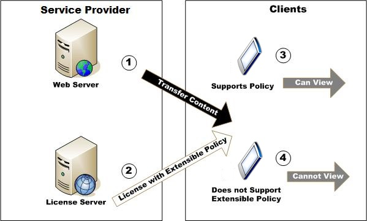

---
author:
title: Licenses Restricted by Extensible Policy
description: The Extensible Media Rights (XMR) system is a binary system used to convey media usage rights and restrictions.
ms.assetid: "5fc141a7-025e-32d9-7879-ce481c29eaaa"
kindex: licenses, restricted by extensible policy
kindex: restrictions, licenses restricted by extensible policy
kindex: extensible policies, licenses restricted by
kindex: policies, licenses restricted by extensible policy
keywords:  restricted by extensible policy licenses,  licenses restricted by extensible policy restrictions,  licenses restricted by extensible policies,  licenses restricted by extensible policy policies
ms.author:
ms.topic: conceptual
ms.prod: playready
ms.technology: drm
---

# Licenses Restricted by Extensible Policy

The Extensible Media Rights (XMR) system is a binary system used to convey media usage rights and restrictions. PlayReady enables support for extending the existing XMR policy system to create special policies that are applicable to specific subsets of the PlayReady ecosystem. These policies are application enforced, and application implementers must elect to enable support for extensible policies. Extensible policies add flexibility for both application developers and for content owners.

Extensible policies are designed so that content owners can create a policy that is supported only by applications that are capable of enforcing a specific policy. This content and policy may be transferred to any client but only work on devices capable of enforcing that extensible policy. For example, a policy can be created that requires content to be played in a specific time zone. Devices that can identify their time zone from GPS information can enforce this policy and can therefore implement support for this. However, devices that don't have support for this policy must ignore such policies, while continuing to parse any data following the unknown object type. Ignoring unknown objects and continuing to parse is important for allowing extensibility while maintaining backward compatibility.

The following figure illustrates this example.

In the figure, at points 1 and 2, the Web server and license server transfer content and a license that require an extensible policy to one client that supports the extensible policy and another that does not. At point 3 the first client attempts to use the policy to consume the content. When it encounters the extensible policy, it checks its system to verify that the policy is being properly enforced. After the policy is verified, the client displays the content. At point 4, the client that does not support the extensible policy opens the license, and identifies that it cannot enforce the policy. The client then discards the content and policy because it cannot view it.

