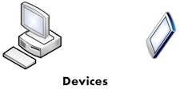
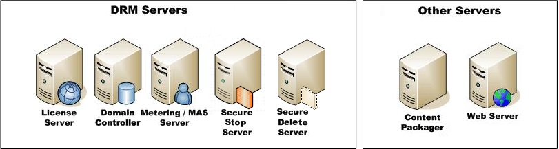
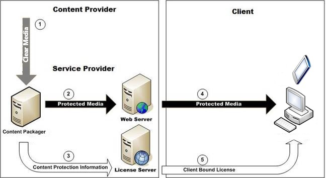

# Microsoft PlayReady Ecosystem
   
  
Clients and servers are the two main components in the PlayReady ecosystem. These components communicate using protocols specified by Microsoft. Content is protected by a content packaging service using PlayReady, then transferred to clients that decrypt the content by using information stored in a license. The information in this section serves as a primer to the PlayReady concepts that are provided as scenarios in [Common PlayReady Scenarios](commonplayreadyscenarios.md).  
 

   

## PlayReady clients  
   
  
PlayReady clients are devices capable of playing back protected content when given a license for that content (such as media player programs on personal computers or applications on devices such as cell phones, tablets, and smart TVs). Clients also must be able to enforce the rights and restrictions associated with a policy included in a license.   
   
  
The following figure shows the icons used throughout this document that symbolize devices used as PlayReady clients.  
   
  
  
  

   

## PlayReady servers  
   
  
Customized application servers enable interoperation with the clients. Service providers use the PlayReady Server Software Development Kit (SDK) to build servers with service-specific business logic. For example, a subscription service would customize servers to have a service-specific license. The license might include expiration times and license issuance restrictions that tie to a specific data backend that has subscriber information. By using the PlayReady Server SDK, the customized server builder can be confident the service will protect content and issue licenses that work with PlayReady system clients.  
   
  
PlayReady servers include license servers, domain controllers, metering servers, secure stop servers, and secure delete servers. In addition to the PlayReady servers, you may also have a content packager to encrypt and encode your content, as well as a Web server to distribute the content on the Web. The following figure shows the icons used throughout this document to represent the different servers.  
   
  
  

> [!NOTE]   
> Content is stored and distributed using Web servers, but PlayReady products do not include or require a specialized Web server for content storage and distribution.  
  

   

## Content and license flow  
   
  
In PlayReady systems, a content packing service encrypts content and stores it on a Web server. That content is then transferred to clients that acquire content decryption information from a license server. The following figure depicts content and license flow for license acquisition (LA). Gray arrows indicate unlicensed content transfers and content transfers with a license. Black arrows indicate protected content transfer without a license, and white arrows indicate license transfer.  
   
  
  
   
  
The following steps describe the content and license flow for license acquisition shown in the previous figure:  
 
   1. A content provider packages unprotected content by using either third party software or the PlayReady Server SDK. 
  
   1. When the content is packaged, the content provider copies the protected content to a content distribution server/system. 
  
   1. The content provider transfers the license information to a license server. 
  
   1. A client then will acquire the protected content.
  
   1. When the client attempts to play the content, the header indicates that the client needs to acquire a license. The client then performs license acquisition from a license server.  

   
  
For more information about license acquisition, see [License Acquisition](licenseacquisition.md). 

The PlayReady encryption and licensing process is more fully explained in [Basic encryption and licensing process](basicpurposeofplayready.md#basicprocess).
  
