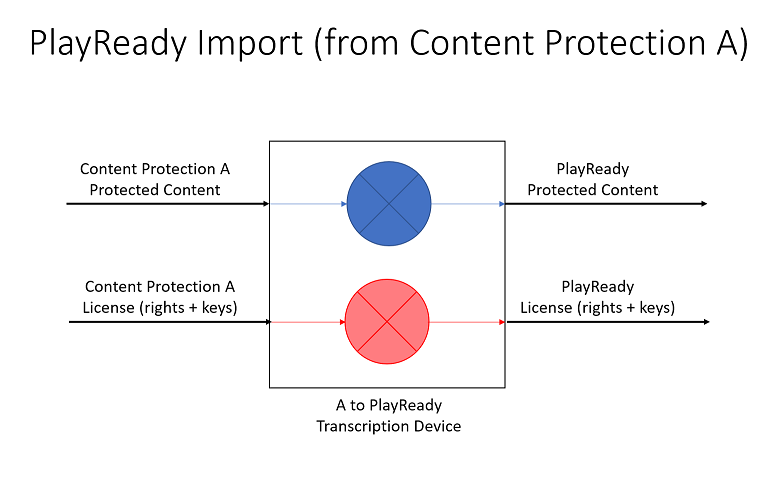

---
author:
title: "PlayReady and Other Protection Technologies"
description: ""
ms.assetid: "4bd6d175-18c2-1014-3762-73379579bbc5"
kindex: content, about moving PlayReady
kindex: moving, about PlayReady content
kindex: about, moving PlayReady content
kindex: PlayEnabler, moving PlayReady content
keywords:  PlayRedy and other protection technologies
ms.author:
ms.topic: conceptual
ms.prod: playready
ms.technology: drm
---

# PlayReady and Other Protection Technologies

PlayReady systems are able to interoperate with other content protection systems through the following features discussed in this topic:  

   *  Common Encryption

   *  Play Enablers

   *  Copy Enablers (supported in PlayReady 1.X and 2.X only)

   *  Move Enablers (supported in PlayReady 1.X and 2.X only)

   *  Import and Export

## Common Encryption

A service provider may encrypt a content file once with a content key (CK) and deliver this CK to different clients using different content protection technologies. By doing this, a single protected asset can be served a set of heterogenous clients, which saves storage and content delivery network (CDN) cost compared to a system where specific protected content is served to each type of client. 
 
Let's take the example of a service delivering protected content to PlayReady clients (first content protection technology) and to DRM B clients (second content protection technology). The content is a fragmented MP4 file (fMP4, ISOBMFF) or an adaptive streaming asset based on fragmented MP4 files (such as DASH, Smooth Streaming, or HLS), and the encryption format used is the ISO/IEC 23001-7:2016 Standard. 
 
Here is the content flow in the overall system: 

1.  First, the service generates a content key (CK)&mdash;typically a AES 128 bit key, and an encryption mode, typically AESCTR or AESCBC, plain or partial&mdash;and a key identifier (KID, typically a 128-bit **GUID**).

2.  The service packages the clear file: 

    a.  Encrypts the video and audio frames using CK and outputs the protected file.

    b.  Generates a PlayReady Header including the KID, based on the PlayReady specifications, and includes it in the header of the protected file.

    c.  Generates a DRM B Header, based on DRM B specifications, and includes it in the header of the protected file.

3.  The service delivers the protected file to the PlayReady client:

    a.  The PlayReady client parses the protected content and discovers the PlayReady Header (among other headers).

    b.  The PlayReady client uses the PlayReady Header information to request a license from the service's PlayReady license server, which returns a license containing the CK.

    c.   The PlayReady client uses the CK to decrypt the protected content and render it.

4.  The service delivers the protected file to the DRM B client:

    a.  The DRM B client parses the protected content, discovers the DRM B Header (among other headers).

    b.  The DRM B client uses the DRM B Header information to request a license from the service's DRM B license server, which returns a license containing the CK.

    c.  The DRM B client uses the CK to decrypt the protected content and render it.
    
For additional information about the MPEG Common Encryption Standard, see: 

   *  [MPEG Common Encryption](https://en.wikipedia.org/wiki/MPEG_Common_Encryption)
   *  [ISO Common Encryption ('cenc') Protection Scheme for ISO Base Media File Format Stream Format](https://w3c.github.io/encrypted-media/format-registry/stream/mp4.html)
   *  [ISO Common Encryption EME Stream Format and Initialization Data](https://www.w3.org/TR/2014/WD-encrypted-media-20140828/cenc-format.html)

> [!NOTE]
> This mechanism can be extended to content encrypted with multiple keys, for example, in multi-track or multi-quality content where different tracks are encrypted with different content keys, or in content where content keys are changed periodically (rotating keys). 
    

## Play enablers  

A **PlayEnabler** represents a technology that content from a PlayReady client is allowed to play to. For example: 

   *  A client playing PlayReady-protected content and passing the audio/video to an AirPlay receiver, using the AirPlay link protection.
   *  A client playing PlayReady-protected content and passing the audio/video to Unknown Output.
   *  A client playing PlayReady-protected content and passing the audio/video to a network receiver, protected using DTCP-IP.

A Play Enabler object is an optional right that a license may contain, if it's set by the service provider when creating the license. If it is present, the client is allowed to play and pass the audio/video signal to the corresponding output. Note that a Play Enabler involves an Export operation if passing to the corresponding output requires transcription (that is, PlayReady decryption and re-encryption with a different encryption key and format). 

## Copy Enablers

A **CopyEnabler**  represents a technology that content from a PlayReady client is allowed to copy to.

> [!NOTE]
> This is not the operation of copying PlayReady protected content from one location to another, which does not require any right. This is the operation of copying the protected content AND the right or license to play it.

 

For example, a PlayReady client may decrypt PlayReady content to re-encrypt it using CSS and burn a video DVD. This operation makes a copy of the content (the original PlayReady protect content file still exist on the device, but a copy has been created in a DVD), and involves transcription (PlayReady decryption and CSS re-encryption).

A Copy Enabler object is an optional right that a license may contain. If it is present, the client is allowed to copy the content to the corresponding format and storage. Note that a Copy Enabler involves an Export operation if making the corresponding copy requires transcription (that is, PlayReady decryption and re-encryption with a different encryption key and format). 

> [!NOTE]
> Copy Enablers were supported up to PlayReady 2.X. They are no longer supported by clients 3.0 and above.

## Move Enablers

A **MoveEnabler** represents a technology that content from a PlayReady client is allowed to move to.

> [!NOTE]
> This is not the operation of moving PlayReady protected content from one location to another, which does not require any right. This is the operation of moving the protected content AND the right or license to play it.

For example, a PlayReady client may decrypt PlayReady content to re-encrypt it using CPRM and store it onto a CPRM enabled drive, then deleting the original PlayReady protected content and license. This operation moves the content (the original PlayReady protect content file no longer exist on the device, but a copy has been created on the Content Protection for Recordable Media (CPRM)-enabled drive), and involves transcription (PlayReady decryption and CSS re-encryption). 

A Move Enabler object is an optional right that a license may contain. If it is present, the client is allowed to move the content to the corresponding format and storage. Note that a Move Enabler involves an Export operation if making the corresponding destination format requires transcription (that is, PlayReady decryption and re-encryption with a different encryption key and format). 

> [!NOTE]
> Move Enablers were supported up to PlayReady 2.X. They are no longer supported by clients 3.0 and above.

## Import and Export

Some system of devices may change the format of the protected content AND its associated license from one Content Protection Technology to another. This operation is either called import or export. In general, such an operation much be explicitly allowed by the exporting technology (A) to occur.

 

PlayReady Import designates an operation where content is initially protected using a Content Protection A technology and then protected using PlayReady, typically in a transcriptor. What it means is the encryption keys of the protected content are protected in a Content Protection A license when they get in the device, and are protected in a PlayReady license when they get out of that device. It may involve transcrypting the content (decrypting the content, and re-encrypting the content using different keys), or simply repackaging the encryption keys from the Content Protection A license format to the PlayReady license format. It may also involve transcribing the rights and right restrictions from Content Protection X technology to PlayReady XMR. 

 

PlayReady Export designates an operation where content is initially protected using PlayReady and then protected using Content Protection Y technology, typically in a transcryptor. PlayReady does not allow exporting protected content by default, but allows some export through explicit optional rights set in the license, known as Play Enablers, Copy Enablers and Move Enablers.

For example, a user uses a computer to acquire subscription content that is protected with PlayReady and then wants to stream that content to a playback device on a network that only supports DTCP-IP. To play the content protected with PlayReady on that device, the protected content must be exported to DTCP-IP. 

To enable this scenario, PlayReady Server SDK allows developers to specify additional content protection formats for export in an inclusive list. This inclusive list is created per license by adding **GUID**s that correspond to the permitted content protection formats (adding **GUID**s to the inclusive list is accomplished with the **PlayEnabler** class). These **GUID**s and their associated rights mappings are defined in the PlayReady Server SDK Compliance Rules that accompanied your license agreement from Microsoft. The client sending content may only export the content to those content protection systems specified in the license inclusive list. 

 

