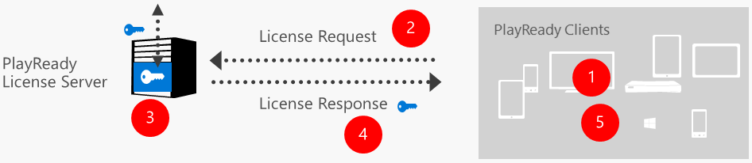
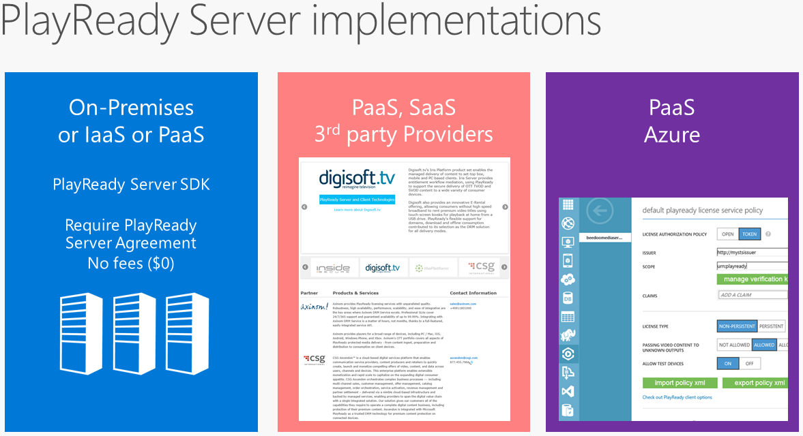

# PlayReady License Services
   
The process of obtaining a license to play back PlayReady protected content is handled by a PlayReady license server. The PlayReady server contains the handler that authorizes playback of PlayReady protected client. It does this by providing the encryption key that unlocks the encrypted content that the client requests to play. In addition, the PlayReady license server response contains the rights and rights restrictions for that content. 

The following figure shows the steps that describe how a client gets a license from a PlayReady license service.

  1.  The client obtains media to be played back.
  2.  The client initiates a license request from the PlayReady license service. The client can either proactively request the license before playing back the content, or reactively request the license once it discovers a license is required after playback begins.
  3.  The PlayReady license server receives the request from the client and processes the license request.
  4.  The PlayReady license server sends the response to the request back to the client. The license response will contain the key to unlock the encrypted media, along with a set of rights and rights restrictions that specify exactly what can be played back.
  5.  The client receives the license response, parses the rights and rights restrictions, and begins playback.

You are not required to develop and deploy your own PlayReady license service. You can obtain these services from a third party, such as a [PlayReady Partner](https://www.microsoft.com/playready/partners/). However, if you do decide to develop your own PlayReady license service, Microsoft provides the PlayReady Server Software Development Kit (SDK) free of charge to those who want to program their own PlayReady license server. Note that a PlayReady license server only runs on Windows Server. 

A PlayReady license server can be developed and deployed in numerous ways:

  *  Develop the license server yourself or through a third party.
  *  Operate the license server yourself or through an application service provider (ASP).
  *  Deploy on the premises, in a private cloud, or in a public cloud.

PlayReady Server SDK provides the following functionality for license servers:

  *  Technology integrates on any network infrastructure (proxies and so on).
  *  Technology integrates with any web service or logic.
  *  Delivered as Windows Server libraries, plus C# code in the SDK. Includes sample handlers in source code.

