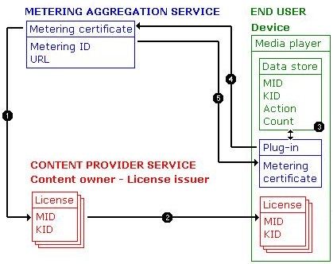

# PlayReady Metering
   
  
*Metering* is the process for counting the number of times content is played. Metering is important because it allows a subscription content service provider to offer content on this basis. For example, in North America, if a song is transferred to a "blind" system, in which there will be no monitoring of the usage, a "mechanical royalty" of approximately 8 cents per song is required. On the other hand, if the licensee monitors content usage and reports it, the licensee pays a reduced mechanical royalty of 1 cent for each *play*. This can make a significant difference during transfers of large catalogs of music (for example, 10,000 songs). Even extremely heavy music-listening is likely to generate only 2,000 plays per month ($20 in royalties), whereas the mechanical royalty for these 10,000 songs would have been $800. There is therefore an economic incentive to "meter" content under this circumstance.  
 

   

## Metering architecture  
   
  
Metered content uses a license with a metering identifier (MID) to track content usage. When content with a metered license is played, it updates entries in the metering store. The license contains the MID, and this allows the information to be grouped by MID. Usage data is grouped by the key identifier (KID)&mdash;if there is a different KID for each content file, each usage of that file is reported. Metering is turned on once for an entire license. At that point, every right will increment a separate entry in the store. Metering can be enabled on any device.
   
  
To perform metering, a device transmits its metering data to a metering aggregation server. Furthermore, the media player application may perform additional scheduling calculations to restrict metering reporting cycles to regular intervals, such as every two weeks.  
   
  
The following figure illustrates the basic metering architecture.  
   
  
  
   
  
The metering process performs the following steps, as illustrated in the figure:  
 
   1. The metering aggregation service provides the license issuer a metering certificate, which contains a metering identifier and a URL indicating where metering data will be reported. Then the license issuer includes the MID in the licenses for content that requires metering. 
  
   1. End users acquire this content and receive a license for that content, through the standard license acquisition process.
  
   1. A media player on a device opens this content license. The DRM component of the media player records metering data, which includes a tally of the number of times the content is used, the type of action performed, and the metering identifier.

      > [!NOTE]
      > When recording metering data, the media player uses the license key identifier to tally the counted actions. So to track metering information for individual content items, you must protect each content item using a unique key identifier.  

   1. A metering plug-in or application on the device periodically requests metering data for a specific metering identifier and then sends the data to the corresponding metering aggregation service.
  
      This metering data can be decrypted only by the metering aggregation service that owns the metering certificate containing this metering identifier.
  
      For example, suppose a user subscribes to two music services and downloads metered content from each. The metering plug-in for one of the services requests metering data for its metering identifier. Only metering data for that identifier is gathered, and then it is sent to the corresponding metering aggregation service.
  
      A transaction identifier is created at this time for the items that are reported.
  
   1. After the metering aggregation service receives and processes the metering data, the service returns a response to the media player, prompting the player to clear the metering data that was reported. The transaction identifier is saved until a reporting transaction has been completed. If the process of reporting metering data is interrupted, the transaction identifier identifies which data to resend, thereby ensuring that a transaction is complete before clearing the data store.  

  

   

## Metering certificate acquisition  
   
  
PlayReady incorporates a protocol to get the metering certificate from the license server.  
  

   

## Initiators  
   
  
PlayReady follows the principles of service orientation, in that a service is a passive piece of code you interact with through messages. As such, services wait for incoming messages before doing any work. Clients are the "initiators" that send messages to services to request work. The communication between server and client is then orchestrated through "endpoints" that the server exposes. These endpoints have three main properties:  
 
   *  An address that signifies where messages are sent
  
   *  A binding that defines how to send the message
  
   *  The contract that describes what the message contains  

  

   

## Collecting and updating metering information  
   
  
Each license for metered content contains a metering identifier (MID). Each time the device uses this license (for example, by playing the content), the metering section of the data store is updated by incrementing the metered count for the action just performed; this update occurs at the same time that secure store operations are updated. Data for each type of metered action is stored separately.  
   
  
The device periodically reports its metering data to the metering aggregation service. This information is collected for every metered action for a given MID in the metering store. Periodically, the player on the device initiates the process of reporting the metering data and receives a metering certificate in the request for a metering challenge. This metering certificate contains the MID and the URL of the corresponding metering aggregation service. The device creates a metering challenge for the MID and sends the challenge to the metering aggregation service URL. For example, suppose a user subscribes to two music services and downloads metered content from each. The metering data would be reported using two metering challenges. After this transaction, the device must clear and reset the metering store on the device for all the items that were reported in the metering challenge.  
   
  
The device encrypts the metering challenge with the public key of the metering certificate and signs the challenge.  
   
  
The metering aggregation service decrypts the metering challenge with the private key of the metering certificate; this value is known only to the metering aggregation service. It then returns a metering response to the device.  
   
  
The device processes the response, which indicates the MIDs for which to clear and reset the data store.  
  
