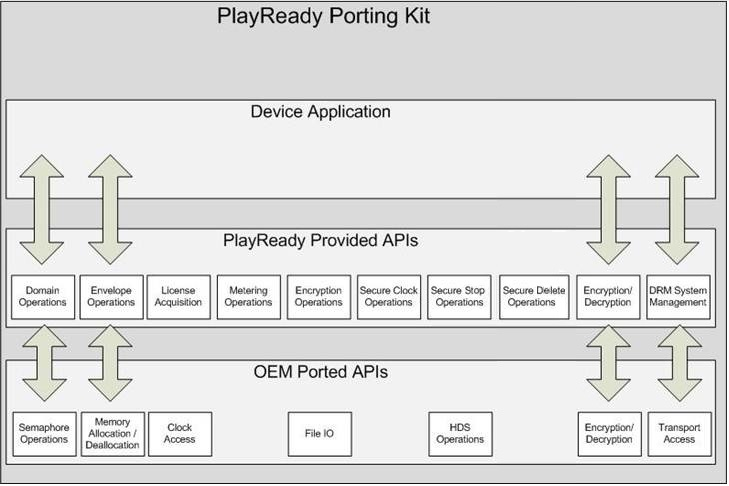

# PlayReady Device Porting Kit
   
  
PlayReady Device Porting Kit (Device PK) contains ANSI C source code designed to help developers create portable devices for use with digital content that was protected with PlayReady technology. With this porting kit, PlayReady technology can then be translated to a wide variety of system architectures using different operating system environments and various device classes such as mobile phones, set-top boxes, and portable media players.  
   
  
PlayReady Device Porting Kit provides features you can use to enable your hardware devices to render protected digital content. The porting kit is a non-optimized, platform-independent, source-code implementation of a PlayReady client.  
   
  
The porting kit supports license acquisition from a license server. The porting kit also supports metering, PlayReady domains, non-A/V content protection and extraction, secure stop, and a secure clock.   
   
  
PlayReady Device Porting Kit is for integrated circuit (IC) vendors and original equipment manufacturers (OEMs) who want to implement PlayReady on operating systems other than Windows, on various processors, and in consumer electronics devices. The PlayReady API is written in C (not C++) and conforms to the ANSI C standards to maintain compatibility with most platform compilers.  
 

   

## Features  
   
  
The porting kit provides the following features:  
 
   *  License acquisition.
  
   *  Metering.
  
   *  Domain join and leave for devices.
  
   *  Secure Stop.   

   *  Secure clock/anti-rollback clock.   

   *  Chained licenses.   

   *  Scalable licenses (for live linear TV with key rotation).   

   *  ANSI C code simplifies integration on embedded devices.  

  

   

## Components  
   
  
The porting kit includes the following components:  
 
   *  The source code form of PlayReady.
  
   *  Applicable test certificate.
  
   *  Specifications and associated documentation and libraries in object code form.
  
   *  Test media.
  

  

   

## Architecture  
   
  
The following figure shows the PlayReady PK architecture components that Microsoft provides with the porting kit.  
   
  
  
   
  
When building a device based on PlayReady Device Porting Kit, a device builder will adapt the functionality in the OEM APIs in order to enable the functionality that Microsoft provides in the PlayReady APIs. Once these APIs are implemented, the device builder can create an application that enables PlayReady operations on the portable device.  
  
