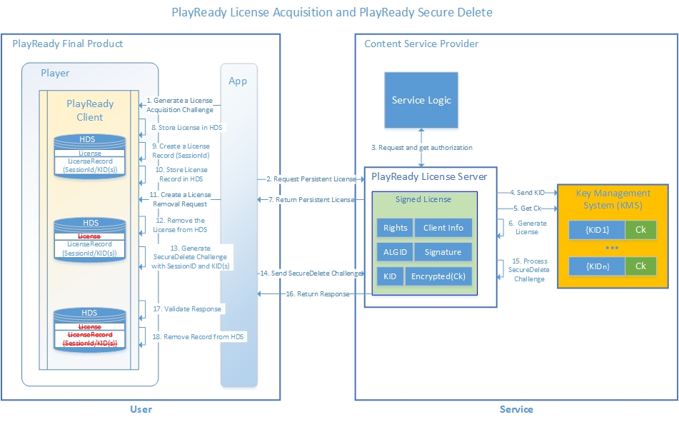

---
author:
title: "PlayReady Secure Delete"
description: "The PlayReady Secure Delete feature allows service providers to receive secure acknowledgement when a persistent license is deleted by the app on the client."
ms.assetid: "012a9779-4bc0-450f-a1ec-ef93c9d25a8e"
kindex: license, Secure Delete
kindex: processing, Secure Delete
kindex: delete, secure
keywords: Secure Delete, Secure Delete license
ms.author:
ms.topic: conceptual
ms.prod: playready
ms.technology: drm
---

# PlayReady Secure Delete

Introduced in PlayReady version 4.0, *PlayReady Secure Delete* is a feature that allows service providers to receive secure acknowledgement when a persistent license is deleted by the application on the client. Previously, when a license was deleted, service providers were not notified when deletion was completed. With PlayReady Secure Delete, the following operations are possible.

* Service providers can track which licenses are currently stored and which licenses have been deleted, on a given client machine.
* Service providers can issue a specific number of persistent licenses to a client, and track the count of licenses on that client’s machine.
* The Secure Delete feature also satisfies the [Encrypted Media Extensions (EME) specification](http://www.w3.org/TR/encrypted-media/) requirement as defined in September 2017, which specifies that a record of license deletion must be sent to the server upon license deletion.

## Secure Delete scenario

The following figure illustrates a Secure Delete flow.

Before Secure Delete occurs, the application or client first instantiates a PlayReady Content Decryption Module (CDM) and acquires a persistent license from the server (Steps 1-7 in the figure above).

Next, PlayReady stores the license in the data store (HDS, Hashed Data Storage), along with a record of the license session blob, which is composed of a session identifier (SessionId) and one or more key identifiers (KIDs). When the application or client initiates a license deletion request, it will call the appropriate APIs to remove the license(s) associated with the KID from the data store. During a non-Secure Delete license removal process, PlayReady removes the license(s) from the data store without further action. Using Secure Delete, PlayReady not only removes the license(s) associated with the KID from the data store, but also generates a Secure Delete challenge that contains the SessionId and KID(s) (Steps 12-13 in the figure above).

The application or client then sends the Secure Delete challenge to the Secure Delete server, which then processes the challenge. 

After processing the Secure Delete challenge, the Secure Delete server sends an un-encrypted, unsigned Secure Delete response that contains a base 64 encoded SessionId to the application (or client).

Finally, once the client receives the Secure Delete response, PlayReady validates that the SessionId contained in the Secure Delete response matches the SessionId that was used to generate the Secure Delete challenge. If the validation is successful, PlayReady removes the record of the license session from the data store.

