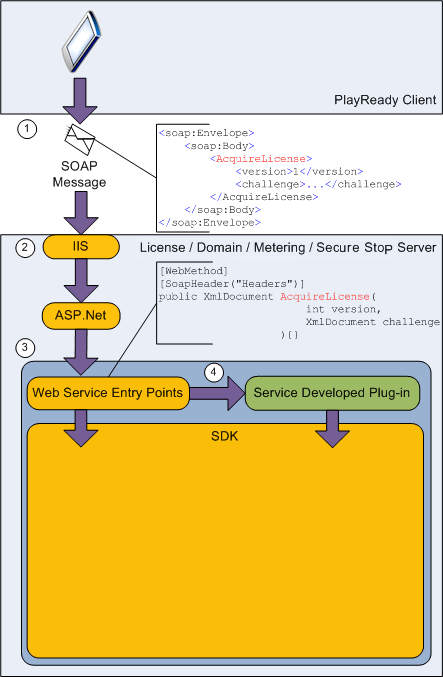

# PlayReady Server SDK
   
  
PlayReady Server Software Development Kit (SDK) is a collection of APIs that make it easier for developers to create PlayReady license delivery, domain, metering, secure stop, and secure delete services.  
 

   

## Features  
   
  
PlayReady Server SDK:  
 
   *  Provides licensing support (issuance and acknowledgement).
  
   *  Updates the metering certificate acquisition protocols.
  
   *  Provides support for joining and leaving PlayReady domains.
  
   *  Provides metering support.
  
   *  Provides secure stop support.

   *  Provides secure delete support.
  
   *  Includes .Net based development.
  

  

   

## Components  
   
  
PlayReady Server SDK includes the following components:  
 
   *  Libraries and interfaces for accessing the PlayReady Server SDK features.
  
   *  Documentation and specifications for related technologies.
  
   *  Whitepapers for server builders.
  
   *  Content packaging tools.
  

  

   

## Architecture  
   
  
The following figure shows how the PlayReady Server SDK components interact in the PlayReady Server SDK architecture.  
   
  
  
   
  
As shown in the figure, a PlayReady client interacts with PlayReady Server SDK by following these steps:  
 
   1. The client sends a SOAP message to the server to initiate an operation. 
  
   1. The SOAP message passes through the Internet Information Services (IIS) and ASP.net components to reach a Web service entry point. 
  
   1. The Web service entry point then processes the call, processes the data, and triggers the service plug-in. 
  
   1. The service-specific application logic (implemented by the service provider) is encapsulated in a service developed plug-in.  

   
  
Service-specific application logic typically is either going to be identification information or business logic. Service information includes the service identifier (service ID) and the license acquisition URL associated with licenses (these settings are service-specific). Also specified in the plug-in is business logic associated with the service such as the policy that is associated with issued licenses.  
   
  
Service providers can implement their own services by using PlayReady Server SDK and offer individualized, unique license-issuing scenarios. For example, consider two services, Contoso and Fabrikam. Each service provider needs to provide separate identifiers for its services and each supports different policies. The Contoso service could build a license issuance service that issues licenses that point to its <http://contoso.com> license servers, and the Contoso service could issue licenses that expire after three months. The Fabrikam service can implement its own service that issues licenses that point to its <http://fabrikam.com> license servers and that expire in one month.   
   
  
PlayReady Server SDK enables various scenarios that are based on the following protocols:  
 
   *  Domain join
  
   *  Domain leave
  
   *  Acquire license
  
   *  Acknowledge license
  
   *  Process metering data
  
   *  Get metering certificate

   *  Process Secure Stop data

   *  Process Secure Delete data
  

  
