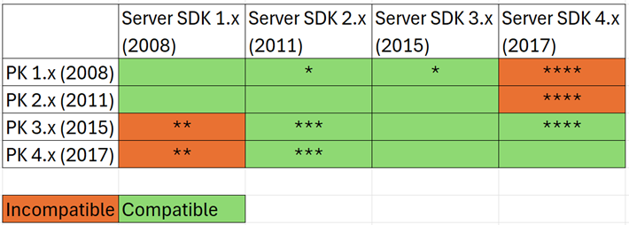

# PlayReady Product Versions

The following table shows the feature availability for each version of the PlayReady products.

&nbsp;
> [!div class="mx-tdBreakAll"]
> |Release date| Version |What's new| PlayReady Server SDK (.NET Legacy)| PlayReady Server SDK (.NET Core)| PlayReady Device Porting Kit| PlayReady Certificate Generation Kit| PlayReady PC SDK for Windows 7 Desktop Apps |
> |:--- |:---|:---|:---|:---|:---|:---|:---|
> |Jun'08|**1.0** | Initial version | 1.0.1105| &mdash;| 1.0.1130|1.0.1130|1.1|
> |Oct'08|**1.2** | [Embedded Licenses](embedded-licenses.md) | 1.2.1404 | &mdash;| 1.2.1404|1.2.1404|1.2|
> |May'09|**1.3** | [Specifications section](../Specifications/specifications.md) | &mdash; | &mdash;|&mdash;| &mdash; |1.3|
> |Apr'10|**1.5** | Common Encryption Smooth Streaming | 1.5.4018| &mdash;| &mdash; | 1.5| No further enhancements |
> |Sep'10|**1.5.2** | Security improvements | 1.5.4094| &mdash;| &mdash;| &mdash; | &mdash; |
> |Sep'11|**2.0** | - Live TV with Key Rotation through Scalable Embedded Licenses - Silverlight Client Verification | 2.0.1402 | &mdash;| 2.0.1402 | 2.0.1402| &mdash; |
> |Apr'12|**2.1** | - PlayEnablers for additional policies - License Template Handler| 2.1.1444| &mdash;| &mdash;| &mdash; | &mdash; |
> |Dec'12|**2.5** | - PlayReady-Network Device (PlayReady-ND)| &mdash; | &mdash;| 2.5.1789 | 2.5.1778| &mdash; |
> |Nov'13|**2.9** | - LicenseTemplateHandlerChaining sample - Support for iOS and Android| 2.9.1995| &mdash;| &mdash;| &mdash; | &mdash; |
> |May'14|**2.11** | - MPEG-DASH - Updated PlayReady-ND test transmitter - Updates to PlayReady Client SDK for iOS - Updates to PlayReady Client SDK for Android| &mdash; | &mdash;| 2.11.2155| &mdash; | &mdash; |
> |Mar'15|**3.0** | - SL3000 - Multiple Keys - [Secure Stop](secure-stop-Server.md) - Improvements for non-persistent licenses|3.0| &mdash;|  3.0.4019 | 3.0.2726 | &mdash; |
> |Sep'16|**3.2** | [Secure Time](../Features/trusted-clocks.md) (Secure Clock Service in the TEE)|&mdash;| &mdash;|3.2.4242| 3.2.4242 | Deprecated |
> |Apr'17|**3.3** | - New CDMi module - Fix for vulnerabilities in the PK header parser |&mdash;| &mdash;|3.3.4474| 3.3.4475 | &mdash;|
> |Oct'17|**4.0**| - Expanded support for multiple Common Encryption Modes, 'cbcs' supported in addition to 'cenc'. - [Secure Delete](secure-delete-Server.md) support | 4.0.5117 | &mdash;| 4.0.5102 | 4.0.5102| No longer distributed (see [PlayReady on Windows](playready-on-windows.md))|
> |Feb'19|**4.2**| - See [What's New in PlayReady Version 4.2](what-is-new/what-is-new-4-2.md) | 4.2.5545 | &mdash;| 4.2.5545 | &mdash; | &mdash; |
> |Aug'19|**4.3**| - See [What's New in PlayReady Version 4.3](what-is-new/what-is-new-4-3.md) | 4.3.5841 | 4.3.5841 | &mdash;  | &mdash; | &mdash; |
> |May'20|**4.4**| - See [What's New in PlayReady Version 4.4](what-is-new/what-is-new-4-4.md) | 4.4.6621 | 4.4.6621 | 4.4.6621 | &mdash; | &mdash; |
> |Oct'21|**4.5**| - See [What's New in PlayReady Version 4.5](what-is-new/what-is-new-4-5.md) | 4.5.7218 | 4.5.7218 | 4.5.7220 | &mdash; | &mdash; |
> |Dec'22|**4.6**| - See [What's New in PlayReady Version 4.6](what-is-new/what-is-new-4-6.md) | 4.6.7668 | 4.6.7604 | 4.6.7673 | &mdash; | &mdash; |
> |Oct'24|**4.6**| Required Release, culmination of numerous features and security updates over several releases | 4.6.7674 | 4.6.7607 | &mdash; | &mdash; | &mdash; |

## Porting Kit Version Compatibility with Server SDK Versions

PlayReady license services maintain backward compatibility for legacy PlayReady devices. For example, a new license service developed with the PlayReady Server SDK 4.0 can deliver licenses to a legacy device that was developed using the PlayReady Device Porting Kit (PK) 1.2 from its initial release (2008).  

There are, however, some nuances in compatibility as services and devices move into the PlayReady 3.0 and higher releases. PlayReady Clients developed with the 3.0 and higher Device Porting Kit cannot obtain licenses from a license service built prior to the 2011 release of the Server SDK 2.0. Services running earlier versions of the Server SDK will need to upgrade to be compatible with PlayReady 3.0 and higher. 

### PlayReady Compatibility Matrix  

Most versions of PlayReady on the client can work with the different versions of the PlayReady Server SDK. There are some subtleties as noted below as well as a change with PlayReady clients developed on the 4.0 Device Porting Kit. 

The following table lists the compatibility between the various PlayReady Device Porting Kit and PlayReady Server SDK versions:

| &nbsp; | &nbsp; |
|--------|--------|
| \* | Some PK 1.2 clients did not support revocation which is required in Server SDK 2.x+. This is not common. |
| \** | PK 3.0 and higher clients cannot use a Server SDK prior to version 2.0 to get a media playback license.|
| \*** | PK 3.0 and higher clients can use license servers using a 2.X SDK, but can only obtain a license with a SL2000 security level. In addition, new features, such as support for version 4.2 headers (multiple keys) and policies such as Secure Stop and MaxResDecode, are not available when creating a license. There have been issues with chained licenses (root/leaf) on some PK 3.0 clients with Server SDK 2.0. Services will need to test clients to validate compatibility. There are a set of scenarios at the end of this document that can assist in testing. |
| \**** |As of PK 4.0 license responses are no longer signed if they don't contain persistent licenses. This causes failure of playback for the client versions before PK 3.3 which require signatures. In order to remediate this, licensees can use two options. (1) Client apps can opt out of the persistent signature check by passing DRM_PROCESS_LIC_RESPONSE_SIGNATURE_NOT_REQUIRED to Drm_LicenseAcq_ProcessResponse. (2) License server can add another “dummy” persistent license to the response.|

Microsoft recommends that customers running older Server SDK versions upgrade to the latest version of the Server SDK. This will ensure that you are on the supported path.
