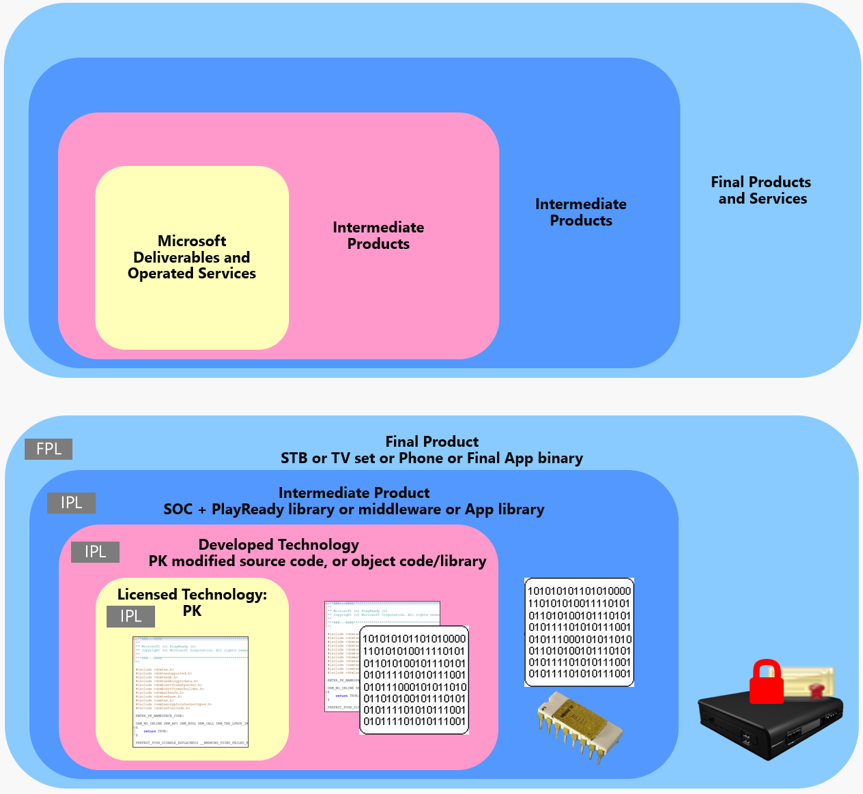

# PlayReady Products, Deliverables and Services

PlayReady is a very versatile technology that is designed to allow the development of clients on virtually any processor, any platform, any operating system (OS), and any environment, and develop and deploy clients by the licensees or their partners, whether they are "System on a Chip" (SOC) vendors, third party developers, original design manufacturers (ODMs), or original equipment manufacturers (OEMs). A common scenario is an SOC vendor preparing the PlayReady library for their processor XYZ, and the OEMs passing this library from the SOC vendor and the certificates they received from Microsoft to their ODM, to manufacture and distribute a device that includes an operational PlayReady Client.

Likewise, on the Server side, PlayReady is very flexible to allow the development and deployment of Servers in different types of environments (native Windows Server system, private cloud, public cloud, hybrid cloud), different types of architecture (combined with the service logic, distant from the service logic), and using partnerships. A service provider may use the PlayReady Server SDK received from Microsoft to prototype, but use a third party company to develop their License Server logic, and use another company to operate it, in a public cloud infrastructure.

PlayReady Customers, whether they are service providers, device makers, or application developers, are not required to develop either their PlayReady Client or Server themselves. Instead, they may obtain these services or products from third-party developers, that we refer to as PlayReady partners.

This section discusses the parts of PlayReady that are supplied by Microsoft and the parts that can be developed and deployed by the customers themselves, or their third party partners.

Here is a figurative view of these levels of product integration, and its translation to a PlayReady Client Product:

 
 

## In this section

[PlayReady Server SDK](Server-sdk.md)

[PlayReady Server on Azure](Server-on-azure.md)

[PlayReady Device Porting Kit](device-porting-kit.md)

[PlayReady on Windows](playready-on-windows.md)

[PlayReady on Xbox](playready-on-xbox.md)

[PlayReady and Silverlight](silverlight.md)

[PlayReady Product Versions](product-versions.md)

[License to Use PlayReady](license-to-use-playready.md)

[PlayReady Compliance and Robustness Rules](compliance-and-robustness-rules.md)

[PlayReady Certificates and Certificate Authority](certificates.md)

[PlayReady Secure Clock Services](secure-clock-services.md)

[PlayReady Test Server](test-Server.md)
