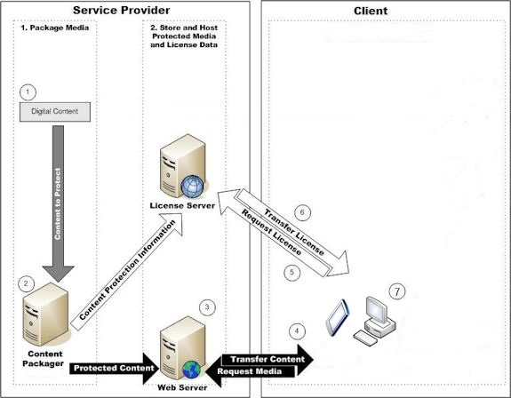

# Scenario: Purchased Content

In the purchased content scenario, a content owner sells media to consumers using an online media store. Online media stores can include thousands of movies or millions of songs available for sale, and they can serve hundreds of thousands of customers. In current examples, license acquisition occurs between the content provider's store interface, built using the PlayReady Server SDK.

The following figure illustrates how the various components interact in a purchased content scenario.

 

The purchased content scenario performs the following steps:

   1. The service provider transfers unprotected content to the content packager.

   1. The content packager protects the file by using an encryption format that is compatible with PlayReady (for example, MPEG Common Encryption CENC CTR).

      This "packaged" file may then be distributed using a variety of methods.

   1. The content provider distributes content by using Web Servers or other transfer mechanisms.

      When distributing protected content, the content owner must use License Servers to indicate rights to be included in licenses issued for the content. These rules (and information needed to determine the content key) are given to a License Server, which then has all the information necessary to create licenses for that content.

   1. On the consumer/media consumer side, users browse the content store and download or stream content using their devices. The Client determines when protected content requires a license.

   1. The Client then sends a license request to a License Server.

   1. Based on specific business rules, the License Server issues a license for that particular piece of content. The License Server may require customer identification or payment before issuing a license. The license contains the content key, which allows the Client's media player to access the content.

   1. The user can play the content, according to the conditions specified in the license.

The figure above illustrates either a download-and-play model or a streaming model. Other scenarios would lead to a slightly different illustration. For example, live streaming would perform the packaging/encryption in real-time in step 2.

Optionally, purchased content can be shared across devices using domains and embedded licenses. For more information, see [PlayReady Domains](domain-Server.md) and [Embedded Licenses](embedded-licenses.md).

For content that was purchased to own, users expect the content to play indefinitely on their devices. Services would most likely issue licenses for this content with no expiration at all. However, because users change devices frequently, and because each device may change its PlayReady identity some time (when a re-individualization is run, or when a device is completely reinstalled), services should be ready at any time to re-issue licenses for purchased content that was previously delivered to a user or a device.
