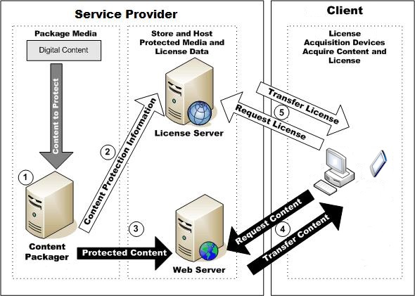

---
author:
title: Scenario Rental Content
description:
ms.assetid: "30da1be6-dfdc-d98e-261b-cc86c7e6da02"
kindex: scenarios, rental content
kindex: rental content scenario
kindex: streaming, rental content
kindex: download and play, rental content
keywords:  rental content scenarios, rental content scenario,  rental content streaming,  rental content download and play
ms.author:
ms.topic: conceptual
ms.prod: playready
ms.technology: drm
---

# Scenario: Rental Content

In rental content, the license delivered for the content specifies an expiration date and time. After this date and time occurs, the content may still be on the user's device, and the license may still also be persisting in the user's device's data store, but the PlayReady client in the user's device will use the device's clock system to verify if the license is still valid, and enforce the expiration set by the service in the license.

In addition, it is a recommended good practice to set a begin date and time (typically the date and time that the user paid for the content). This will help protect the system in some cases where the user would be able to roll back the clock of their device.

An alternative is for the service to provide a limitation in the license in terms of a time span that indicates when the license will expire after the first play. This allows the service provider to issue a license that could begin at some time in the future, expire at a specified time, and/or expire after a specified duration, after the content is first played.

A typical example would be:

   *  A user rents content on Friday, November 11, 2016 at 8 PM.

   *  The license delivered to the user includes the following restrictions:

      *  Right&mdash;Play

      *  Begin Time&mdash;November 11, 2016 at 8 PM

      *  Expiration Time&mdash;December 11, 2016 at 8PM

      *  Expiration After First Play&mdash;48 hours

Because rental content generally requires start and expiration times, the client will be required to support some type of PlayReady trusted clock. For more information, see [Trusted Clocks](trusted-clocks.md).

The following figure indicates the interactions between clients and servers in the rental content scenario.

 

The rental content scenario performs the following steps, as illustrated in the figure:

   1. Content that will be distributed to clients is protected with Microsoft PlayReady technology.

   1. The service provider transfers content protection information to a license server.

   1. The service provider transfers protected content to a server for distribution over the Web.

   1. A client requests content for streaming or download.

   1. The client acquires a license and either begins streaming or downloading the content from the content server using an Internet protocol such as SSTP, DASH, HLS, or HTTP. While the client is streaming or downloading the content, it can decrypt the content and the decrypted content can be continuously played back.

The most common delivery mechanisms for rental content is to stream the protected content from a Web service, or to download the content onto a local device and then play the content.

## Streaming rental content

When streaming rental media, content continuously plays back while it's being transferred from the Web server. The following technical aspects should be considered when implementing rental content that is streamed to user devices.

   *  PlayReady supports many kinds of protocols. There is no restriction for any protocol. However, clients usually support one or many of the following standards: SSTP (Smooth Streaming, DASH, HLS). In addition to these protocols, it is perfectly acceptable and doable for a service that controls both its backend and clients to implement a different protocol, for example multicast TS on a closed network.

   *  The format of the content is typically H264 + AAC, or H265 + AAC, but all other codecs are allowed by PlayReady. However, for some of them the service may have to build the tools.

   *  Streaming rental content can use either a persistent or non-persistent license.

      The most obvious case would be non-persistent licenses. Non-persistent licenses are stored in volatile memory (RAM) and only last for as long as the current session. Non-persistent licenses are well adapted to the streaming scenario, because for streaming, the device has to be connected anyway, and can afford acquiring a non-persistent license just in time at the time of playback.

      A non-persistent license that is pre-acquired will also shorten the time to first frame. For more information, see [License Generation and Issuance](license-persistence.md).

      Another way to optimize the time to first frame when streaming rental content is to leverage "PlayReady Limited Duration Licenses." While the user is presented a page with a list of videos to select, licenses with a very small duration are pre-acquired in the background (typically thirty seconds). These licenses include the restriction "Real Time Expiration," which ensure that the client will actually stop playing back with this license after thirty seconds. Then the user can select one of the listed videos to play. At this time, playback can start immediately. The player requests a full rental license (for 48 hours) for the video selected by the user, and the player then seamlessly binds to the rental license while playing back. This optimization is possible on PlayReady version 3.0 or later clients, which support real time expiration and non-persistent license delivery in batches.

   *  It is possible to use persistent licenses for streaming scenarios as well. Persistent licenses are stored in non-volatile memory (in the local data store) and last for the lifetime of the store or until a time-based restriction is reached.

## Download and play rental content

Rental content can also be downloaded to the client before playback can begin. Typically this is done to achieve a constant quality of the content not correlated with the network quality, but may require some delay before the playback can actually start.

The following technical aspects should be considered when implementing rental content that is downloaded and played.

   *  The content may be downloaded as a simple file through HTTP, if the content is already authored in the right format for the device. Another option is that the client retrieves the successive fragments of an adaptive streaming asset over the streaming protocol (SSTP, DASH, HLS, other) and packs them all on the device's local storage for further play back, in the form of a single fragmented file or a collection of fragment files. The latter allows more sophisticated scenarios like late binding, which is the ability for a client to select different tracks based on its preferences. For example, pick one video quality among multiple qualities, one particular audio track, or a subtitle track, independent of the initial content authoring on the backend.

   *  Download and play rental content can also use either a persistent or non-persistent license. Typically, a predelivery persistent license would be preferred.

   *  When using persistent licenses, the device may occasionally need to remove licenses from the data store after their expiration.

   *  Like all persistent licenses that include an expiration date, they should also include a begin date that helps prevent some user attacks against the device's trusted clock system.

