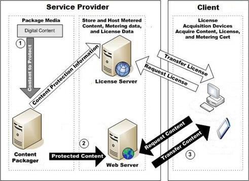

---
author:
title: "Scenario: Subscription Content"
description: ""
ms.assetid: "635ac0f9-99cd-365d-3349-f1fd12d2f408"
kindex: scenarios, subscription content
kindex: subscription content scenario
kindex: streaming, subscription content
kindex: download and play, subscription content
keywords:  subscription content scenarios, subscription content scenario,  subscription content streaming,  subscription content download and play
ms.author:
ms.topic: conceptual
ms.prod: playready
ms.technology: drm
---

# Scenario: Subscription Content

Microsoft PlayReady enables scenarios in which a content owner sells subscriptions to a catalog of music or video using an online media store.

Because a PlayReady server doesn't include any business logic but can, however, be linked to any business logic backend (through web services), the delivery of PlayReady licenses for subscription content can be the same as for rental content. So, the client will request individual licenses for each piece of content (video, music) that has to be played.

Note that the service can deliver multiple licenses in one single license response for optimization purposes. For example,in a scenario where the client is playing an episode of a series, the client requests a license for the episode one when the user selects that video. The service may want to deliver licenses for all the episodes of the series at once in order to lower the gap between episodes. Delivering multiple licenses is even more beneficial for music when playing multiple tracks without any gaps.

In a subscription model where a large number of content pieces are played (for example, in a music service where the user downloads thousands of tracks to play offline), the client has to manage thousands of different licenses, one for each content. Because this is a subscription service (for example, it requires a monthly renewal), the licenses that are delivered have an expiration at the renewal date of the monthly subscription, and the user expects all the licenses to be renewed when the monthly fee is paid again.

To optimize this scenario, the service should use chained licenses. Each piece of content is bound to a unique leaf license. All leaf licenses are bound to the same root license. The leaf licenses do not have beginning and expiration times, but the root license has these beginning and expiration times. Therefore, only the root license must be reacquired upon subscription renewal. A leaf license may be metered because mechanical royalties (pay per play) tend to be lower when content play counts are monitored. Additionally, devices that play subscription content must support a PlayReady trusted clock to enforce the subscription policy associated with playback licenses. For more information, see [License Chaining](licensechaining.md).

 

The subscription content scenario performs the following steps, as illustrated in the figure.

   1. The service provider transfers unprotected content to the content packaging server.

      The service provider configures the content for metering and transfers the license to the license server.

   1. The service provider transfers protected content to a Web server for distribution. If the subscription service uses metering, the client must acquire a metering certificate before playing back content.

   1. When the client is ready, it can acquire subscription content and a license that expires when the subscription ends.

   1. The client reports metering data to the metering aggregation server for royalty payments.

The most common delivery mechanisms for subscription content is to stream the protected content from a Web service, or to download the content onto a local device and then play the content.

## Streaming subscription content

In a subscription scenario, where the subscription allows a certain maximum number of concurrent streams (for example, three streams), the service may want to leverage PlayReady Secure Stop to enforce this number.

With adaptive streaming protocols over HTTP, the stream is HTTP cached and the streaming origin server gets all the streaming requests. As a consequence, it is non-trivial for the service to count how many clients currently play one stream.

PlayReady Secure Stop solves this problem. PlayReady Secure Stop allows a service to be notified when a client stops playing a stream. Combined with non-persistent licenses, which allow the service to be notified when a client start playing a stream, it allows the service to count in real time how many clients play a stream, or a collection of streams, under a particular account, and enforce this number.

## Download and play subscription content

The following technical aspects should be considered when implementing subscription content that is downloaded and played.

   *  Like rental or any other scenario, downloading a piece of content before playing back allows a constant quality of content not correlated with the network quality, but may require some delay before the playback can actually start. For example, if the network bandwidth is typically between 2 Mbps and 5 Mbps, averaging 4 Mbps, and the user pays for a full high definition (HD) stream at 4 Mbps, the only way to ensure a constant high quality is to pre-download the content. Progressive download allows the client to start downloading the content, then start playing back before the download is complete. In the above example, a prebuffering of 5 minutes may be enough to ensure the expected quality during playback.

   *  Other advantages of download delivery is to allow content consumption in environments with zero or low connectivity (for example, subways, commuter trains, airplanes, and so on).

   *  Services that want to do content push may want to leverage PlayReady metering. PlayReady metering allows a service to deliver a persistent license and get notified afterwards if the content has actually been played. Based on this information, the service can push content to a device and pay content owners, or invoice users, based on their actual consumption. Typically, this functionality would be helpful in the following scenario:

      1. A user has a subscription for a video service.

      1. The user starts watching episode 1 of a TV series.

      1. The service pushes episodes 2, 3, and 4 to the device (the device application downloads these episodes, and the associated persistent licenses).

      1. The user gets disconnected in the subway.

      1. The user plays episodes 2 and 3.

      1. The user gets reconnected.

      1. The service gets notified that the user played episodes 1, 2, and 3, but not episode 4.

