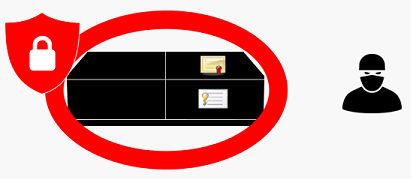
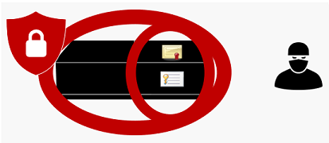

# Security Level
The Security Level is a property of a PlayReady Client, and every license delivered to a client has a property indicating the minimum Security Level required from a client to allow binding to this license.

## The Security Level of a Client

The PlayReady Client Security Level is a property of the client (device or application) that defines how robust the client is against unauthorized use. The higher the Security Level is, the more robust the client has claimed to be.

PlayReady currently defines three levels:

|Security Level|Purpose|Client Implementation|Version|
| --- | --- | --- | --- |
|SL150|For clients under development or under test. 
Not suitable for commercial content in a commercial scenario.|Any implementation is acceptable. Assets, Client Secrets, or Content Secrets are not protected at all against unauthorized use.|Any|
|SL2000|For hardened devices and applications consuming commercial content.|For devices and applications.
Assets, Client Secrets, or Content Secrets are protected through software or hardware means.|Any|
|SL3000|For hardened devices with the highest security consuming the highest quality of commercial content.|For devices only.
Assets, Client Secrets, and Content Secrets are protected through hardware means, using a Trusted Execution Environment (TEE) of the processor. Conformant to a superset of the Compliance and Robustness requirements.|PlayReady 3.0 or higher|

 
Illustration of a SL2000 device or application. The Final Product is hardened and verified against unauthorized use.

Illustration of a SL3000 device. The Intermediate Product is hardened and verified using a TEE, and the Final Product is hardened and verified against unauthorized use.

## Hardware-DRM versus Software-DRM
SL2000 Clients are commonly referred to as "Software-DRM" Clients, because their robustness is backed mostly with software means.
SL3000 Clients are commonly referred to as "Hardware-DRM" Clients, because the core functionalities of their PlayReady stack must be implemented in a Trusted Execution Environment (TEE) of the processor, and backed by hardware means.

Increasingly, content providers are moving towards hardware-based protections for granting permission to play back full high value content in apps. Robust support for a hardware implementation of the cryptographic core has been added to PlayReady to meet this need. This support enables secure playback of higher value content on multiple device platforms. Key material (including private keys, content keys, and any other key material used to derive or unlock said keys) and decrypted compressed and uncompressed video samples are protected by leveraging hardware security. Hardware-based PlayReady is supported on a multitude of devices, including both Windows and non-Windows devices such as TV sets, phones, and tablets.

## Using the Security Level in a License
The Security Level is a property of the client defined during the development cycle. It has implications on the means that are implemented to assure the security of the Content Secrets and Client Secrets against attacks, and on the development and certification plans that the client developer makes.

License Servers can adjust the licenses, or license properties, delivered to clients based on their Security Level, by two methods.

   * The Security Level is a property of the Client Certificate embedded in the client at manufacturing time. When a client acquires a license from a License Server, it provides in the license request a copy of its Client Certificate. The License Server receives this request and can check for the security level of the client before it delivers licenses to them. It can include logic to deliver different licenses for different clients. For example, a SL3000 Client will have access to a higher resolution than the SL2000 Client, and receive different licenses than than the other client. Or, it will have access to a different catalog, including theatrical releases.

   * In addition, every license delivered includes a property called MinimumSecurityLevel, which is set to 150, 2000, or 3000 by the License Server. A License Server delivering a license to a client sets this value in the license. Clients binding a license verify if their own Client Security Level is equal or greater than the MinimumSecurityLevel value of the license. If it isn't, they refuse to bind and play.

