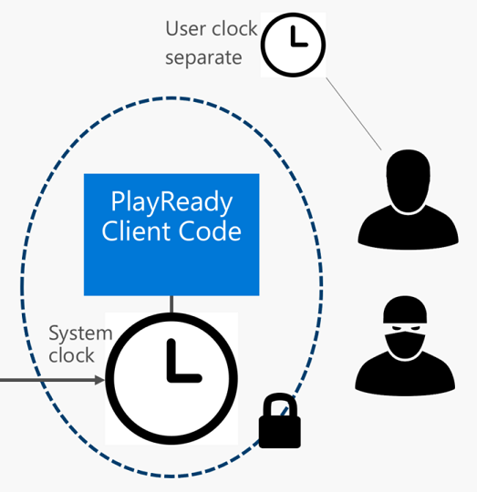
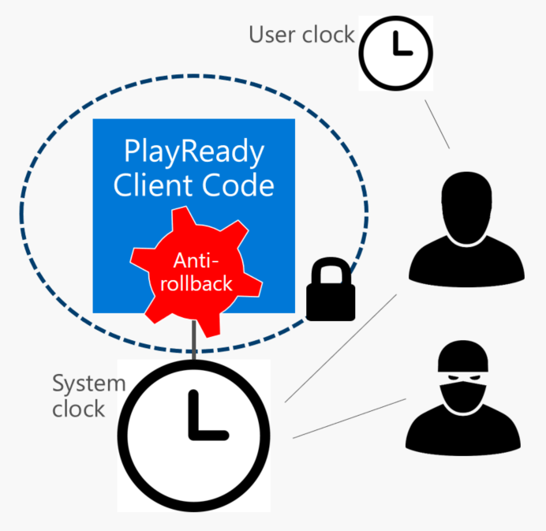

# PlayReady Trusted Clocks

A *PlayReady Trusted Clock* is a general term for a clock that is used to enforce time-based limitations set to PlayReady protected content on PlayReady Clients. Any Client that implements a trusted clock ensures that the Client that restricts playback to a beginning date and time, an expiration date and time, or expiration date and time after first play cannot be tampered with using hacking tools to a level defined in the <a href="https://www.microsoft.com/playready/licensing/compliance/" target="_blank">Robustness Rules for PlayReady Products</a>.

Microsoft does not require Client developers to use a trusted clock. However, Clients without a trusted clock won't be allowed to manage license with time based policies, including expiration. Because this scenario is very common in the industry (like rental or subscription), Microsoft does recommend implementing a secure clock in every Client.

Client developers can choose amongst two types of PlayReady Trusted Clocks in their design. They both allow manage licenses with time-based policies:
1. *PlayReady Secure Clock*
2. *PlayReady Anti-rollback Clock*

## PlayReady Secure Clock
A *PlayReady Secure Clock* is "a hardware real-time clock that has been designed to resist unauthorized access at the level defined in the Robustness Rules", as defined in the <a href="https://www.microsoft.com/playready/licensing/compliance/" target="_blank">Defined Terms document for the Compliance and Robustness Rules for PlayReady Products</a>.

Per the requirements of the <a href="https://www.microsoft.com/playready/licensing/compliance/" target="_blank">Compliance Rules for PlayReady Products</a>, a *PlayReady Secure Clock* must use a *PlayReady Secure Clock Service* to set its value. Microsoft operates some [*PlayReady Secure Clock Services*](secure-clock-services.md) that device makers can use for this purpose.

## PlayReady Anti-rollback Clock
A *PlayReady Anti-rollback Clock* is "a real-time clock that is periodically verified by the PlayReady Final Product to have advanced", as defined in the [Defined Terms document for the Compliance and Robustness Rules for PlayReady Products](https://www.microsoft.com/playready/licensing/compliance/)

Per the requirements of the <a href="https://www.microsoft.com/playready/licensing/compliance/" target="_blank">Compliance Rules for PlayReady Products</a>, a *PlayReady Anti-rollback Clock* can use any source of time to set its value. The trust in the clock is provided by the anti-rollback mechanism built-in the PK. Using a *PlayReady Secure Clock Service* to set its value is also allowed. Microsoft operates some [*PlayReady Secure Clock Services*](secure-clock-services.md) that device makers can use for this purpose.

