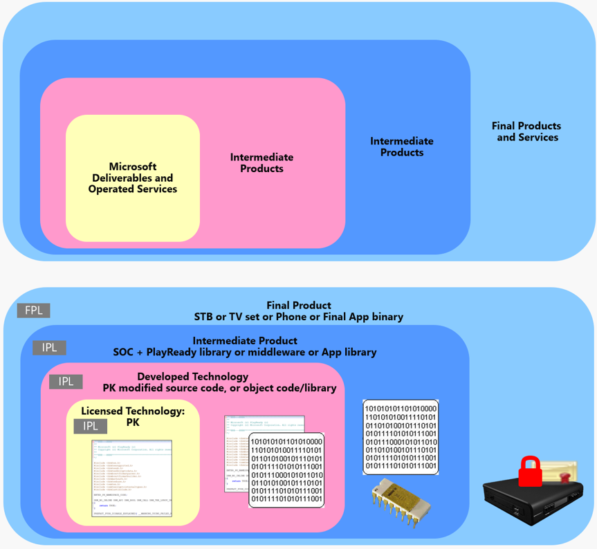

# Working with PlayReady

PlayReady is a very versatile technology that is designed to allow the development of clients on virtually any processor, any platform, any operating system (OS), and any environment, and develop and deploy clients by the licensees or their partners, whether they are "System on a Chip" (SOC) vendors, third party developers, original design manufacturers (ODMs), or original equipment manufacturers (OEMs). A common scenario is an SOC vendor preparing the PlayReady library for their process XYZ, and the OEMs passing this library from the SOC vendor and the certificates they received from Microsoft to their ODM, to manufacture and distribute a device that includes an operational PlayReady client.

Likewise, on the server side, PlayReady is very flexible to allow the development and deployment of servers in different types of environments (native Windows Server system, private cloud, public cloud, hybrid cloud), different types of architecture (combined with the service logic, distant from the service logic), and using partnerships. A service provider may use the PlayReady Server SDK received from Microsoft to prototype, but use a third party company to develop their license server logic, and use another company to operate it, in a public cloud infrastructure.

PlayReady Customers, be they service providers, device makers, or application developers, are not required to develop either their PlayReady client or server themselves. Instead, they may obtain these services or products from third-party developers, that we refer to as PlayReady partners. 

This topic discusses the parts of PlayReady that are supplied by Microsoft and the parts that can be developed and deployed by the customers themselves, or their third party partners. 

Here is a figurative view of these levels of product integration, and its translation to a PlayReady Client Product:

## PlayReady parts supplied by Microsoft

The following sections describe the parts of PlayReady that are supplied by Microsoft.

### License to use PlayReady

If you are an original equipment manufacturer (OEM), a PlayReady client developer, or a PlayReady service provider, you must first obtain a PlayReady license from Microsoft before you can begin developing your product. This will entitle you to receive from Microsoft all of the material you will need to create your product, whether it is an integrated circuit with built-in PlayReady functionality, a device including a PlayReady client in the OS or the silicon, a PlayReady application running on iOS or Android, or a PlayReady server supplying licenses for specific content.

There are separate licenses depending on what type of PlayReady product you intend to produce. For example, there are licenses for distributing a device, developing a downloadable software application, or developing server applications or deploying a PlayReady service to end-users. For more information about all of the licensing options for the various parts of PlayReady, see [PlayReady Licensing Options](https://www.microsoft.com/playready/licensing/).

These licenses provide additional benefits including intellectual property rights, intellectual property protection, and indemnification.

If you are a content provider using third party PlayReady clients and PlayReady servers, you do not need a license from Microsoft to encrypt your content with a PlayReady Header. In addition, if you are an encryptor developer, you do not need a license from Microsoft to include a PlayReady Header insertion function in your encryptor code. See [Developing and operating a PlayReady packager](#playreadypackager) for more information.

### Compliance and Robustness Rules

Microsoft edits and publishes the PlayReady Compliance Rules and the PlayReady Robustness Rules, the requirements of which all PlayReady Final Products distributed on the market must satisfy, as specified in the PlayReady license agreement(s) customers sign with Microsoft. Compliance Rules specify the required behaviors of PlayReady implementations, and describe how content may be accessed and passed using specific policy rules. Robustness Rules specify different data and functions in PlayReady Products and the levels of robustness required to protect them against unauthorized use and attacks. For more information, see the [PlayReady Compliance and Robustness Rules](https://www.microsoft.com/playready/licensing/compliance/).

### Certificates and Certificate Authority

A certificate is a digitally-signed binary document used to grant and revoke privileges to devices and servers to perform specific operations. PlayReady customers can request several different types of certificates depending on their needs.

Certificates generally fall into two main categories: server certificates and client certificates. Server certificates allow a Customer to run the PlayReady Server SDK; client or device certificates allow devices to play content. There are also test client certificates, which are only used for test devices and can be revoked at any time.

Microsoft owns the PlayReady Certificate Authority (PlayReady CA) including the PlayReady top level CA certificates, which gives Microsoft the authority to deliver PlayReady certificates to its customers, and revoke them whenever it is required to keep the ecosystem functional and secure.

Complete information about certificates and how to obtain different types of certificates is contained in the PlayReady Documentation Help file that is supplied to PlayReady licensees.

### PlayReady Server SDK

PlayReady Server SDK is delivered as two Microsoft MSI files that contain the libraries, samples, and tools required to develop a PlayReady license server, PlayReady domain server, PlayReady metering server, PlayReady secure stop server, or PlayReady secure delete server. In addition, you will also be supplied with the PlayReady documentation and any additional current information in the PlayReady Server SDK readme file.

For more information on PlayReady Server SDK, see [PlayReady Server SDK](playreadyserversdk.md).

### PlayReady Server on Azure

Microsoft Azure Media Services (AMS) provides a service for encrypting content and delivering PlayReady DRM licenses, called Content Protection. Media Services also provides APIs that let you configure the rights and restrictions that you want for the PlayReady DRM runtime to enforce when a user plays back protected content. When a user requests PlayReady protected content, the player application will request a license from the AMS license service. The AMS license service will issue a license to the player if it is authorized. A PlayReady license contains the decryption key that can be used by the client player to decrypt and stream the content.

For more information about PlayReady on Azure, see [Announcing Azure Media Services Live Streaming With PlayReady encryption capability](https://azure.microsoft.com/en-us/blog/announcing-azure-media-services-live-streaming-with-playready-encryption-capability/) and the Azure [Protecting Content Overview](https://docs.microsoft.com/en-us/azure/media-services/media-services-content-protection-overview).

### PlayReady on Windows

Microsoft develops and distributes a PlayReady Client in every Windows 8, 8.1, and 10 unit, and in every Xbox unit. This PlayReady Client is exposed and freely accessible through a high-level API to application developers.

Application developers can create Universal Windows Platform (UWP) applications capable of providing PlayReady content to the user while enforcing the access rules defined by the content provider. An application can freely use this built-in PlayReady Client in Windows 8, 8.1 or 10, without signing any agreement with Microsoft, and without the need of any PlayReady certificate, or any PlayReady fee or royalty due.

Windows 10 PlayReady documentation can be found at [PlayReady for Windows 10](https://msdn.microsoft.com/en-us/windows/uwp/audio-video-camera/playready-client-sdk). Samples of PlayReady Windows 10 applications can be found as part of the [UWP Samples collection](https://github.com/Microsoft/Windows-universal-samples) and at [PlayReady sample Universal Windows Apps for Windows 10 (Javascript/C#/EME)](https://code.msdn.microsoft.com/windowsapps/PlayReady-samples-for-124a3738).

You can also create PlayReady Windows Store and Web applications for Windows 8.1. Windows 8.1 PlayReady documentation can be found at [Developing PlayReady Windows Store and Web Apps](https://msdn.microsoft.com/en-us/library/windows/apps/xaml/dn468834.aspx). Samples of PlayReady Windows 8.1 applications can be found at [PlayReady sample for Windows 8.1 Store apps](https://code.msdn.microsoft.com/windowsapps/PlayReady-sample-for-bb3065e7).

Some PlayReady Partners provide SDKs to run PlayReady on Windows 7 and Mac OS, based on Electron, Xamarin, or other technologies. You can contact these [PlayReady Partners](https://www.microsoft.com/playready/partners) directly for more information.

Silverlight is a deprecated application framework running on Windows 7 and Mac OS that includes a fully functional PlayReady client. It runs in browsers with limitations, and can also run out of browsers to provide standalone apps on Windows 7 and Mac OS.

### PlayReady Device Porting Kit

PlayReady Device Porting Kit is delivered as a Microsoft MSI file that contains the libraries, samples, tools, and source code required to create portable devices for use with digital content that was protected with PlayReady technology.

For more information on PlayReady Device Porting Kit, see [PlayReady Device Porting Kit](playreadyportingkit.md).

### PlayReady documentation

Microsoft supplies all of the documentation that describes how to develop and deploy many types of PlayReady clients and servers. The following list contains the various sources for PlayReady documentation. Some of these sources are public, whereas others can only be observed by PlayReady licensees.

   *  [PlayReady Public Documents](https://www.microsoft.com/playready/documents/)

      Contains white papers and public technical specifications for PlayReady. This website is public and can be viewed by anyone.

   *  [PlayReady for Windows 10](https://msdn.microsoft.com/en-us/windows/uwp/audio-video-camera/playready-client-sdk)

      Describes how to implement a PlayReady client on Windows 10. This website location is public and can be viewed by anyone.

   *  [Developing PlayReady Windows 8.1 Store and Web Apps](https://msdn.microsoft.com/en-us/library/windows/apps/xaml/dn468834.aspx)

      Describes how to implement a PlayReady client on Window 8.1. This website location is public and can be viewed by anyone.

   *  PlayReady Documentation

      Describes how to implement PlayReady servers and client, including all of the API documentation associated with both. This Help file is provided to you after you have signed a licensing agreement with Microsoft.

   *  [PlayReady Training Slides](http://wmlalicensing.com)

      Provides training slides that describe how to implement PlayReady clients and servers. This website is restricted to licensees. 

   *  [PlayReady Video Tutorials](http://test.playready.microsoft.com/Home/DocSupportTutorials)

      Provides video training and PlayReady conference videos that describe in detail aspects of PlayReady implementation. This website is restricted to licensees and requires an authorization token.

### PlayReady Test Server

The PlayReady Test Server website includes documentation and test tools for PlayReady developers to test your products. Whether you are a PlayReady licensee or a non-licensee, an OEM, SOC vendor, a client developer, and application developer, an encoder vendor, or a service developer, this website provides you with the following tools:

   *  A test license service
   *  Test video content (audio and video)
   *  Test audio content
   *  Test applications (HTML/JS, Silverlight)

> [!NOTE]
> Content and licenses delivered from this website are public and do not provide the level of security required for a production service.

The PlayReady Test Server is provided as an optional service to PlayReady developers. You do not need to use this service to test or certify your PlayReady implementations. For more information, see the [PlayReady Test Server](http://test.playready.microsoft.com/) website.

### Secure clock service

Microsoft runs secure clock services that allow PlayReady clients to request the current time and securely set their internal clock to enforce PlayReady time-based policies, such as content rental expiration.

Microsoft runs multiple versions of these services depending on the version and security level of the client requesting the time.

## Developing and operating a PlayReady server

A company, typically a service provider, with an active PlayReady Server agreement can access the PlayReady Server SDK and use it to develop and operate a PlayReady server (license server, domain controller, metering server, secure stop server, or secure delete server).

This company can, however, share roles with third parties:

  *  PlayReady Server Development partners&mdash;these partners can develop the logic of a PlayReady server on behalf of the customer.
  *  PlayReady application service provider (ASP) partners&mdash;these partners can develop and operate, or operate a PlayReady server on behalf of the customer. This server may be connected to the customer’s backend logic and Key Management System in different ways to provide a complete DRM system.

See the [PlayReady Partners](https://www.microsoft.com/playready/partners) page for more information.

## Developing and operating a PlayReady packager

If you are developing an encoder utilizing PlayReady technologies, you will need to include a PlayReady Header in the encrypted content. The PlayReady Header contains information about the content being played back, including the key identifiers (KIDs) that identify the keys used to encrypt the data, the default license acquisition URL of the PlayReady license server, and any custom data that you want to include. The key and KID used to encrypt the content must be shared with the PlayReady license server that will be issuing the licenses for that specific content, typically through a Key Management System.

For more information about encrypting content and the PlayReady Header, see [Content Encryption and Delivery](contentencryptionanddelivery.md) and the [PlayReady Header Object Specification](https://www.microsoft.com/playready/documents/). 

>[!NOTE]
>Microsoft does not provide a Key Management System with PlayReady.

## Developing and operating a PlayReady Client

A PlayReady Client can be any device or application that provides PlayReady protection for media content and includes the PlayReady Client functionality. A PlayReady Client can be embedded in hardware, can be supplied as part of the operating system, or can be included in an application. This excludes applications that are developed to use an existing underlying PlayReady Client integrated in the platform, for example UWP apps for Windows using the PlayReady Client integrated in Windows 10 and not containing any PlayReady code per se.

The basic level of security that must be provided for each of these types of clients is documented in the [PlayReady Compliance and Robustness Rules](https://www.microsoft.com/playready/licensing/compliance/).

The following table clarifies whether a PlayReady Client needs to be developed or not.

| Example| PlayReady Client or not|
| --- | --- |
| Set top box containing PlayReady PK Code and a PlayReady Client Certificate on the hardware or OS| Yes|
| Android Phone containing PlayReady PK Code and a PlayReady Client Certificate in the OS| Yes|
| Application running on that Android phone using the high level APIs to trigger operations from that OS integrated PlayReady Client| No, the application just uses an existing PlayReady Client|
| Application running on an Android phone and containing PlayReady PK Code and a PlayReady Client Certificate in the application, to be device independent| Yes, the application is a PlayReady Client|
| Application running on an iOS phone and containing PlayReady PK Code and a PlayReady Client Certificate in the application| Yes, the application is a PlayReady Client|
| UWP application running on Windows 10| No, the application just uses an existing PlayReady Client|

### Device on which to install the PlayReady Device Porting Kit

If you are designing a device with PlayReady installed in hardware or PlayReady on an integrated circuit, it is up to you to supply any hardware or software required to port the PlayReady Device Porting kit to your hardware. Some integrated circuits designed by [PlayReady Partners](https://www.microsoft.com/playready/partners/) already have PlayReady installed on the chip, and you could use these integrated circuits while designing your device. 

For general information about developing hardware-based PlayReady, see [Hardware versus software DRM](#hardwarevssoftware).

### Windows or Xbox application

PlayReady DRM enables developers to create UWP apps capable of providing PlayReady content to the user while enforcing the access rules defined by the content provider. If you are designing an application that runs on Windows or Xbox, see [PlayReady DRM](https://docs.microsoft.com/en-us/windows/uwp/audio-video-camera/playready-client-sdk).

### Hardware versus software DRM

Increasingly, content providers are moving towards hardware-based protections for granting permission to play back full high value content in apps. Robust support for a hardware implementation of the cryptographic core has been added to PlayReady to meet this need. This support enables secure playback of higher value content on multiple device platforms. Key material (including private keys, content keys, and any other key material used to derive or unlock said keys), and decrypted compressed and uncompressed video samples are protected by leveraging hardware security. Hardware-based PlayReady DRM is supported on a multitude of devices, including both Windows and non-Windows devices such as TV sets, phones, and tablets.

