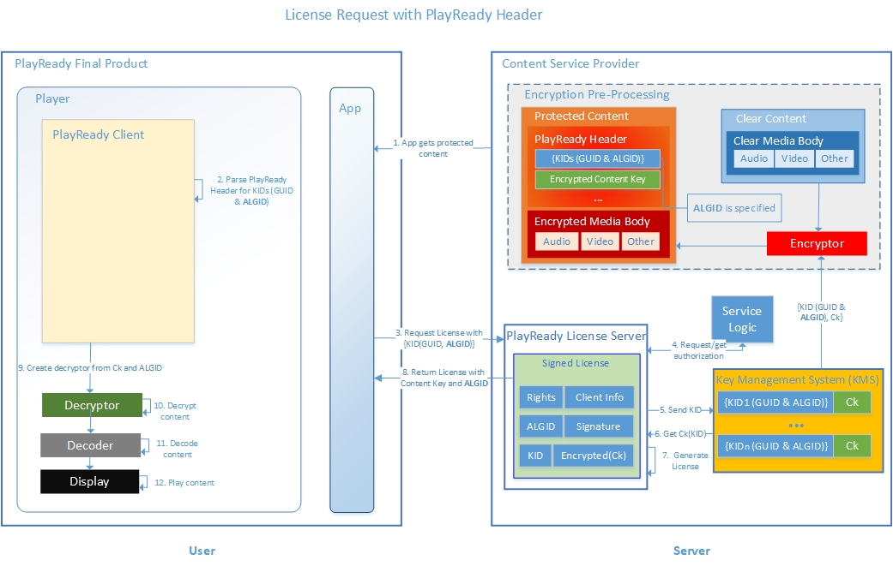

# PlayReady Content Encryption Modes


This topic provides an overview about content encryption modes in PlayReady systems. For an overview about PlayReady and content encryption, see [PlayReady Content Encryption](content-encryption.md). See [Glossary](../Overview/glossary-and-abbreviations.md) for encryption terms and definitions.

PlayReady version 1.0 introduced AES-128 CTR content encryption mode, in addition to the Microsoft-specific COCKTAIL encryption mode previously used in WMDRM (Windows Media Digital Rights Management). *AES-128 CTR* content encryption mode uses AES keys, with a length of 128 bits used on the content files in Counter Mode (CTR).

Starting with version 4.0, PlayReady systems support AES 128 bit keys in both Counter Mode (CTR) and Cipher Block Chaining mode (CBC).

This change ensures that services using PlayReady can fully take advantage of a unique stream and file format across all devices. In addition, Microsoft supports the CMAF (Common Media Application Format) standard, as defined in [ISO/IEC FDIS 23000-19](https://www.iso.org/standard/71975.html).

## Common Encryption modes

The ISO standard ISO/IEC 23001-7 defines four Common Encryption modes.


PlayReady Clients starting with version 4.0 support AES CBC keys, which allows support the Common Encryption mode 'cbcs'. Prior to version 4.0, AES CTR is the mode that has been mainly supported by PlayReady Clients, which allows support the Common Encryption mode 'cenc'. Note that Common Encryption modes 'cens' and 'cbc1' are allowed and technically doable in a PlayReady ecosystem, but not supported.

## Support for the ‘cbcs’ AES-CBC Encryption Scheme

All clients built on or after PlayReady PK version 4.0 may support CBC keys. Support is optional for clients, though, and signaled to License Servers through an additional property in the license acquisition protocol.

&nbsp;

| |COCKTAIL|'cenc'|'cbcs'|
|--|--|--|--|
|PlayReady Client 1.0|supported|supported| not supported |
|PlayReady Client 2.0|supported|supported| not supported |
|PlayReady Client 2.5|supported|supported| not supported |
|PlayReady Client 3.0| not supported |supported| not supported |
|PlayReady Client 3.3| not supported |supported| not supported |
|PlayReady Client 4.0| not supported |supported|supported |

&nbsp;

**Notes:**

* Windows 10 computers equipped with an Intel Icelake processor or later and supporting HWDRM (SL3000) will support 'cbcs' starting in 2018.
* All Xbox One units upgraded with version 1709 or higher support 'cbcs'.
* All PlayReady License Servers starting with version 4.0 support issuing licenses with CBC keys.

## Signaling the ALGID in the PlayReady Header

The PlayReady Header is an XML document usually included in the header of a content file or stream. It describes the PlayReady attributes needed, for a client to decrypt this content. The PlayReady Header has its own specification and versioning. For more information, see [PlayReady Header Specification](../Specifications/playready-header-specification.md).

&nbsp;

| |PlayReady Header 4.3|PlayReady Header 4.2|PlayReady Header 4.1|PlayReady Header 4.0|
|--|--|--|--|--|
|PlayReady Client 1.0| | | |&#10004;|
|PlayReady Client 2.0| | |&#10004;|&#10004;|
|PlayReady Client 2.5| | |&#10004;|&#10004;|
|PlayReady Client 3.0| |&#10004;|&#10004;|&#10004;|
|PlayReady Client 3.3| |&#10004;|&#10004;|&#10004;|
|PlayReady Client 4.0|&#10004;|&#10004;|&#10004;|&#10004;|

&nbsp;

The following is an example of a PlayReady Header v4.2.

```xml
<WRMHEADER
          version="4.2.0.0"
          xmlns="http://schemas.microsoft.com/DRM/2007/03/PlayReadyHeader">
  <DATA>
    <PROTECTINFO>
      <KIDS>
        <KID ALGID="AESCTR" CHECKSUM="xNvWVxoWk04=" VALUE="0IbHou/5s0yzM80yOkKEpQ=="></KID>
        <KID ALGID="AESCTR" CHECKSUM="GnKaQIRacPU=" VALUE="/qgG2xbs4k2SKCxx6bhWqw=="></KID>
       </KIDS>
    </PROTECTINFO>
    <LA_URL>http://rm.contoso.com/rightsmanager.asmx</LA_URL>
    <DS_ID>AH+03juKbUGbHl1V/QIwRA==</DS_ID>
    <DECRYPTORSETUP>ONDEMAND</DECRYPTORSETUP>
  </DATA>
</WRMHEADER>
```

The ALGID (algorithm identifier) is a property of the KID element, and specifies the encryption algorithm that was used to encrypt the content. Starting with PlayReady Header version 4.2, the ALGID is required and must be set to either “AESCTR” or “COCKTAIL”. However, starting with version 4.3, the ALGID can also be set to the value “AESCBC” . The following example shows a PlayReady Header version 4.3 with the ALGID values set to "AESCBC".

```xml
<WRMHEADER
          version="4.3.0.0"
          xmlns="http://schemas.microsoft.com/DRM/2007/03/PlayReadyHeader">
  <DATA>
    <PROTECTINFO>
      <KIDS>
        <KID VALUE="PV1LM/VEVk+kEOB8qqcWDg==" ALGID="AESCBC"/>
        <KID VALUE="tuhDoKUN7EyxDPtMRNmhyA==" ALGID="AESCBC"/>
      </KIDS>
    </PROTECTINFO>
    <LA_URL>http://rm.contoso.com/rightsmanager.asmx</LA_URL>
    <DS_ID>AH+03juKbUGbHl1V/QIwRA==</DS_ID>
    <DECRYPTORSETUP>ONDEMAND</DECRYPTORSETUP>
  </DATA>
</WRMHEADER>
```

The following figure shows a content flow, where the license request is based on the PlayReady Header and the ALGID is specified.



## Missing ALGIDs

Starting with the PlayReady Header version 4.3, the ALGID may be missing. The following example shows a PlayReady Header version 4.3 with ALGID values missing.

```xml
<WRMHEADER
          version="4.3.0.0"
          xmlns="http://schemas.microsoft.com/DRM/2007/03/PlayReadyHeader">
  <DATA>
    <PROTECTINFO>
      <KIDS>
        <KID VALUE="PV1LM/VEVk+kEOB8qqcWDg=="/>
      </KIDS>
    </PROTECTINFO>
    <LA_URL>http://rm.contoso.com/rightsmanager.asmx</LA_URL>
    <DS_ID>AH+03juKbUGbHl1V/QIwRA==</DS_ID>
    <DECRYPTORSETUP>ONDEMAND</DECRYPTORSETUP>
  </DATA>
</WRMHEADER>
```

The following figure shows a content flow, where the license request is using the CDMi module, and the ALGID is missing.


**Notes:** Each PlayReady Header may have:

* Only one encryption type. For example, if ALGID=”AESCTR”, all keys for the header are used in CTR mode. When ALGID="AESCBC", all keys for this header are used in CBC mode.
* When the ALGID is missing, all keys for this header are used in Counter Mode or Cipher Block Chaining, but the value is not inserted in the header.
* Making a license acquisition request with a PlayReady Header v4.3 to a License Server below v4.0 will throw an exception.
* A license response can include one or many licenses, where each license contains one key and any number of policies.


### Why the ALGID value is missing

Microsoft recommends that encryptors always include the same ALGID value in the PlayReady Header that they included when they processed the content.

In a standard scenario, the encryptor encrypts content and generates the PlayReady Header in the content. The encryptor knows which AES mode it used for encryption; thus, it includes this information in the ALGID property of the PlayReady Header. Clients initiate license requests based on PlayReady Headers parsed out of real content, so the ALGID value is present and valid.

In some scenarios, the client initiates a license request based on a simple KID value (a 128-bit GUID). In this case, the ALGID value in the PlayReady Header inserted in the license request is going to be missing (also known as unspecified). One example is when the client makes a license request by using HTML5 EME APIs.

### How the Client handles a missing ALGID

If the client initiates a license request based on an incoming PlayReady Header, then the ALGID value in the license request is going to reflect the value found in the header because the license acquisition challenge includes a copy of the PlayReady Header. In this case:

- For all PlayReady Headers v4.2 or lower, the ALGID value is required and must be valid.
- For PlayReady Headers v4.3 or higher, the ALGID value can be present and valid, or missing.

### How the Server SDK handles a missing ALGID

All licenses delivered through a license response MUST include a valid ALGID value.

If ALGID is unspecified in the incoming license request, the License Server must get this information from the backend of the service and put the right value in the license response.

## Initialization Vectors (IVs)

In PlayReady versions 3.3 and earlier, only 64-bit IVs (8-byte IVs) are supported in CTR mode. Starting with PlayReady version 4.0, both 64-bit and 128-bit IVs (8-byte and 16-byte IVs) are supported both in CTR and CBC modes.

Examples:

* HLS compliant streams that frequently use 128-bit IVs in CBC  mode are now supported.
* Some HbbTV conformant streams that use 128-bit IVs in CTR mode are now supported .

## Limitations

* A PlayReady Header must use only one ALGID value for all the KID elements. In other words, all the keys used to encrypt the different tracks and qualities of an asset must be AES CTR or AES CBC. If the ALGID is missing on any KID element, it must be missing from all KID elements.
* Generating a license with a CBC key when the incoming Client Certificate is Windows and SL2000 throws an exception. This is because Windows Clients support CBC only on SL3000 units. It may be possible to deliver a license with a CBC key to a SL2000 Client, however, if  this client is PlayReady version 4.0 minimum and declares support for the CBC mode.
* Generating a license with a CBC key when the incoming Client Certificate is a device that uses a Porting Kit version prior to 4.0 will throw an exception.
* Generating a license with a CBC key when the incoming license request does not indicate support for AES CBC, will throw an exception.

>[!IMPORTANT]
>Services must not encrypt a single piece of content in CTR mode and in CBC mode using the same {KID, Ck}. 
>  *  For functional reasons, a client acquiring both a license for {KID, Ck, AESCTR} and for {KID, Ck, AESCBC} would not function. 
>  *  For robustness reasons, an attacker having access to the same content encrypted with the same key both in CBC and CTR modes could more easily decrypt content without authorization.

