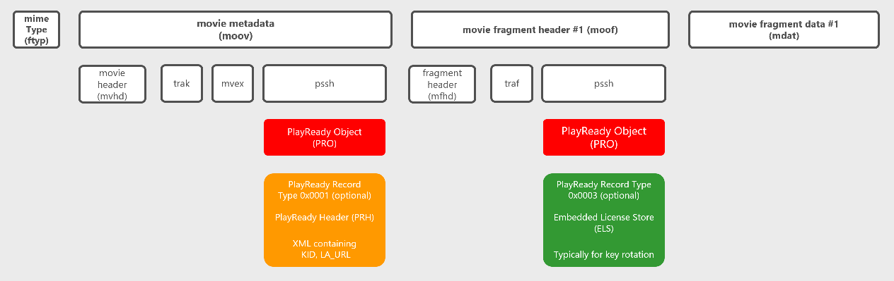

# How to package MP4-based content for PlayReady

## Content Encryption

The packager needs to encrypt the content. Any encryption format that uses AES-128 keys used in CTR mode or CBC mode is allowed by the Compliance Rules. 

MP4-based formats are recommended. CMAF is the preferred MP4-based format for PlayReady Clients, Windows 10 and the Xbox.

To ensure support on Windows and other Microsoft endpoints, Microsoft recommends using Common Encryption: 'cenc' or 'cbcs'. See [*ISO/IEC FDIS 23001-7:2016 “Information technology – MPEG systems technologies – Part 7: Common encryption in ISO base media file format files”*](https://www.iso.org/standard/68042.html)

For more information, see [Content Encryption and Delivery](content-packaging-and-delivery.md)

## Inserting a PlayReady Header into the content

The packager needs to insert the PlayReady Header it has generated into the content. It is typically inserted either in the header of the content files, or in the manifest of streaming assets.

This header includes default values for information that is needed by a PlayReady client to request a license for this particular content piece.
For example, a PlayReady client needs to know what Key IDs (KIDs) are used in the asset, so it can request for the key values. It also needs to know the address of a license server that will deliver this license. It optionally needs to know which webpage to render to the user in case a license request is declined by the license server (the user may be directed to a payment page).

Here is an example of a PlayReady Header
```xml
<WRMHEADER xmlns="http://schemas.microsoft.com/DRM/2007/03/PlayReadyHeader" version="4.3.0.0">
  <DATA>
    <PROTECTINFO>
      <KIDS>
        <KID ALGID="AESCTR" VALUE="PV1LM/VEVk+kEOB8qqcWDg=="></KID>
      </KIDS>
    </PROTECTINFO>
    <LA_URL>http://rm.contoso.com/rightsmanager.asmx</LA_URL>
    <LUI_URL>http://www.contoso.com/pay/</LUI_URL>
  </DATA>
</WRMHEADER>
```

When a PlayReady client needs to play protected content, it will request a license for the content if it hasn't got any yet. To initiate the license request, the app developer may have provisioned the app with hardcoded or dynamic values for the KID array, LA_URL, and the behavior in case of a license request denial. The app has overriden the KID or KA_URL default values. If he hasn't, the client is expected to do the license request based on the default values found in the content header itself.

For MP4 ISO files, Microsoft recommends following the ISO format specification and inserting the PlayReady Header in a PSSH box.

**Example of a MP4 file containing a PlayReady Object**

Here is a segmented MP4 file with a PlayReady Object that contains a PlayReady Header:


Here is the HEX view of this file:


Here is a segmented MP4 file with a PlayReady Object that contains a PlayReady Header and another PlayRady Object that contains a PlayReady Embedded License Store:




For adaptive streaming assets, Microsoft recommends inserting the PlayReady Header in the manifest of the asset.

**Example of a MPEG-DASH manifest containing a PlayReady Header**
```xml
<?xml version="1.0" encoding="utf-8"?>
<MPD xmlns="urn:mpeg:dash:schema:mpd:2011" xmlns:xsi="http://www.w3.org/2001/XMLSchema-instance" profiles="urn:mpeg:dash:profile:isoff-live:2011" type="static" xmlns:cenc="urn:mpeg:cenc:2013" xmlns:mspr="urn:microsoft:playready" mediaPresentationDuration="PT10M56.907S" minBufferTime="PT4S">
  <Period>
    <AdaptationSet id="1" group="1" profiles="ccff" bitstreamSwitching="true" segmentAlignment="true" contentType="video" mimeType="video/mp4" codecs="avc1.640028" maxWidth="1920" maxHeight="1080" startWithSAP="1">

        <ContentProtection schemeIdUri="urn:mpeg:dash:mp4protection:2011" value="cenc" cenc:default_KID="10000000-1000-1000-1000-100000000001"/>
        <ContentProtection schemeIdUri="urn:uuid:9a04f079-9840-4286-ab92-e65be0885f95" value="2.0" cenc:default_KID="10000000-1000-1000-1000-100000000001">
            <mspr:pro>PABXAFIATQBIAEUAQQBEAEUAUgAgAHgAbQBsAG4AcwA9ACIAaAB0AHQAcAA6AC8ALwBzAGMAaABlAG0AYQBzAC4AbQBpAGMAcgBvAHMAbwBmAHQALgBjAG8AbQAvAEQAUgBNAC8AMgAwADAANwAvADAAMwAvAFAAbABhAHkAUgBlAGEAZAB5AEgAZQBhAGQAZQByACIAIAB2AGUAcgBzAGkAbwBuAD0AIgA0AC4AMwAuADAALgAwACIAPgA8AEQAQQBUAEEAPgA8AEwAQQBfAFUAUgBMAD4AaAB0AHQAcAA6AC8ALwBlAHgAcABlAHIAaQBtAGUAbgB0AGEAbAAxAC4AYQB6AHUAcgBlAHcAZQBiAHMAaQB0AGUAcwAuAG4AZQB0AC8AcgBpAGcAaAB0AHMAbQBhAG4AYQBnAGUAcgAuAGEAcwBtAHgAPwBjAGYAZwA9ACgAYwBrADoAVwAzADEAYgBmAFYAdAA5AFcAMwAxAGIAZgBWAHQAOQBXADMAMQBiAGYAUQA9AD0ALABjAGsAdAA6AEEARQBTADEAMgA4AEIAaQB0AEMAQgBDACkAPAAvAEwAQQBfAFUAUgBMAD4APABQAFIATwBUAEUAQwBUAEkATgBGAE8APgA8AEsASQBEAFMAPgA8AEsASQBEACAAQQBMAEcASQBEAD0AIgBBAEUAUwBDAEIAQwAiACAAVgBBAEwAVQBFAD0AIgBBAEEAQQBBAEUAQQBBAFEAQQBCAEEAUQBBAEIAQQBBAEEAQQBBAEEAQQBRAD0APQAiAD4APAAvAEsASQBEAD4APAAvAEsASQBEAFMAPgA8AC8AUABSAE8AVABFAEMAVABJAE4ARgBPAD4APAAvAEQAQQBUAEEAPgA8AC8AVwBSAE0ASABFAEEARABFAFIAPgA=</mspr:pro>
        </ContentProtection>

        <SegmentTemplate timescale="10000000" media="video/bbb_sunflower_1080p_60fps_normal_VIDEO$Number$.mp4"  initialization="video/bbb_sunflower_1080p_60fps_normal_VIDEO0.mp4">
          <SegmentTimeline>
            <S d="83166700" />
            <S d="79166700" />
            <S d="80333300" />
            <S d="73000000" />
          </SegmentTimeline>
        </SegmentTemplate>
      <Representation id="video" bandwidth="10646158" width="1920" height="1080"/>
    </AdaptationSet>
  </Period>
</MPD>
```

## See also
[Supported Formats](mp4-based-formats-supported-by-playready-clients.md)
[PlayReady Test Server Content](http://test.playready.microsoft.com/)
