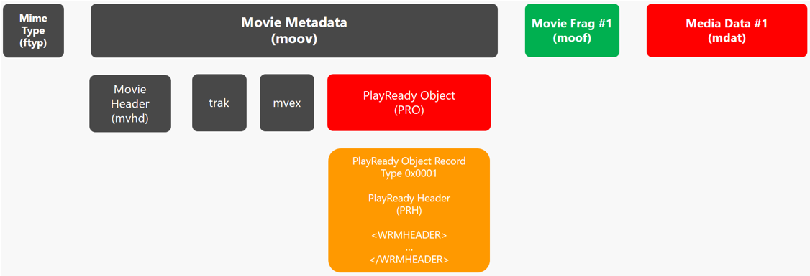

# How to package mp4 based content for PlayReady

## Content Encryption

The packager needs to encrypt the content. Any encryption format that uses AES-128 keys used in CTR mode or CBC mode is allowed by the Compliance Rules. 

To ensure support on Windows and other Microsoft endpoints, Microsoft recommends using Common Encryption: CENC or CBCS. See [*ISO/IEC FDIS 23001-7:2016 “Information technology – MPEG systems technologies – Part 7: Common encryption in ISO base media file format files”*](https://www.iso.org/standard/68042.html)

For more information, see [Content Encryption and Delivery](content-packaging-and-delivery.md)

## Inserting a PlayReady Header into the content

The packager needs to insert the PlayReady Header it has generated into the content. It is typically inserted either in the header of the content files, or in the manifest of streaming assets.

This header includes default values for information that is needed by a PlayReady client to request a license for this particular content piece.
For example, a PlayReady client needs to know what Key IDs (KIDs) are used in the asset, so it can request for the key values. It also needs to know the address of a license server that will deliver this license. It optionally needs to know which webpage to render to the user in case a license request is declined by the license server (the user may be directed to a payment page).

Here is an example of a PlayReady Header
```xml
<WRMHEADER xmlns="http://schemas.microsoft.com/DRM/2007/03/PlayReadyHeader" version="4.3.0.0">
  <DATA>
    <PROTECTINFO>
      <KIDS>
        <KID ALGID="AESCTR" VALUE="PV1LM/VEVk+kEOB8qqcWDg=="></KID>
      </KIDS>
    </PROTECTINFO>
    <LA_URL>http://rm.contoso.com/rightsmanager.asmx</LA_URL>
    <LUI_URL>http://www.contoso.com/pay/</LUI_URL>
  </DATA>
</WRMHEADER>
```

When a PlayReady client needs to play protected content, it will request a license for the content if it hasn't got any yet. To initiate the license request, the app developer may have provisioned the app with hardcoded or dynamic values for the KID array, LA_URL, and the behavior in case of a license request denial. The app has overriden the KID or KA_URL default values. If he hasn't, the client is expected to do the license request based on the default values found in the content header itself.

For MP4 ISO files, Microsoft recommends following the ISO format specification and inserting the PlayReady Header in a PSSH box.

**Example of a MP4 file containing a PlayReady Header**



For adaptive streaming assets, Microsoft recommends inserting the PlayReady Header in the manifest of the asset.

**Example of a MPEG-DASH manifest containing a PlayReady Header**
```xml
<?xml version="1.0" encoding="utf-8"?>
<MPD xmlns="urn:mpeg:dash:schema:mpd:2011" xmlns:xsi="http://www.w3.org/2001/XMLSchema-instance" profiles="urn:mpeg:dash:profile:isoff-live:2011" type="static" xmlns:cenc="urn:mpeg:cenc:2013" xmlns:mspr="urn:microsoft:playready" mediaPresentationDuration="PT10M56.907S" minBufferTime="PT4S">
  <Period>
    <AdaptationSet id="1" group="1" profiles="ccff" bitstreamSwitching="true" segmentAlignment="true" contentType="video" mimeType="video/mp4" codecs="avc1.640028" maxWidth="1920" maxHeight="1080" startWithSAP="1">

        <ContentProtection schemeIdUri="urn:mpeg:dash:mp4protection:2011" value="cenc" cenc:default_KID="10000000-1000-1000-1000-100000000001"/>
        <ContentProtection schemeIdUri="urn:uuid:9a04f079-9840-4286-ab92-e65be0885f95" value="2.0" cenc:default_KID="10000000-1000-1000-1000-100000000001">
            <mspr:pro>PABXAFIATQBIAEUAQQBEAEUAUgAgAHgAbQBsAG4AcwA9ACIAaAB0AHQAcAA6AC8ALwBzAGMAaABlAG0AYQBzAC4AbQBpAGMAcgBvAHMAbwBmAHQALgBjAG8AbQAvAEQAUgBNAC8AMgAwADAANwAvADAAMwAvAFAAbABhAHkAUgBlAGEAZAB5AEgAZQBhAGQAZQByACIAIAB2AGUAcgBzAGkAbwBuAD0AIgA0AC4AMwAuADAALgAwACIAPgA8AEQAQQBUAEEAPgA8AEwAQQBfAFUAUgBMAD4AaAB0AHQAcAA6AC8ALwBlAHgAcABlAHIAaQBtAGUAbgB0AGEAbAAxAC4AYQB6AHUAcgBlAHcAZQBiAHMAaQB0AGUAcwAuAG4AZQB0AC8AcgBpAGcAaAB0AHMAbQBhAG4AYQBnAGUAcgAuAGEAcwBtAHgAPwBjAGYAZwA9ACgAYwBrADoAVwAzADEAYgBmAFYAdAA5AFcAMwAxAGIAZgBWAHQAOQBXADMAMQBiAGYAUQA9AD0ALABjAGsAdAA6AEEARQBTADEAMgA4AEIAaQB0AEMAQgBDACkAPAAvAEwAQQBfAFUAUgBMAD4APABQAFIATwBUAEUAQwBUAEkATgBGAE8APgA8AEsASQBEAFMAPgA8AEsASQBEACAAQQBMAEcASQBEAD0AIgBBAEUAUwBDAEIAQwAiACAAVgBBAEwAVQBFAD0AIgBBAEEAQQBBAEUAQQBBAFEAQQBCAEEAUQBBAEIAQQBBAEEAQQBBAEEAQQBRAD0APQAiAD4APAAvAEsASQBEAD4APAAvAEsASQBEAFMAPgA8AC8AUABSAE8AVABFAEMAVABJAE4ARgBPAD4APAAvAEQAQQBUAEEAPgA8AC8AVwBSAE0ASABFAEEARABFAFIAPgA=</mspr:pro>
        </ContentProtection>

        <SegmentTemplate timescale="10000000" media="video/bbb_sunflower_1080p_60fps_normal_VIDEO$Number$.mp4"  initialization="video/bbb_sunflower_1080p_60fps_normal_VIDEO0.mp4">
          <SegmentTimeline>
            <S d="83166700" />
            <S d="79166700" />
            <S d="80333300" />
            <S d="73000000" />
          </SegmentTimeline>
        </SegmentTemplate>
      <Representation id="video" bandwidth="10646158" width="1920" height="1080"/>
    </AdaptationSet>
  </Period>
</MPD>
```


## Supported Formats

# [DASH 1 Key](#tab/case1)

- mp4 based asset
- DASH manifest
- Fixed Key along the asset
- Single Key for all tracks and representations
- PlayReady Header in the manifest at the AdaptationSet level, or in the DASH init segment

#### Supported
- Supported on Windows 10 Fall Creators Update (released October 2017) and above

#### Asset Manifest
```xml
<?xml version="1.0" encoding="utf-8"?>
<MPD ...>
  <Period>
    <ContentProtection schemeIdUri="urn:uuid:9a04f079-9840-4286-ab92-e65be0885f95" value="2.0" cenc:default_KID="10000000-1000-1000-1000-100000000001">
      <mspr:pro>...</mspr:pro>
    </ContentProtection>
    <AdaptationSet ...>
      <Representation bandwidth="315108" codecs="avc1.64002A" frameRate="25" height="720" id="video/avc1" scanType="progressive" width="1280">
        <SegmentList duration="4000" timescale="1000">
          <Initialization sourceURL="video/avc1/init.mp4"/>
          <SegmentURL media="video/avc1/seg-1.mp4"/>
```
#### Asset Files
```
[init segment] separate file for a dash stream. Includes only the moov box
  [moov] 
    [pssh] pssh box for PlayReady. Includes a PRO including a PRH with KID and LA_URL
    [pssh] pssh box for other DRM

[any segment]
  [moof] movie fragment header
    [traf] track fragment
      [senc] sample encryption box. Includes Sample Initialization Vectors
  [mdat] movie fragment data
```

#### Test Vectors
See [Test Content on the Test Server](http://test.playready.microsoft.com/Content/Content2X)

# [DASH Multiple Keys](#tab/case2)


- mp4 based asset
- DASH manifest
- Fixed Key along the asset
- Different Keys for the different tracks and representations. For example, use a different key for all the video tracks above 1080p, to restrict access to the 4K resolution to some clients.
- PlayReady Header in the manifest at the AdaptationSet level, or in the DASH init segment. The single PlayReady Header contains a list of all the KIDs used for all the tracks and representations of the stream.

#### Supported
- Supported on Windows 10 Fall Creators Update (released October 2017) and above

#### Asset Manifest
```xml
<?xml version="1.0" encoding="utf-8"?>
<MPD ...>
  <Period>
    <ContentProtection schemeIdUri="urn:uuid:9a04f079-9840-4286-ab92-e65be0885f95" value="2.0" cenc:default_KID="10000000-1000-1000-1000-100000000001">
      <mspr:pro>...</mspr:pro>
    </ContentProtection>
    <AdaptationSet ...>
      <Representation bandwidth="315108" codecs="avc1.64002A" frameRate="25" height="720" id="video/avc1" scanType="progressive" width="1280">
        <SegmentList duration="4000" timescale="1000">
          <Initialization sourceURL="video/avc1/init.mp4"/>
          <SegmentURL media="video/avc1/seg-1.mp4"/>
```
#### Asset Files
```
[init segment] separate file for a dash stream. Includes only the moov box
  [moov] 
    [pssh] pssh box for PlayReady. Includes a PRO including a PRH with KID and LA_URL
    [pssh] pssh box for other DRM

[any segment]
  [moof] movie fragment header
    [traf] track fragment
      [senc] sample encryption box. Includes Sample Initialization Vectors
  [mdat] movie fragment data
```

#### Test Vectors
See [Test Content on the Test Server](http://test.playready.microsoft.com/Content/Content2X)

# [DASH Multi Period Keys](#tab/case3)

# [DASH Rotating Keys](#tab/case4)

```xml
<?xml version="1.0" encoding="utf-8"?>
  <SmoothStreamingMedia MajorVersion="2" MinorVersion="2" TimeScale="10000000" IsLive="TRUE" Duration="7200000000" LookAheadFragmentCount="2" DVRWindowLength="7200000000">
  <Protection>
    <ProtectionHeader SystemID="9a04f079-9840-4286-ab92-e65be0885f95">
    8AEAAAEAAQDmATwAVwBSAE0ASABFAEEARABFAFIAIAB4AG0AbABuAHMAPQAiAGgAdAB0AHAAOgAvAC8AcwBjAGgAZQBtAGEAcwAuAG0AaQBjAHIAbwBzAG8AZgB0AC4AYwBvAG0ALwBEAFIATQAvADIAMAAwADcALwAwADMALwBQAGwAYQB5AFIAZQBhAGQAeQBIAGUAYQBkAGUAcgAiACAAdgBlAHIAcwBpAG8AbgA9ACIANAAuADEALgAwAC4AMAAiAD4APABEAEEAVABBAD4APABDAFUAUwBUAE8ATQBBAFQAVABSAEkAQgBVAFQARQBTAD4APABJAEkAUwBfAEQAUgBNAF8AVgBFAFIAUwBJAE8ATgA+ADcALgAxAC4AMQA1ADcAMgAuADEAOAA8AC8ASQBJAFMAXwBEAFIATQBfAFYARQBSAFMASQBPAE4APgA8AC8AQwBVAFMAVABPAE0AQQBUAFQAUgBJAEIAVQBUAEUAUwA+ADwARABFAEMAUgBZAFAAVABPAFIAUwBFAFQAVQBQAD4ATwBOAEQARQBNAEEATgBEADwALwBEAEUAQwBSAFkAUABUAE8AUgBTAEUAVABVAFAAPgA8AC8ARABBAFQAQQA+ADwALwBXAFIATQBIAEUAQQBEAEUAUgA+AA==</ProtectionHeader>
  </Protection>
  <StreamIndex ...
```

# [HLS 1 Key](#tab/case5)

- mp4 based asset
- HLS playlist
- Fixed Key along the asset
- Single Key for all tracks
- PlayReady Header in the playlist using a the EXT-X-PLAYREADYHEADER tag

#### Supported
- Encryption mode SAMPLE-AES, CBC mode, with a key delivered by PlayReady: supported on the Xbox One, One S, One X since the update of January 2018
- Encryption mode SAMPLE-AES-CTR, CTR mode, with a key delivered by Playready: supported on Windows 10 April 2018 Update (released April 2018) and above

#### Asset Manifest
```M
#EXTM3U
#EXT-X-VERSION:4
#EXT-X-PLAYREADYHEADER:XAMAAAEAAQBSAzwAVwBSAE0ASABFAEEARABFAFIAIAB4AG0AbABuAHMAPQAiAGgAdAB0AHAAOgAvAC8AcwBjAGgAZQBtAGEAcwAuAG0AaQBjAHIAbwBzAG8AZgB0AC4AYwBvAG0ALwBEAFIATQAvADIAMAAwADcALwAwADMALwBQAGwAYQB5AFIAZQBhAGQAeQBIAGUAYQBkAGUAcgAiACAAdgBlAHIAcwBpAG8AbgA9ACIANAAuADAALgAwAC4AMAAiAD4APABEAEEAVABBAD4APABQAFIATwBUAEUAQwBUAEkATgBGAE8APgA8AEsARQBZAEwARQBOAD4AMQA2ADwALwBLAEUAWQBMAEUATgA+ADwAQQBMAEcASQBEAD4AQQBFAFMAQwBUAFIAPAAvAEEATABHAEkARAA+ADwALwBQAFIATwBUAEUAQwBUAEkATgBGAE8APgA8AEsASQBEAD4ANABSAHAAbABiACsAVABiAE4ARQBTADgAdABHAGsATgBGAFcAVABFAEgAQQA9AD0APAAvAEsASQBEAD4APABDAEgARQBDAEsAUwBVAE0APgBLAEwAagAzAFEAegBRAFAALwBOAEEAPQA8AC8AQwBIAEUAQwBLAFMAVQBNAD4APABMAEEAXwBVAFIATAA+AGgAdAB0AHAAcwA6AC8ALwBwAHIAbwBmAGYAaQBjAGkAYQBsAHMAaQB0AGUALgBrAGUAeQBkAGUAbABpAHYAZQByAHkALgBtAGUAZABpAGEAcwBlAHIAdgBpAGMAZQBzAC4AdwBpAG4AZABvAHcAcwAuAG4AZQB0AC8AUABsAGEAeQBSAGUAYQBkAHkALwA8AC8ATABBAF8AVQBSAEwAPgA8AEMAVQBTAFQATwBNAEEAVABUAFIASQBCAFUAVABFAFMAPgA8AEkASQBTAF8ARABSAE0AXwBWAEUAUgBTAEkATwBOAD4AOAAuADAALgAxADcAMQAzAC4AMQAzADwALwBJAEkAUwBfAEQAUgBNAF8AVgBFAFIAUwBJAE8ATgA+ADwALwBDAFUAUwBUAE8ATQBBAFQAVABSAEkAQgBVAFQARQBTAD4APAAvAEQAQQBUAEEAPgA8AC8AVwBSAE0ASABFAEEARABFAFIAPgA=
#EXT-X-MEDIA:TYPE=AUDIO,GROUP-ID="audio",NAME="aac_UND_2_128",DEFAULT=YES,URI="QualityLevels(128003)/Manifest(aac_UND_2_128,format=m3u8-aapl)"
#EXT-X-STREAM-INF:BANDWIDTH=1138489,RESOLUTION=640x288,CODECS="avc1.640015,mp4a.40.2",AUDIO="audio"
QualityLevels(970010)/Manifest(video,format=m3u8-aapl)
#EXT-X-I-FRAME-STREAM-INF:BANDWIDTH=1138489,RESOLUTION=640x288,CODECS="avc1.640015",URI="QualityLevels(970010)/Manifest(video,format=m3u8-aapl,type=keyframes)"
#EXT-X-STREAM-INF:BANDWIDTH=2376263,RESOLUTION=960x428,CODECS="avc1.64001e,mp4a.40.2",AUDIO="audio"
QualityLevels(2181139)/Manifest(video,format=m3u8-aapl)
#EXT-X-I-FRAME-STREAM-INF:BANDWIDTH=2376263,RESOLUTION=960x428,CODECS="avc1.64001e",URI="QualityLevels(2181139)/Manifest(video,format=m3u8-aapl,type=keyframes)"
#EXT-X-STREAM-INF:BANDWIDTH=3513624,RESOLUTION=1280x572,CODECS="avc1.64001f,mp4a.40.2",AUDIO="audio"
QualityLevels(128003)/Manifest(aac_UND_2_128,format=m3u8-aapl)
```
### Asset Files
```
[representation] mp4 file for each track*representation
  [moov] 
    [pssh] pssh box for PlayReady. Includs a PRO including a PRH with KID and LA_URL
    [pssh] pssh box for other DRM
  [moof] movie fragment header
    [traf] track fragment
      [uuid]
        [senc] sample encryption box. Includes Sample Initialization Vectors
  [mdat] movie fragment data
```
#### Test Vectors
See [Test Content on the Test Server](http://test.playready.microsoft.com/Content/Content2X)

# [Smooth 1 Key](#tab/case6)

- mp4 based asset
- Smooth Streaming manifest
- Fixed Key along the asset
- Single Key for all tracks
- PlayReady Header in the manifest at the top level

#### Supported
- Supported on Windows since version xyz

#### Asset Manifest
```xml
<?xml version="1.0" encoding="UTF-8"?>
<SmoothStreamingMedia MajorVersion="2" MinorVersion="1" Duration="1209510000">
  <StreamIndex Chunks="61" DisplayWidth="1280" Type="video" MaxWidth="1280" Url="QualityLevels({bitrate})/Fragments(video={start time})" MaxHeight="720" QualityLevels="8" Name="video" DisplayHeight="720">
    <QualityLevel Index="1" Bitrate="331000" FourCC="H264" MaxWidth="284" MaxHeight="160" />
    <QualityLevel Index="2" Bitrate="230000" FourCC="H264" MaxWidth="224" MaxHeight="128" />
    <c d="20020000" />
    <c d="20020000" />
    <c d="20020000" />
  </StreamIndex>
  <StreamIndex Chunks="61" Index="0" Type="audio" Url="QualityLevels({bitrate})/Fragments(audio={start time})" QualityLevels="1" Name="audio">
    <QualityLevel AudioTag="255" BitsPerSample="16" Bitrate="128000" FourCC="AACL" CodecPrivateData="1210" Channels="2" PacketSize="4" SamplingRate="44100" />
    <c d="20201360" />
    <c d="19969161" />
    <c d="19969161" />
  </StreamIndex>
  <Protection>
    <ProtectionHeader SystemID="9a04f079-9840-4286-ab92-e65be0885f95">...</ProtectionHeader>
  </Protection>
</SmoothStreamingMedia>
```
### Asset Files
```
[representation] mp4 file for each track*representation
  [moov] 
    [pssh] pssh box for PlayReady. Includs a PRO including a PRH with KID and LA_URL
    [pssh] pssh box for other DRM
  [moof] movie fragment header
    [traf] track fragment
      [uuid]
        [senc] sample encryption box. Includes Sample Initialization Vectors
  [mdat] movie fragment data
```
#### Test Vectors
See [Test Content on the Test Server](http://test.playready.microsoft.com/Content/Content2X)

# [Smooth Rotating Keys](#tab/case7)

Here is the Smooth Streaming Manifest extracted from the test stream `http://playready.directtaps.net/media/live/channel01.isml/Manifest`

```xml
<?xml version="1.0" encoding="utf-8"?>
  <SmoothStreamingMedia MajorVersion="2" MinorVersion="2" TimeScale="10000000" IsLive="TRUE" Duration="7200000000" LookAheadFragmentCount="2" DVRWindowLength="7200000000">
  <Protection>
    <ProtectionHeader SystemID="9a04f079-9840-4286-ab92-e65be0885f95">
    8AEAAAEAAQDmATwAVwBSAE0ASABFAEEARABFAFIAIAB4AG0AbABuAHMAPQAiAGgAdAB0AHAAOgAvAC8AcwBjAGgAZQBtAGEAcwAuAG0AaQBjAHIAbwBzAG8AZgB0AC4AYwBvAG0ALwBEAFIATQAvADIAMAAwADcALwAwADMALwBQAGwAYQB5AFIAZQBhAGQAeQBIAGUAYQBkAGUAcgAiACAAdgBlAHIAcwBpAG8AbgA9ACIANAAuADEALgAwAC4AMAAiAD4APABEAEEAVABBAD4APABDAFUAUwBUAE8ATQBBAFQAVABSAEkAQgBVAFQARQBTAD4APABJAEkAUwBfAEQAUgBNAF8AVgBFAFIAUwBJAE8ATgA+ADcALgAxAC4AMQA1ADcAMgAuADEAOAA8AC8ASQBJAFMAXwBEAFIATQBfAFYARQBSAFMASQBPAE4APgA8AC8AQwBVAFMAVABPAE0AQQBUAFQAUgBJAEIAVQBUAEUAUwA+ADwARABFAEMAUgBZAFAAVABPAFIAUwBFAFQAVQBQAD4ATwBOAEQARQBNAEEATgBEADwALwBEAEUAQwBSAFkAUABUAE8AUgBTAEUAVABVAFAAPgA8AC8ARABBAFQAQQA+ADwALwBXAFIATQBIAEUAQQBEAEUAUgA+AA==</ProtectionHeader>
  </Protection>
  <StreamIndex ...
```

The manifest includes the PlayReady Header:
```xml
<WRMHEADER xmlns="http://schemas.microsoft.com/DRM/2007/03/PlayReadyHeader" version="4.1.0.0">
<DATA>
  <CUSTOMATTRIBUTES>
    <IIS_DRM_VERSION>7.1.1572.18</IIS_DRM_VERSION>
  </CUSTOMATTRIBUTES>
  <DECRYPTORSETUP>ONDEMAND</DECRYPTORSETUP>
</DATA>
</WRMHEADER>
```

## See also
[PlayReady Test Server Content](http://test.playready.microsoft.com/)

