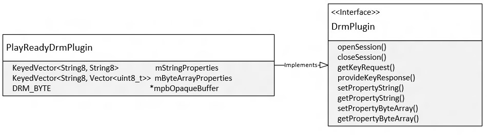
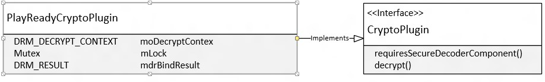

# 2. Interfaces
   
  
 [PlayReadyDrmPlugin](4playreadydrmplugin.md) provides the implementation for the DRM plug-in interface. **PlayReadyDrmPlugin** is responsible for wrapping the DRM Manager APIs and doing the proper translation for the parameters as specified by the interface into a format that PlayReady can operate on.   

    
  
 [PlayReadyCryptoPlugin](5playreadycryptoplugin.md) provides the implementation for the Crypto plug-in interface, which is responsible for decrypting the samples. The OEM must ensure that the decrypted samples never leave the trusted execution environment (TEE).   

  
