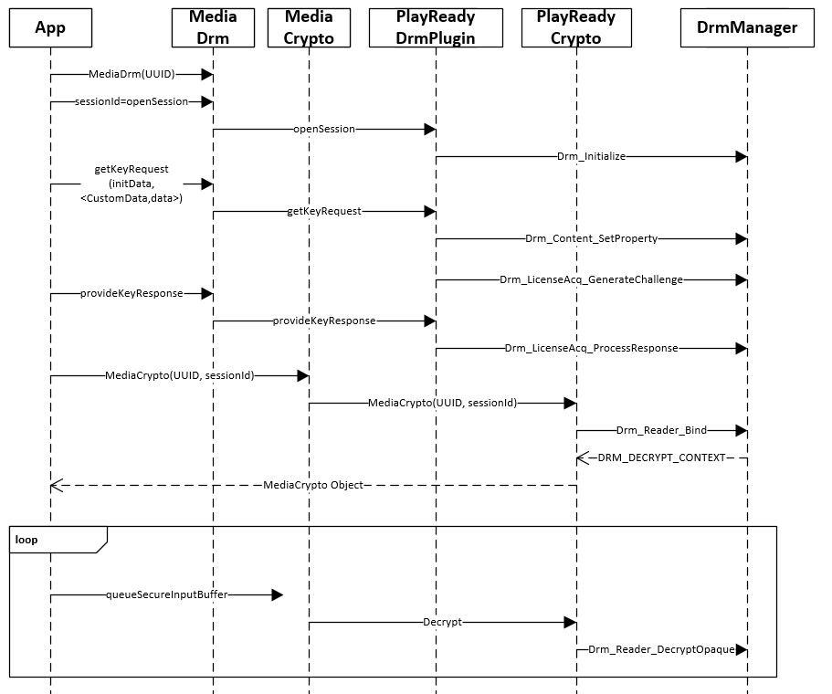
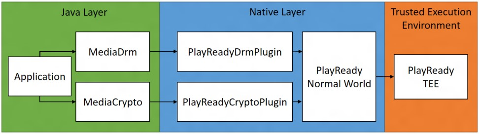

# 3. Operation
   
  
The following steps describe a simple playback scenario:   
 
   1. The app creates the **MediaDrm** object, which will result in the instantiation of [PlayReadyDrmPlugin](4playreadydrmplugin.md).
   
   1. Then call [openSession](4playreadydrmplugin.md#opensession), which will result in the initialization of the DRM Manager.  
 
   1. The app will then call [getKeyRequest](4playreadydrmplugin.md#getkeyrequest) and pass the content header extracted from the content as the *initData* parameter. In addition, the app can also pass the license acquisition challenge custom data in the *optionalParameters* key-value vector. The license acquisition challenge custom data should then propagate to the DRM Manager as a Drm_Content_SetProperty call.   

   1. At this point the app will be able to execute the (**getKeyRequest** / [provideKeyResponse](4playreadydrmplugin.md#providekeyresponse)) which will produce the equivalent (Drm_LicenseAcq_GenerateChallenge) / Drm_LicenseAcq_ProcessResponse) calls on the DRM Manager.   

   1. The app can then instantiate a **MediaCrypto** object that will create an instance of a [PlayReadyCryptoPlugin](5playreadycryptoplugin.md) interface (wrapping DRM_DECRYPT_CONTEXT) when the Drm_Reader_Bind call returns.   

   1. Afterwards, all decryption calls will utilize the [PlayReadyCryptoPlugin::decrypt](5playreadycryptoplugin.md#decrypt) method, which will return a handle to the decrypted samples.   

   
  
    
   
  
    
 
