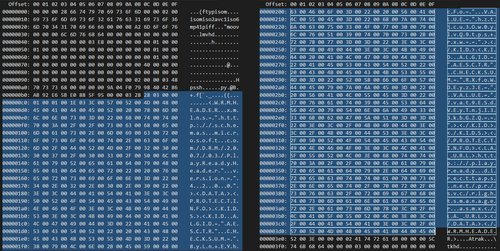

# PlayReady Header Specification

## 1. Introduction
This specification applies to any end product created with the PlayReady Server SDK, PlayReady Device Porting Kit, Windows, Xbox, Windows Phone, and Silverlight.

### 1.1. Change History

| Version | Change |
| --- | --- |
| November 1, 2017 | Add the Syntax Requirements section. Fix multiples examples with incorrect attribute order (attributes must be in alphabetical order)<p/>|
| July 12, 2017 | Add PlayReady Header 4.3.0.0 section, supported starting with PlayReady version 4.<p/>Add syntax requirement that all XML nodes must be explicitly closed by a closing tag |
| April 10, 2015 | Add PlayReady Header 4.2.0.0 section, supported starting with PlayReady version 3 |
| September, 2011 | Add PlayReady Header 4.1.0.0 section, supported starting with PlayReady version 2 |
| August 2008 | Initial version documenting the PlayReady Header 4.0.0.0 supported in PlayReady version 1 |

## 2. PlayReady Object (PRO)

The PlayReady Object (PRO) contains the following fields.

| Field name| Field type| Size (bits)| Description|
| --- | --- | --- | --- |
| Length| DWORD| 32| The length of the PlayReady Object in bytes. This value should not exceed 15 kilobytes (KB).|
| PlayReady Object Record Count| WORD| 16| Specifies the number of PlayReady Object Records in the PlayReady Object.|
| PlayReady Object Records| BYTE array| Varies|Contains a variable number of records that contain information related to licenses and license acquisition.|

### 2.1 PlayReady Object Records

The PlayReady Object consists of additional sub-objects called PlayReady Object Records. PlayReady Object Records contain the following fields.

| Field name| Field type| Size (bits)| Description|
| --- | --- | --- | --- |
| Record Type| WORD| 16| Specifies the type of data stored in the Record Value.|
| Record Length| WORD| 16| Specifies the size in bytes of the Record Value.|
| Record Value| BYTE array| Varies| The content of the object depends on the value of Record Type.|

&nbsp;

The Record Type field has one of the following values.

|Value type| Description|
| --- | ---|
| 0x0001| Indicates that the record contains a PlayReady Header (PRH).|
| 0x0002| Reserved.|
| 0x0003| Indicates an Embedded License Store (ELS).|

### 2.2. PlayReady Object Examples

The following figure shows a segmented MP4 file with a PlayReady Object that contains a PlayReady Header:


The following figure shows the HEX view of this MP4 file:



## 3. PlayReady Header (PRH)

The PlayReady Header (PRH) is used by a Client to locate or acquire a license for the piece of content it is stored in. It is encoded using UTF-16.

### 3.1. Version support matrix

<table>
    <tr>
        <th></th>
        <th>PlayReady Header v4.3.0.0</th>
        <th>PlayReady Header v4.2.0.0</th>
        <th>PlayReady Header v4.1.0.0</th>
        <th>PlayReady Header v4.0.0.0</th>
    </tr>
    <tr>
        <td>PlayReady 4.0 SDK based Clients<br/> (see note 4)</td>
        <td align="center">✔</td>
        <td align="center">✔</td>
        <td align="center">✔</td>
        <td align="center">✔</td>
    </tr>
    <tr>
        <td>PlayReady 3.0 SDK based Clients<br/> (see note 3)</td>
        <td></td>
        <td align="center">✔</td>
        <td align="center">✔</td>
        <td align="center">✔</td>
    </tr>
    <tr>
        <td>PlayReady 2.x SDK based Clients<br/> (see note 2)</td>
        <td></td>
        <td></td>
        <td align="center">✔</td>
        <td align="center">✔</td>
    </tr>
    <tr>
        <td>PlayReady 1.x SDK based Clients<br/> (see note 1)</td>
        <td></td>
        <td></td>
        <td></td>
        <td align="center">✔</td>
    </tr>
</table>

Notes:
  * (4) Xbox One version 1709 or higher are PlayReady 4.X Clients.
  * (3) Windows 10 (all versions) and Xbox One version 1703 or lower are PlayReady 3.X Clients. Newest non-Windows devices (for example, Smart TVs) released after 2017 are PlayReady 3.X Clients.
  * (2) Silverlight and Windows 8, 8.1 are PlayReady 2.X Clients. Most non-Windows devices (for example, Smart TVs) released between 2011 and 2017 are PlayReady 2.X Clients.
  * (1) Most non-Windows devices (for example, Smart TVs) released between 2008 and 2011 are PlayReady 1.X Clients.

### 3.2. Syntax Requirements

#### 3.2.1. Canonicalized
The XML must be canonicalized.

#### 3.2.2. All Node and Attributes names are case-sensitive

<table>
    <tr>
        <td>• Supported</td>
        <td>&lt;KID VALUE="PV1LM/VEVk+kEOB8qqcWDg=="&gt;&lt;/KID&gt;</td>
    <tr>
        <td style="border: none">• Not supported</td>
        <td style="border: none">&lt;KID value="PV1LM/VEVk+kEOB8qqcWDg=="&gt;&lt;/KID&gt;<br/>
            &lt;kid VALUE="PV1LM/VEVk+kEOB8qqcWDg=="&gt;&lt;/kid&gt;
        </td>
    </tr>
</table>

#### 3.2.3. Closing tags must be explicit

All XML nodes must be explicitly closed by a closing tag including those in nodes inside the CUSTOMATTRIBUTES node.

<table>
    <tr>
        <td>• Supported</td>
        <td>&lt;KID VALUE="PV1LM/VEVk+kEOB8qqcWDg=="&gt;&lt;/KID&gt;<br/>
            &lt;CUSTOMATTRIBUTES&gt;&lt;MyNode FooAttribute="Foo"&gt;&lt;/MyNode&gt;&lt;/CUSTOMATTRIBUTES&gt;
        </td>
    </tr>
    <tr>
        <td style="border: none">• Not supported</td>
        <td style="border: none">&lt;KID VALUE="PV1LM/VEVk+kEOB8qqcWDg=="/&gt;
&lt;CUSTOMATTRIBUTES&gt;&lt;MyNode FooAttribute="Foo"/&gt;&lt;/CUSTOMATTRIBUTES&gt;</td>
    </tr>
</table>

#### 3.2.4. Namespace attributes

All namespace attributes must be before non-namespaces attributes.

<table>
    <tr>
        <td>• Supported</td>
        <td>&lt;WRMHEADER xmlns="http://schemas.microsoft.com/DRM/2007/03/PlayReady
Header" version="4.3.0.0"&gt;</td>
    </tr>
    <tr>
        <td style="border: none">• Not supported</td>
        <td style="border: none">&lt;WRMHEADER version="4.3.0.0" xmlns="http://schemas.microsoft.com/DRM/
2007/03/PlayReadyHeader"&gt;</td>
    </tr>
</table>

#### 3.2.5.	Alphabetical order

All attributes must be in alphabetical order including those in nodes inside the CUSTOMATTRIBUTES node.

<table>
    <tr>
        <td>• Supported</td>
        <td>&lt;KID ALGID="AESCBC" VALUE="PV1LM/VEVk+kEOB8qqcWDg=="&gt;&lt;/KID&gt;<br/>&lt;CUSTOMATTRIBUTES&gt;&lt;MyNode BarAttribute="Bar" FooAttribute="Foo"&gt;&lt;/MyNode&gt;&lt;/CUSTOMATTRIBUTES&gt;</td>
    </tr>
    <tr>
        <td style="border: none">• Not supported</td>
        <td style="border: none">&lt;KID VALUE="PV1LM/VEVk+kEOB8qqcWDg==" ALGID="AESCBC"&gt;&lt;/KID&gt;<br/>&lt;CUSTOMATTRIBUTES&gt;&lt;MyNode FooAttribute="Foo" BarAttribute="Bar"&gt;&lt;/MyNode&gt;&lt;/CUSTOMATTRIBUTES&gt;</td>
    </tr>
</table>

### 3.3. v4.3.0.0

PlayReady Header v4.3.0.0 was introduced with PlayReady version 4.0 in September 2017 to support AESCBC keys in a header. This support allows encryption of content in CBC mode, in particulat for the Common Encryption modes 'cbcs'. It also increases the interoperability of PlayReady Clients with other DRM systems, as well as existing content.

#### 3.3.1. Differences with other versions

Starting with version 4.0, PlayReady SDKs and Clients are able to process PlayReady Header versions 4.0, 4.1, 4.2 and 4.3. PlayReady SDKs prior to version 4.0 will return an "unsupported version" error when provided with v4.3 headers.

The PlayReady Header format v.4.3.0.0 has the following changes compared to v4.2.0.0:

  *  The **WRMHEADER** element’s version attribute is set to the string “4.3.0.0”.
  *  The **ALGID** element located inside the KID element can now have the value "AESCBC", in addition to "AESCTR", provided that:
     *  The **ALGID** element located inside the **KID** element may be missing in a license acquisition request. Microsoft recommends that the **ALGID** element has a valid value in the header included in the content.
     *  When the **ALGID** elements are present, and there is more than one **KID** element in the **KIDS** element, all the **ALGID** values must be the same.
     *  When the **ALGID** element is set to “AESCBC”, the **CHECKSUM** attribute must not be included.

#### 3.3.2. Examples

The following is an example of a PlayReady Header 4.3.0.0 with AESCBC keys:

```xml
<WRMHEADER xmlns="http://schemas.microsoft.com/DRM/2007/03/PlayReadyHeader" version="4.3.0.0">
  <DATA>
    <PROTECTINFO>
      <KIDS>
        <KID ALGID="AESCBC" VALUE="PV1LM/VEVk+kEOB8qqcWDg=="></KID>
        <KID ALGID="AESCBC" VALUE="tuhDoKUN7EyxDPtMRNmhyA=="></KID>
      </KIDS>
    </PROTECTINFO>
    <LA_URL>http://rm.contoso.com/rightsmanager.asmx</LA_URL>
    <DS_ID>AH+03juKbUGbHl1V/QIwRA==</DS_ID>
  </DATA>
</WRMHEADER>
```

The following is an example of a PlayReady Header 4.3.0.0 with a missing ALGID:

```xml
<WRMHEADER xmlns="http://schemas.microsoft.com/DRM/2007/03/PlayReadyHeader" version="4.3.0.0">
  <DATA>
    <PROTECTINFO>
      <KIDS>
        <KID VALUE="PV1LM/VEVk+kEOB8qqcWDg=="></KID>
      </KIDS>
    </PROTECTINFO>
    <LA_URL>http://rm.contoso.com/rightsmanager.asmx</LA_URL>
    <DS_ID>AH+03juKbUGbHl1V/QIwRA==</DS_ID>
    <DECRYPTORSETUP>ONDEMAND</DECRYPTORSETUP>
  </DATA>
</WRMHEADER>
```

#### 3.3.3.	Format

The PlayReady Header v4.3.0.0 has the following syntax.

```xml
<WRMHEADER xmlns="http://schemas.microsoft.com/DRM/2007/03/PlayReadyHeader" version="4.3.0.0">
  <DATA>
      <PROTECTINFO>
        <KIDS>
          <KID ALGID="value" CHECKSUM=“base64-encoded value" VALUE="base64-encoded guid"></KID>
          <KID ALGID="value" CHECKSUM=“base64-encoded value" VALUE="base64-encoded guid"></KID>
          <KID ALGID="value" CHECKSUM=“base64-encoded value" VALUE="base64-encoded guid"></KID>
        </KIDS>
      </PROTECTINFO>
      <LA_URL> URL for license acquisition </LA_URL>
      <LUI_URL>
        URL for Non-silent license acquisition web page
      </LUI_URL>
    <DS_ID> base64-encoded guid </DS_ID>
    <CUSTOMATTRIBUTES xmlns="">
      <mm:Publisher xmlns:mm="urn:schema-musicmogul-com">
           <mm:Author>
                Elvis Presley
           </mm:Author>
           <mm:CreationDate>
                2007/08/21:12:00:00
           </mm:CreationDate>
        </mm:Publisher>
    </CUSTOMATTRIBUTES>
    <DECRYPTORSETUP>ONDEMAND</DECRYPTORSETUP>
  </DATA>
</WRMHEADER>
```

The tags are described below.

| Tag name| Required| Description|
| --- | --- | --- |
| WRMHEADER| Yes| Outermost element of the header object. It can contain one **DATA** element and must contain one version attribute. The version for the header is "4.3.0.0". Every time Microsoft defines new mandatory tags or attributes, a new version number is associated with those tags or attributes. If the version is greater than that for which the Client code was written, then the Client code must fail, because it implies that the header contains mandatory tags that the Client does not understand. If the version is less than or equal to that for which the Client code was written, than the Client code can safely skip any tags or attributes that it does not understand.|
| DATA| No| Container element for header data, including third-party tags. No more than one **DATA** element may be included in the **WRMHEADER** element.|
| PROTECTINFO| No| Specifies zero or one **KIDS** element. No more than one **PROTECTINFO** element may be included in the **DATA** element.|
| KIDS| No| Specifies one or more **KID** elements that may be used for creating decryptor objects for the associated content. Either one or zero **KIDS** elements may exist under the **PROTECTINFO** node.|
| KID| No| Contains all key data for a given license. If the **KIDS** node is present, one or more **KID** element must exist under the **KIDS** node. The **KID** element contains the following attributes.<br/><br/>**ALGID**: Optional. Specifies the encryption algorithm. May be set to either: "AESCTR", "AESCBC", or "COCKTAIL".<br/><br/>**CHECKSUM**: Optional. Only for AESCTR keys. Contains a checksum calculated by using the KID VALUE attribute and content key. Refer to the [Key Checksum Algorithm](#keychecksum) section of this document for details.<br/><br/>If this node exists in the WRMHeader XML then its data value must be empty.<br/><br/>**VALUE**: Required. Contains a base64-encoded key ID GUID value. Note that this GUID (DWORD, WORD, WORD, 8-BYTE array) value must be little endian byte order.|
| LA_URL| No| Contains the URL for the license acquisition Web service. Only absolute URLs are allowed. No more than one **LA_URL** element may be included in the **DATA** element.<br/><br/>If this node exists in the WRMHeader XML then its data value must not be empty.|
| LUI_URL| No| Contains the URL for a non-silent license acquisition Web page. Only absolute URLs are allowed. No more than one **LUI_URL** element may be included in the **DATA** element.<br/><br/>If this node exists in the WRMHeader XML then its data value must not be empty.|
| DS_ID| No| Service ID for the domain service. Only up to one **DS_ID** element may be included in the **DATA** element.<br/><br/>If this node exists in the WRMHeader XML then its data value must not be empty.|
| CUSTOMATTRIBUTES| No| The content author can add custom XML inside this element. Microsoft code does not act on any data contained inside this element. No more than one **CUSTOMATTRIBUTES** element may be included in the **DATA** element.<br/><br/>If this node exists in the WRMHeader XML then its data value must not be empty.|
| DECRYPTORSETUP| No| This tag may only contain the value "ONDEMAND". When this tag is present in the **DATA** node and its value is set to "ONDEMAND" then it indicates to an application that it should not expect the full license chain for the content to be available for acquisition, or already present on the Client machine, prior to setting up the media graph. If this tag is not set then it indicates that an application can enforce the license to be acquired, or already present on the Client machine, prior to setting up the media graph. No more than one **DECRYPTORSETUP** element may be included in the **DATA** element.

### 3.4. v4.2.0.0

PlayReady Header v4.2.0.0 was introduced with PlayReady version 3.0 in April 2015 to allow multiple KIDs in a single header. This means that multiple keys can be used to encrypt a single asset, for example when the audio tracks must be encrypted with a different key than the video tracks.

#### 3.4.1. Differences with other versions

PlayReady 3.0 SDKs and later Clients are able to process the v4.0, v4.1, and v4.2 PlayReady Header versions. Prior PlayReady SDKs return an “unsupported version” error when provided with v4.2 headers. When using the v4.2 header, the Client has to know what Server version it is using through a custom, app-specific mechanism. PlayReady SDKs provide no native way to get this version information.

The PlayReady Header format v.4.2.0.0 has the following changes compared to v4.1.0.0:

  *  The **WRMHEADER** element’s version attribute is set to the string “4.2.0.0”.
  *  The **KID** element located inside the **PROTECTINFO** element has been renamed to **KIDS** and is still optional.
  *  Multiple **KID** elements are located inside the **KIDS** element.

#### 3.4.2. Example

PlayReady Header 4.2.0.0 with two AESCTR keys:

```xml
<WRMHEADER xmlns="http://schemas.microsoft.com/DRM/2007/03/PlayReadyHeader" version="4.2.0.0">
  <DATA>
    <PROTECTINFO>
      <KIDS>
        <KID ALGID="AESCTR" CHECKSUM="xNvWVxoWk04=" VALUE="0IbHou/5s0yzM80yOkKEpQ=="></KID>
        <KID ALGID="AESCTR" CHECKSUM="GnKaQIRacPU=" VALUE="/qgG2xbs4k2SKCxx6bhWqw=="></KID>
      </KIDS>
    </PROTECTINFO>
    <LA_URL>http://rm.contoso.com/rightsmanager.asmx</LA_URL>
    <DS_ID>AH+03juKbUGbHl1V/QIwRA==</DS_ID>
  </DATA>
</WRMHEADER>
```

#### 3.4.3. Format

The PlayReady Header v4.2.0.0 has the following syntax.

```xml
<WRMHEADER xmlns="http://schemas.microsoft.com/DRM/2007/03/PlayReadyHeader" version="4.2.0.0">
  <DATA>
      <PROTECTINFO>
        <KIDS>
          <KID ALGID="AESCTR" CHECKSUM="base64-encoded value" VALUE="base64-encoded guid"></KID>
          <KID ALGID="AESCTR" CHECKSUM="base64-encoded value" VALUE="base64-encoded guid"></KID>
          <KID ALGID="AESCTR" CHECKSUM="base64-encoded value" VALUE="base64-encoded guid"></KID>
        </KIDS>
      </PROTECTINFO>
      <LA_URL> URL for license acquisition </LA_URL>
      <LUI_URL>
        URL for Non-silent license acquisition web page
      </LUI_URL>
    <DS_ID> base64-encoded guid </DS_ID>
    <CUSTOMATTRIBUTES xmlns="">
      <mm:Publisher xmlns:mm="urn:schema-musicmogul-com">
           <mm:Author>
                Elvis Presley
           </mm:Author>
           <mm:CreationDate>
                2007/08/21:12:00:00
           </mm:CreationDate>
        </mm:Publisher>
    </CUSTOMATTRIBUTES>
    <DECRYPTORSETUP>ONDEMAND</DECRYPTORSETUP>
  </DATA>
</WRMHEADER>
```

The tags are described below.

|Tag name| Required| Description|
| --- | --- | --- |
| WRMHEADER| Yes| Outermost element of the header object. It can contain one **DATA** element and must contain one version attribute. The version for the header is "4.2.0.0". Every time Microsoft defines new mandatory tags or attributes, a new version number is associated with those tags or attributes. If the version is greater than that for which the Client code was written, then the Client code must fail, because it implies that the header contains mandatory tags that the Client does not understand. If the version is less than or equal to that for which the Client code was written, than the Client code can safely skip any tags or attributes that it does not understand.|
| DATA| No| Container element for header data, including third-party tags. Only up to one **DATA** element may be included in the **WRMHEADER** element.|
| PROTECTINFO| No| Specifies zero or one **KIDS** element. No more than one **PROTECTINFO** element may be included in the **DATA** element.|
| KIDS| No| Specifies one or more **KID** elements that may be used for creating decryptor objects for the associated content. Either one or zero **KIDS** elements may exist under the **PROTECTINFO** node.|
| KID| No| Contains all key data for a given license. If the **KIDS** node is present, one or more **KID** elements must exist under the **KIDS** node. The **KID** element contains the following attributes.<br/><br/>**ALGID**: Required. Specifies the encryption algorithm. Must be set to either: AESCTR, or COCKTAIL<br/><br/>**CHECKSUM**: Optional. Contains a checksum calculated using the KID VALUE and content key. Refer to the [Key Checksum Algorithm](#keychecksum) section of this document for details.<br/><br>If this node exists in the WRMHeader XML then its data value must be empty.<br/><br/>**VALUE**: Required. Contains a base64-encoded key ID GUID value. Note that this GUID (DWORD, WORD, WORD, 8-BYTE array) value must be little endian byte order.|
| LA_URL| No| Contains the URL for the license acquisition Web service. Only absolute URLs are allowed. No more than one **LA_URL** element may be included in the **DATA** element.<br/><br/>If this node exists in the WRMHeader XML then its data value must not be empty.|
| LUI_URL| No| Contains the URL for a non-silent license acquisition Web page. Only absolute URLs are allowed. No more than one **LUI_URL** element may be included in the **DATA** element.<br/><br/>If this node exists in the WRMHeader XML then its data value must not be empty.|
| DS_ID| No| Service ID for the domain service. No more than one **DS_ID** element may be included in the **DATA** element.<br/><br/>If this node exists in the WRMHeader XML then its data value must not be empty.|
| CUSTOMATTRIBUTES| No| The content author can add arbitrary XML inside this element. Microsoft code does not act on any data contained inside this element. No more than one **CUSTOMATTRIBUTES** element may be included in the **DATA** element.<br/><br/>If this node exists in the WRMHeader XML then its data value must not be empty.|
| DECRYPTORSETUP| No| This tag may only contain the value "ONDEMAND”. When this tag is present in the **DATA** node and its value is set to “ONDEMAND” then it indicates to an application that it should not expect the full license chain for the content to be available for acquisition, or already present on the Client machine, prior to setting up the media graph. If this tag is not set then it indicates that an application can enforce the license to be acquired, or already present on the Client machine, prior to setting up the media graph. No more than one **DECRYPTORSETUP** element may be included in the **DATA** element.|

 
### 3.5. v4.1.0.0

PlayReady Header v4.1.0.0 was introduced with PlayReady version 2.0 in September 2011 to support live linear streams with scalable leaf licenses embedded in the stream. This type of stream requires Clients to bind a scalable root license without knowledge of the content encryption key that will be used in the decryptor.

#### 3.5.1. Differences with other versions

PlayReady 2.0 SDKs and later Clients are able to process both the v4.0 and v4.1 PlayReady Header versions. Prior PlayReady SDKs return an “unsupported version” error when provided with v4.1 headers.

The PlayReady Header format v.4.1.0.0 has the following changes compared to v4.0.0.0:

  *  The **WRMHEADER** element’s version attribute is set to the string “4.1.0.0”.
  *  The **DATA** element contains an optional **DECRYPTORSETUP** element.
  *  The **KID** element is located inside the **PROTECTINFO** element and is optional rather than required.
  *  The **KID** element contains the attributes **ALGID** (required), **CHECKSUM** (optional), and **VALUE** (required).
  *  The **KEYLEN** element has been removed. The **KEYLEN** attribute was previously used to disambiguate cocktail licenses with different length keys. The v4.1 header will break the ability to support anything but 8-byte cocktail keys. If you use cocktail keys that aren't 8-byte, you must use v4.0 headers.
  *  The **ALGID** and **CHECKSUM** elements have been removed since their data is contained within attributes of the **KID** element.

#### 3.5.2. Format

The PlayReady Header v4.1.0.0 has the following syntax.

```xml
<WRMHEADER xmlns="http://schemas.microsoft.com/DRM/2007/03/PlayReadyHeader" version="4.1.0.0">
  <DATA>
      <PROTECTINFO>
        <KID ALGID="AESCTR" CHECKSUM=“base64-encoded value” VALUE="base64-encoded guid"></KID>
      </PROTECTINFO>
      <LA_URL> URL for license acquisition </LA_URL>
      <LUI_URL>
        URL for Non-silent license acquisition web page
      </LUI_URL>
    <DS_ID> base64-encoded guid </DS_ID>
    <CUSTOMATTRIBUTES xmlns="">
      <mm:Publisher xmlns:mm="urn:schema-musicmogul-com">
           <mm:Author>
                Elvis Presley
           </mm:Author>
           <mm:CreationDate>
                2007/08/21:12:00:00
           </mm:CreationDate>
        </mm:Publisher>
    </CUSTOMATTRIBUTES>
    <DECRYPTORSETUP>ONDEMAND</DECRYPTORSETUP>
  </DATA>
</WRMHEADER>
```

The tags are described below.

| Tag name| Required| Description|
| --- | --- | --- |
| WRMHEADER| Yes| Outermost element of the header object. It can contain one **DATA** element and must contain one version attribute. The version for the header is "4.1.0.0". Every time Microsoft defines new mandatory tags or attributes, a new version number is associated with those tags or attributes. If the version is greater than that for which the Client code was written, then the Client code must fail, because it implies that the header contains mandatory tags that the Client does not understand. If the version is less than or equal to that for which the Client code was written, than the Client code can safely skip any tags or attributes that it does not understand.|
| DATA| No| Container element for header data, including third-party tags. No more than one **DATA** element may be included in the **WRMHEADER** element.|
| PROTECTINFO| No| Specifies zero or one **KID** elements that may be used for creating decryptor objects for the associated content. No more than one **PROTECTINFO** element may be included in the **DATA** element.|
| KID| No| Contains all key data for a given license. Either one or zero **KID** elements may exist under the **PROTECTINFO** node. The **KID** element contains the following attributes.<br/><br/>**VALUE**: Required. Contains a base64-encoded key ID GUID value. Note that this GUID (DWORD, WORD, WORD, 8-BYTE array) value must be little endian byte order.<br/><br/>**ALGID**: Required. Specifies the encryption algorithm. Must be set to either: "AESCTR", or "COCKTAIL"<br/><br/>**CHECKSUM**: Optional. Contains a checksum calculated using the KID VALUE and content key. Refer to the [Key Checksum Algorithm](#keychecksum) section of this document for details.<br/><br/>If this node exists in the WRMHeader XML then its data value must be empty.|
| LA_URL| No| Contains the URL for the license acquisition Web service. Only absolute URLs are allowed. No more than one **LA_URL** element may be included in the **DATA** element.<br/><br/>If this node exists in the WRMHeader XML then its data value must not be empty.|
| LUI_URL| No| Contains the URL for a non-silent license acquisition Web page. Only absolute URLs are allowed. No more than one **LUI_URL** element may be included in the **DATA** element.<br/><br/>If this node exists in the WRMHeader XML then its data value must not be empty.|
| DS_ID| No| Service ID for the domain service. No more than one **DS_ID** element may be included in the **DATA** element.<br/><br/>If this node exists in the WRMHeader XML then its data value must not be empty.|
| CUSTOMATTRIBUTES| No| The content author can add arbitrary XML inside this element. Microsoft code does not act on any data contained inside this element. Only up to one **CUSTOMATTRIBUTES** element may be included in the **DATA** element.<br/><br/>If this node exists in the WRMHeader XML then its data value must not be empty.|
| DECRYPTORSETUP| No| This tag may only contain the value "ONDEMAND". When this tag present in the **DATA** node and its value is set to “ONDEMAND” then it indicates to an application that it should not expect the full license chain for the content to be available for acquisition, or already present on the Client machine, prior to setting up the media graph. If this tag is not set then it indicates that an application can enforce the license to be acquired, or already present on the Client machine, prior to setting up the media graph. Only up to one **DECRYPTORSETUP** element may be included in the **DATA** element.|

Notes for v4.1:

  *  All XML tags and attributes in the PlayReady Header are defined by Microsoft. The only exception is the content of the **CUSTOMATTRIBUTES** element. PlayReady PC application developers must not add any custom tags outside of the **CUSTOMATTRIBUTES** element.
  *  The PlayReady Header should abide by the W3C Canonical XML v1.1 specifications ([http://www.w3.org/TR/xml-c14n11/](http://www.w3.org/TR/xml-c14n11/)).
  *  The PlayReady Header does not contain a top-level `?XML` tag that is required in well-formed XML.
  *  It is recommended that the size of this field should not exceed 1 KB.

### 3.6. v4.0.0.0

PlayReady Header v4.0.0.0 was introduced with PlayReady version 1.0 in 2008 and allows a single AESCTR key to support AES encrypted content, or a COCKTAIL key to support WMDRM encrypted content.

#### 3.6.1. Examples

PlayReady Header 4.0.0.0:

```xml
<WRMHEADER xmlns="http://schemas.microsoft.com/DRM/2007/03/PlayReadyHeader" version="4.0.0.0">
  <DATA>
    <PROTECTINFO>
      <ALGID>AESCTR</ALGID>
      <KEYLEN>16</KEYLEN>
    </PROTECTINFO>
    <KID>q5HgCTj40kGeNVhTH9Gexw==</KID>
    <CHECKSUM>w+OZVr8vzrQ=</CHECKSUM>
    <LA_URL>http://rm.contoso.com/rightsmanager.asmx</LA_URL>
    <CUSTOMATTRIBUTES>
      <IIS_DRM_VERSION>8.0.1705.19</IIS_DRM_VERSION>
    </CUSTOMATTRIBUTES>
  </DATA>
</WRMHEADER>
```

Base64-encoded PlayReady Object containing a PlayReady Header 4.0.0.0:

XAMAAAEAAQBSAzwAVwBSAE0ASABFAEEARABFAFIAIAB4AG0AbABuAHMAPQAiAGgAdAB0AHAAOgAvAC8AcwBjAGgAZQBtAGEAcwAuAG0AaQBjAHIAbwBzAG8AZgB0AC4AYwBvAG0ALwBEAFIATQAvADIAMAAwADcALwAwADMALwBQAGwAYQB5AFIAZQBhAGQAeQBIAGUAYQBkAGUAcgAiACAAdgBlAHIAcwBpAG8AbgA9ACIANAAuADAALgAwAC4AMAAiAD4APABEAEEAVABBAD4APABQAFIATwBUAEUAQwBUAEkATgBGAE8APgA8AEsARQBZAEwARQBOAD4AMQA2ADwALwBLAEUAWQBMAEUATgA+ADwAQQBMAEcASQBEAD4AQQBFAFMAQwBUAFIAPAAvAEEATABHAEkARAA+ADwALwBQAFIATwBUAEUAQwBUAEkATgBGAE8APgA8AEsASQBEAD4AcQA1AEgAZwBDAFQAagA0ADAAawBHAGUATgBWAGgAVABIADkARwBlAHgAdwA9AD0APAAvAEsASQBEAD4APABDAEgARQBDAEsAUwBVAE0APgB3ACsATwBaAFYAcgA4AHYAegByAFEAPQA8AC8AQwBIAEUAQwBLAFMAVQBNAD4APABMAEEAXwBVAFIATAA+AGgAdAB0AHAAcwA6AC8ALwBwAHIAbwBmAGYAaQBjAGkAYQBsAHMAaQB0AGUALgBrAGUAeQBkAGUAbABpAHYAZQByAHkALgBtAGUAZABpAGEAcwBlAHIAdgBpAGMAZQBzAC4AdwBpAG4AZABvAHcAcwAuAG4AZQB0AC8AUABsAGEAeQBSAGUAYQBkAHkALwA8AC8ATABBAF8AVQBSAEwAPgA8AEMAVQBTAFQATwBNAEEAVABUAFIASQBCAFUAVABFAFMAPgA8AEkASQBTAF8ARABSAE0AXwBWAEUAUgBTAEkATwBOAD4AOAAuADAALgAxADcAMAA1AC4AMQA5ADwALwBJAEkAUwBfAEQAUgBNAF8AVgBFAFIAUwBJAE8ATgA+ADwALwBDAFUAUwBUAE8ATQBBAFQAVABSAEkAQgBVAFQARQBTAD4APAAvAEQAQQBUAEEAPgA8AC8AVwBSAE0ASABFAEEARABFAFIAPgA=


#### 3.6.2. Format

The PlayReady Header v4.0.0.0 has the following syntax.

```xml
<WRMHEADER xmlns="http://schemas.microsoft.com/DRM/2007/03/PlayReadyHeader" version="4.0.0.0">
<DATA>
      <PROTECTINFO>
        <ALGID>AESCTR</ALGID>
        <KEYLEN>16</KEYLEN>
      </PROTECTINFO>
      <LA_URL> URL for license acquisition </LA_URL>
      <LUI_URL>
        URL for Non-silent license acquisition web page
      </LUI_URL>
    <DS_ID>base64-encoded guid</DS_ID>
    <KID>base64-encoded kid</KID>
    <CUSTOMATTRIBUTES xmlns="">
      <mm:Publisher xmlns:mm="urn:schema-musicmogul-com">
           <mm:Author>
                Elvis Presley
           </mm:Author>
           <mm:CreationDate>
                2007/08/21:12:00:00
           </mm:CreationDate>
        </mm:Publisher>
    </CUSTOMATTRIBUTES>
    <CHECKSUM>
      checksum of the content key for verification
    </CHECKSUM>
  </DATA>
</WRMHEADER>
```

The following table describes the different tags.

| Tag name| Required| Description|
| --- | --- | --- |
| WRMHEADER| Yes| Outermost element of the header object. It can contain one **DATA** element and one version attribute. The version for the header is "4.0.0.0".<br/><br/>Semantics for packager:<br/>Every time Microsoft defines new mandatory tags or attributes, a new version number is associated with those tags or attributes. The version of the PlayReady Header must be set to the highest of the versions of the mandatory tags and attributes present in the header.<br/><br/>Semantics for Client:<br/>If the version is greater than that for which the Client code was written, then the Client code must fail because it implies that the header contains mandatory tags that the Client does not understand. If the version is less than or equal to that for which the Client code was written, then the Client code can safely skip any tags or attributes it does not understand.|
| DATA| Yes| Container element for header data, including third-party tags.|
| PROTECTINFO| Yes| Specifies the type of encryption using the **KEYLEN** and **ALGID** child elements.|
| KEYLEN| Yes| Specifies the size of the content key. Must be set to 16 if **ALGID** is set to "AESCTR" and 7 if **ALGID** is set to "COCKTAIL".|
| ALGID| Yes| Specifies the encryption algorithm. Must be set to the following value:<br/><br/>AESCTR: Corresponds to the AES algorithm in counter mode.<br/><br/>COCKTAIL: Corresponds to the Cocktail algorithm.|
| KID| Yes| Contains a base64-encoded key ID GUID value. Note that this GUID (DWORD, WORD, WORD, 8-BYTE array) value must be little endian byte order.|
| CHECKSUM| No| Contains checksum calculated by using the KID VALUE and content key. See the [Key Checksum Algorithm](#keychecksum) section for details.<br/><br/>Previous versions of PlayReady treated this field as required, so it should be included in any header that is going to be consumed by a previous version of PlayReady.|
| LA_URL| No| Contains the URL for the license acquisition Web service. Only absolute URLs are allowed.|
| LUI_URL| No| Contains the URL for a non-silent license acquisition Web page. Only absolute URLs are allowed.|
| DS_ID| No| Service ID for the domain service.|
| CUSTOMATTRIBUTES| No| The content author can add arbitrary XML inside this element. Microsoft code does not act on any data contained inside this element.|

Notes for v4.0:

  *  All XML tags and attributes in the PlayReady Header are defined by Microsoft. The only exception is the content of the **CUSTOMATTRIBUTES** element. PlayReady PC application developers must not add any custom tags outside of the **CUSTOMATTRIBUTES** element as doing so may clash with future tags that Microsoft defines.
  *  The order of child elements within a container element does not matter.
  *  Note that the PlayReady Header does not contain a top-level `?XML` tag that is required in well-formed XML.
  *  It is recommended that the size of this field should not exceed 1 KB.
  *  **CHECKSUM** is required by PlayReady Server SDK up to version 1.2.
Since version 1.5, PlayReady Server SDK treats the **CHECKSUM** as optional.
PlayReady Porting Kit 1.2 out of the box requires the **CHECKSUM**.
PlayReady Porting Kit 2.0 treats the **CHECKSUM** as optional.

## 4. Embedded License Store (ELS)

It is good practice to add an empty Embedded License Store to the PlayReady Object under the following conditions:

  *  The PlayReady Object is to be inserted into a content file.
  *  The content may be used in a context of PlayReady domains with embedded licenses.

This allows a PlayReady Client to further embed a domain-bound license in the PlayReady Object by simply populating the existing Embedded License Store and saves the effort of having to re-header the entire file with a new PlayReady Object of a larger size than that of the initial one.

>[!NOTE]
>It is recommended that you do not include an empty Embedded License Store in a PlayReady Object, aimed at being inserted as a base-64 string in a Smooth Streaming Client Manifest.

>[!NOTE]
>The recommended size is 10KB.

<a id="keychecksum"></a>

## 5. Key Checksum Algorithm

The checksum algorithm in the PlayReady Header is intended to protect against mismatched keys. In the early days of DRM, songs were encrypted with incorrectly labeled keys. This resulted in white noise being played back when the songs were decrypted. And if the songs were played back loud enough, the playback equipment was destroyed. With the checksum, the content key can be verified as the key that was used to encrypt the file. The algorithm works as follows:

For an **ALGID** value set to “AESCBC”, there is no Key Checksum Algorithm defined. The **CHECKSUM** attribute must be omitted.

For an **ALGID** value set to “AESCTR”, the 16-byte Key ID is encrypted with a 16-byte AES content key using ECB mode. The first 8 bytes of the buffer is extracted and base64 encoded.

For an **ALGID** value set to “COCKTAIL”, perform the following steps:

1.	A 21-byte buffer is created.

2.	The content key is put in the buffer and the rest of the buffer is filled with zeros.

3.	For five iterations:

    a.	buffer = SHA-1 (buffer).

4.	The first 7 bytes of the buffer are extracted and base64 encoded.

5.	After these steps are performed, the base64-encoded bytes are used as the checksum.

## 6. CUSTOMATTRIBUTES

A service provider can add proprietary XML inside the **CUSTOMATTRIBUTES** element of the PlayReady Header. Any tags used inside the **CUSTOMATTRIBUTES** element are guaranteed to not clash with future tags defined by Microsoft.

Microsoft code does not act on any XML inside this element. The service provider’s backend or their Client side code are the only ones who typically interpret the value of this element. For example, let’s say a white label service represents front-end services AAA, BBB, CCC. Such a service can encrypt its content library only once (since that is an expensive operation), but when it serves out content to an end-user, it can set the **CUSTOMATTRIBUTES** to the name of the specific front-end service that the end-user subscribes to. When the end user requests a license for that content, this enables the white label service to determine which front-end service the end-user subscribes to, so that it can issue a different license.

It is recommended that the size of this field should not exceed 1 kilobyte (KB).
