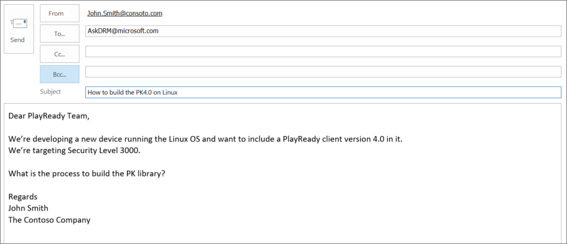

# Support Options

## Technical Support, March 2018 and beyond

Starting in March 2018, Microsoft provides technical support to licensed companies by answering questions sent by email to [AskDRM@microsoft.com](mailto:AskDRM@microsoft.com).

>[!NOTE]
>The **Collaborate Portal** and **Connect Portal** are retired. 

## Licensing Operations

Microsoft provides legal agreement administration and support for the following:

* Licensing and Downloading the PlayReady Device Porting Kit and the PlayReady Server SDK
* PlayReady Licensing Agreement(s) management
* PlayReady Certificate and Deliverables (PK and SDK) fulfillment
* PlayReady royalty reporting and invoicing support 

through:

* the IPLA Portal: [[https://aka.ms/IPLA](https://aka.ms/IPLA)]
* Email to: [ipla@microsoft.com](mailto:ipla@microsoft.com)

 

## Business Discussions

All conversations regarding business inquiries about PlayReady should be emailed in English to [playready@microsoft.com](mailto:playready@microsoft.com). 
