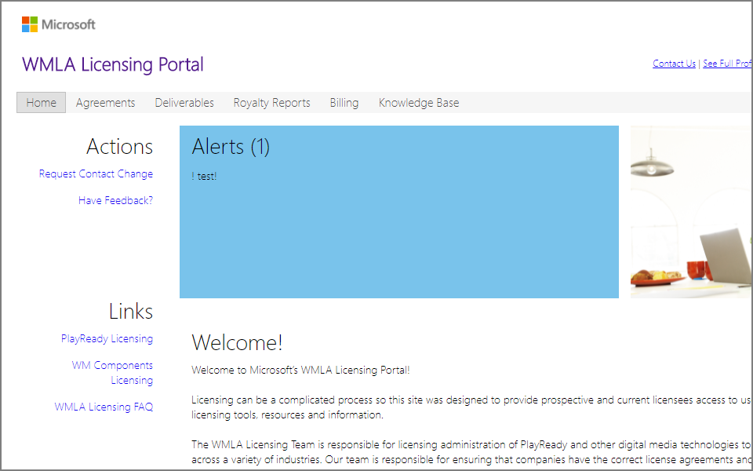

# Support Options

## Technical Support, March 2018 and beyond

Starting in March 2018, Microsoft provides technical support to licensed companies by answering questions sent by email to [AskDRM@microsoft.com](mailto:AskDRM@microsoft.com).

>[!NOTE]
>The **Collaborate Portal** and **Connect Portal** are retired. 

## Operations Support

Microsoft provides support for operations about:

* PlayReady Licensing Agreements management
* PlayReady Certificates request and delivery

through:

* the WMLA Portal: [https://wmlalicensing.com](https://wmlalicensing.com)
* Email to: [wmlalicensing@microsoft.com](mailto:wmlalicensing@microsoft.com)

## Business Discussions

All conversations regarding business inquiries about PlayReady should be emailed in English to [playready@microsoft.com](mailto:playready@microsoft.com). 
